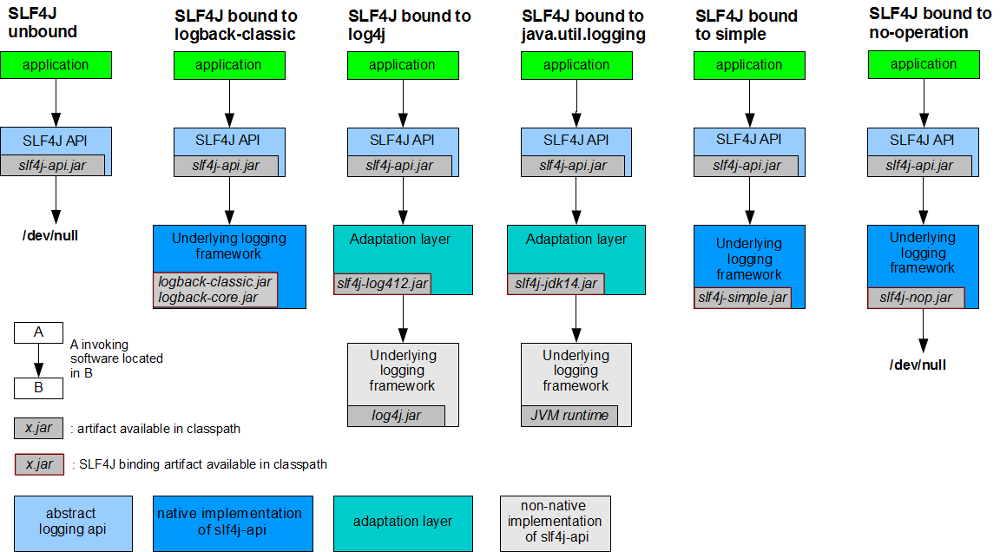

#   Spring Boot

## 配置文件

### yaml、properties

properties：存在编码问题

yaml:

```yaml
person:
	name: tom${random.uuid}
	maps:
		k1: 11
		k2: 22
	list: [a, b]
	list2:
	- a
	- b
```

### @Value 与@ConfigurationProperties的区别

|              | @Value       | @ConfigurationProperties           |
| ------------ | ------------ | ---------------------------------- |
| 功能         | 一个一个指定 | 批量注入配置文件中的属性           |
| 松散语法     | 不支持       | 支持，如fistName和first-name都可以 |
| SpEL         | 支持         | 不支持                             |
| JSR303校验   | 不支持       | 支持 javax.validation              |
| 复杂类型封装 | 不支持       | 支持                               |

@Value 一个个指定属性，不支持复杂类型封装，支持SpEL

@ConfigurationProperties 批量注入属性，支持复杂类型封装，不支持SpEL
	可以配合Validation使用

@EnableConfigurationProperties

### @PropertySource和@ImportResource

@PropertySource：加载指定的配置文件；

@ImportResource：导入Spring的配置文件，让配置文件里面的内容生效；
	例如：@ImportResource(locations = {"classpath:beans.xml"})

​	解析：ConfigurationClassParser.doProcessConfigurationClass(ConfigurationClass, SourceClass)

### Profile

1、多配置文件

​	application-{profile}.yaml， 用spring.profiles.active激活

​	如： application-dev.yaml、application-pro.yaml

2、yaml多文档块

```yaml
server:
	port: 8080
---
spring:
	profiles:
		active: dev
server:
	port: 8081
---
spring:
	profiles:
		active: prod
server:
	port: 8082
```

3、激活方式：

+ 命令行 --spring.profiles.active=dev
+ 配置文件 spring.profiles.active=dev
+ jvm参数 –Dspring.profiles.active=dev

### 配置文件加载位置

springboot 启动会扫描以下位置的application.properties或者application.yml文件作为默认配置文件

file:./config/  项目根路径

1. file:./
2. classpath:/config/
3. classpath:/

以上路径，优先级由高到底，高优先级的配置会覆盖低优先级的配置；

SpringBoot会从这四个位置全部加载主配置文件；互补配置；
我们还可以通过spring.config.location来改变默认的配置文件位置
项目打包好以后，我们可以使用命令行参数的形式，启动项目的时候来指定配置文件的新位置；指定配置文件和默
认加载的这些配置文件共同起作用形成互补配置；
org.springframework.boot.context.config.ConfigFileApplicationListener

### 外部配置加载顺序

SpringBoot也可以从以下位置加载配置； 优先级从高到低；高优先级的配置覆盖低优先级的配置，所有的配置会
形成互补配置

1. 命令行参数

   java -jar spring-boot-02-config-02-0.0.1-SNAPSHOT.jar --spring.config.location=G:/application.properties

2. 来自java:comp/env的JNDI属性

3. Java系统属性（System.getProperties()）

4. 操作系统环境变量

5. RandomValuePropertySource配置的random.*属性值

6. jar包外部的application-{profile}.properties或application.yml(带spring.profile)配置文件

7. jar包内部的application-{profile}.properties或application.yml(带spring.profile)配置文件

8. jar包外部的application.properties或application.yml(不带spring.profile)配置文件

9. jar包内部的application.properties或application.yml(不带spring.profile)配置文件

10. @Configuration注解类上的@PropertySource

11. 通过SpringApplication.setDefaultProperties指定的默认属性

#### spring boot starter

1、引入相关包
2、自动配置

#### spring boot 规范

1、starter.jar 完成相关jar包的引入
2、autoConfigure.jar完成自动配置

## 自动配置原理

### 启动过程的关键注解

```
@SpringBootApplication
	@SpringBootConfiguration
	@EnableAutoConfiguration
		@AutoConfigurationPackage  # 扫描版
		@Import(EnableAutoConfigurationImportSelector.class) # 导入EnableAutoConfiguration
	@ComponentScan
```

### @EnableAutoConfiguration

利用@Import导入了AutoConfigurationImportSelector，扫描所有jar包类路径下的**META‐INF/spring.factories**文件，把扫描到的这些文件的内容包装成properties对象，从properties中获取到EnableAutoConfiguration.class类（类名）对应的值，然后把他们添加在容器中。

EnableAutoConfigurationImportSelector已经废弃，后续会采用AutoConfigurationImportSelector

根据当前不同的条件判断，决定这个配置类是否生效？
一但这个配置类生效；这个配置类就会给容器中添加各种组件；这些组件的属性是从对应的properties类中获取
的，这些类里面的每一个属性又是和配置文件绑定的；

### @Conditional派生注解

@Conditional 扩展注解 作用（判断是否满足当前指定条件）
@ConditionalOnJava 系统的java版本是否符合要求
@ConditionalOnBean 容器中存在指定Bean；
@ConditionalOnMissingBean 容器中不存在指定Bean；
@ConditionalOnExpression 满足SpEL表达式指定
@ConditionalOnClass 系统中有指定的类
@ConditionalOnMissingClass 系统中没有指定的类
@ConditionalOnSingleCandidate 容器中只有一个指定的Bean，或者这个Bean是首选Bean
@ConditionalOnProperty 系统中指定的属性是否有指定的值
@ConditionalOnResource 类路径下是否存在指定资源文件
@ConditionalOnWebApplication 当前是web环境
@ConditionalOnNotWebApplication 当前不是web环境
@ConditionalOnJndi JNDI存在指定项

### 自动配置类顺序

@AutoConfigureBefore
@AutoConfigureAfter
@AutoConfigureOrder

### 自动配置报告

配置文件中添加 **debug: true**

## 日志

### **日志门面** 

~~JCL（Jakarta Commons Logging）~~
SLF4j（Simple Logging Facade for Java）
~~jboss-logging~~

### 日志实现

Log4j
JUL（java.util.logging）
Log4j2
Logback

SLF4j、Log4j、Logback出自同一个人之手

Log4j2 是 apache开发的

spring 选用JCL。不过spring5.0以后，通过spring-jcl-5.1.3.RELEASE做了相应的适配

spring boot选用SLF4j和Logback

一般用 logger.path，如果logger.file 和 logger.path都不指定，只会在控制台输出

### 日志框架切换

如何让系统中所有的日志都统一到slf4j；
1、将系统中其他日志框架先排除出去；
2、用中间包来替换原有的日志框架；
3、我们导入slf4j其他的实现

**spring-boot-starter-logging切换成spring-boot-starter-log4j2**
先排除spring-boot-starter-logging， 然后添加spring-boot-starter-log4j2依赖

### 在系统中使用SLF4j

日志记录方法的调用，不应该来直接调用日志的实现类，而是调用日志抽象层里面的方法；
给系统里面导入slf4j的jar和 logback的实现jar

每一个日志的实现框架都有自己的配置文件。使用slf4j以后，配置文件还是做成日志实现框架自己本身的配置文件；



## Web开发

### 静态资源

静态资源目录，具体见 ResourceProperties

classpath:META-INF/resources
classpath:resources
classpath:static
classpath:public

webjars: https://www.webjars.org/

#### 静态资源的映射规则

WebMvcAutoConfiguration.WebMvcAutoConfigurationAdapter.addResourceHandlers(ResourceHandlerRegistry)

```java
@Override
public void addResourceHandlers(ResourceHandlerRegistry registry) {
    if (!this.resourceProperties.isAddMappings()) {
        logger.debug("Default resource handling disabled");
        return;
    }
    Integer cachePeriod = this.resourceProperties.getCachePeriod();
     // webjars的资源引用
    if (!registry.hasMappingForPattern("/webjars/**")) {
        customizeResourceHandlerRegistration(
            registry.addResourceHandler("/webjars/**")
            .addResourceLocations(
                "classpath:/META-INF/resources/webjars/")
            .setCachePeriod(cachePeriod));
    }
    // StaticLocations
    // classpath:/META-INF/resources/
    // classpath:/resources/
	// classpath:/static/
    // classpath:/public/
    String staticPathPattern = this.mvcProperties.getStaticPathPattern();
    if (!registry.hasMappingForPattern(staticPathPattern)) {
        customizeResourceHandlerRegistration(
            registry.addResourceHandler(staticPathPattern)
            .addResourceLocations(
                this.resourceProperties.getStaticLocations())
            .setCachePeriod(cachePeriod));
    }
}
```

#### 欢迎页

```java
@Bean
public WelcomePageHandlerMapping welcomePageHandlerMapping(
    ResourceProperties resourceProperties) {
    return new WelcomePageHandlerMapping(resourceProperties.getWelcomePage(),
                                         this.mvcProperties.getStaticPathPattern());
}
```

#### 图标ICON

```java
@Configuration
@ConditionalOnProperty(value = "spring.mvc.favicon.enabled", matchIfMissing = true)
public static class FaviconConfiguration {

    private final ResourceProperties resourceProperties;

    public FaviconConfiguration(ResourceProperties resourceProperties) {
        this.resourceProperties = resourceProperties;
    }

    @Bean
    public SimpleUrlHandlerMapping faviconHandlerMapping() {
        SimpleUrlHandlerMapping mapping = new SimpleUrlHandlerMapping();
        mapping.setOrder(Ordered.HIGHEST_PRECEDENCE + 1);
        mapping.setUrlMap(Collections.singletonMap("**/favicon.ico",
                                                   faviconRequestHandler()));
        return mapping;
    }

    @Bean
    public ResourceHttpRequestHandler faviconRequestHandler() {
        ResourceHttpRequestHandler requestHandler = new ResourceHttpRequestHandler();
        requestHandler
            .setLocations(this.resourceProperties.getFaviconLocations());
        return requestHandler;
    }

}
```

### SpringMVC自动配置

WebMvcAutoConfiguration

WebMvcConfigurerAdapter
	WebMvcAutoConfigurationAdapter
		addResourceHandlers
		viewResolver

ContentNegotiatingViewResolver: 组合所有的视图解析器的

DelegatingWebMvcConfiguration

EmbeddedServletContainerCustomizer
EmbeddedServletContainerCustomizerBeanPostProcessor

**扩展MVC**

继承WebMvcConfigurerAdapter自己实现一个适配器， 此时容器中所有的WebMvcConfigurer都会一起起作用；

```java
//使用WebMvcConfigurerAdapter可以来扩展SpringMVC的功能
@Configuration
public class MyWebMvcConfigurerAdapter extends WebMvcConfigurerAdapter {
    @Override
    public void addViewControllers(ViewControllerRegistry registry) {
        registry.addViewController("/myMvc").setViewName("success");
    }
}
```

### 全面接管Spring MVC

@EnableWebMvc 完全接管spring mvc， 所有的自动配置都失效

不推荐

### 错误处理机制

原理：
可以参照ErrorMvcAutoConfiguration；错误处理的自动配置；

1. DefaultErrorAttributes
2. BasicErrorController

```java
@Controller
@RequestMapping("${server.error.path:${error.path:/error}}")
public class BasicErrorController extends AbstractErrorController {
   
    @RequestMapping(produces = "text/html")//产生html类型的数据；浏览器发送的请求来到这个方法处理
public ModelAndView errorHtml(HttpServletRequest request,    
HttpServletResponse response) {            
HttpStatus status = getStatus(request);        
Map<String, Object> model = Collections.unmodifiableMap(getErrorAttributes(        
request, isIncludeStackTrace(request, MediaType.TEXT_HTML)));                
response.setStatus(status.value());        
       
        //去哪个页面作为错误页面；包含页面地址和页面内容
ModelAndView modelAndView = resolveErrorView(request, response, status, model);        
return (modelAndView == null ? new ModelAndView("error", model) : modelAndView);        
}    
@RequestMapping    
@ResponseBody    //产生json数据，其他客户端来到这个方法处理；  
public ResponseEntity<Map<String, Object>> error(HttpServletRequest request) {    
Map<String, Object> body = getErrorAttributes(request,        
isIncludeStackTrace(request, MediaType.ALL));                
HttpStatus status = getStatus(request);        
return new ResponseEntity<Map<String, Object>>(body, status);        
} 
```

3. ErrorPageCustomizer

   ErrorProperties

4. DefaultErrorViewResolver

   ```java
   @Override
   public ModelAndView resolveErrorView(HttpServletRequest request, HttpStatus status,    
   Map<String, Object> model) {            
   ModelAndView modelAndView = resolve(String.valueOf(status), model);        
   if (modelAndView == null && SERIES_VIEWS.containsKey(status.series())) {        
   modelAndView = resolve(SERIES_VIEWS.get(status.series()), model);            
   }        
   return modelAndView;        
   }    
   private ModelAndView resolve(String viewName, Map<String, Object> model) {    
           //默认SpringBoot可以去找到一个页面？  error/404
   String errorViewName = "error/" + viewName;        
          
           //模板引擎可以解析这个页面地址就用模板引擎解析
   TemplateAvailabilityProvider provider = this.templateAvailabilityProviders        
   .getProvider(errorViewName, this.applicationContext);                
   if (provider != null) {        
               //模板引擎可用的情况下返回到errorViewName指定的视图地址
   return new ModelAndView(errorViewName, model);            
   }        
           //模板引擎不可用，就在静态资源文件夹下找errorViewName对应的页面   error/404.html
   return resolveResource(errorViewName, model);        
   } 
   ```

#### 定制错误响应

1. 如何定制错误的页面；
   1）、有模板引擎的情况下；error/状态码; 【将错误页面命名为 错误状态码.html 放在模板引擎文件夹里面的
   error文件夹下】，发生此状态码的错误就会来到 对应的页面；
   我们可以使用4xx和5xx作为错误页面的文件名来匹配这种类型的所有错误，精确优先（优先寻找精确的状态
   码.html）；
   页面能获取的信息；
   timestamp：时间戳
   status：状态码
   error：错误提示
   exception：异常对象
   message：异常消息
   errors：JSR303数据校验的错误都在这里
   2）、没有模板引擎（模板引擎找不到这个错误页面），静态资源文件夹下找；
   3）、以上都没有错误页面，就是默认来到SpringBoot默认的错误提示页面；

2. 如何定制错误的json数据；
   1）、自定义异常处理&返回定制json数据；

   ```java
   @ControllerAdvice
   public class MyExceptionHandler {
       @ResponseBody
       @ExceptionHandler(UserNotExistException.class)
       public Map<String,Object> handleException(Exception e){
           Map<String,Object> map = new HashMap<>();
           map.put("code","user.notexist");
           map.put("message",e.getMessage());
           return map;
       }
   }
   //没有自适应效果...
   ```

   2）、转发到/error进行自适应响应效果处理

   ```java
   @ControllerAdvice
   public class MyExceptionHandler {
   	@ExceptionHandler(UserNotExistException.class)
       public String handleException(Exception e, HttpServletRequest request){
           Map<String,Object> map = new HashMap<>();
           //传入我们自己的错误状态码  4xx 5xx，否则就不会进入定制错误页面的解析流程
           /**
            * Integer statusCode = (Integer) request
            .getAttribute("javax.servlet.error.status_code");
            */
           request.setAttribute("javax.servlet.error.status_code",500);
           map.put("code","user.notexist");
           map.put("message",e.getMessage());
           //转发到/error
           return "forward:/error";
       }
   }
   ```

   3）、将我们的定制数据携带出去；

   出现错误以后，会来到/error请求，会被BasicErrorController处理，响应出去可以获取的数据是由
   getErrorAttributes得到的（是AbstractErrorController（ErrorController）规定的方法）；
   1、完全来编写一个ErrorController的实现类【或者是编写AbstractErrorController的子类】，放在容器中；
   2、页面上能用的数据，或者是json返回能用的数据都是通过errorAttributes.getErrorAttributes得到；
   容器中DefaultErrorAttributes.getErrorAttributes()；默认进行数据处理的；
   自定义ErrorAttributes

   ```java
   //给容器中加入我们自己定义的ErrorAttributes
   @Component
   public class MyErrorAttributes extends DefaultErrorAttributes {
       @Override
       public Map<String, Object> getErrorAttributes(RequestAttributes requestAttributes,
   boolean includeStackTrace) {
           Map<String, Object> map = super.getErrorAttributes(requestAttributes,
   includeStackTrace);
           map.put("company","atguigu");
           return map;
       }
   }
   ```

   最终的效果：响应是自适应的，可以通过定制ErrorAttributes改变需要返回的内容

### 拦截器

需要在 WebMvcConfigurerAdapter 里进行注册

```java
public class MyHandlerInterceptor implements HandlerInterceptor {

	@Override
	public boolean preHandle(HttpServletRequest request, HttpServletResponse response, Object handler)
			throws Exception {
		return false;
	}

	@Override
	public void postHandle(HttpServletRequest request, HttpServletResponse response, Object handler,
			ModelAndView modelAndView) throws Exception {

	}

	@Override
	public void afterCompletion(HttpServletRequest request, HttpServletResponse response, Object handler, Exception ex)
			throws Exception {

	}

}
```

## 嵌入式Servlet容器配置

自动配置

EmbeddedServletContainerAutoConfiguration

### Servlet容器配置修改

```java
@Component
public class MyEmbeddedServletContainerCustomizer implements EmbeddedServletContainerCustomizer {

	@Override
	public void customize(ConfigurableEmbeddedServletContainer container) {
		container.setPort(8085);
	}

}
```

**注册Servlet/Filter/Listener**

DispatcherServletAutoConfiguration

**切换其他嵌入式Servlet容器**

tomcat 默认
netty 适合长连接
undertow 适合高并发

引入spring-boot-starter-web时会自动引入tomcat

原理见： EmbeddedServletContainerAutoConfiguration

​		EmbeddedServletContainerCustomizerBeanPostProcessor

嵌入式容器定制器：EmbeddedServletContainerCustomizer 

​	ServerProperties也是容器定制器

**嵌入式Servlet容器自动配置原理**

EmbeddedServletContainerAutoConfiguration

**嵌入式Servlet容器启动原理**


3. 

## 数据访问

**JDBC自动配置原理**

DataSourceAutoConfiguration

DataSourceConfiguration

DataSourceInitializer 可运行脚本

**druid**

```java
@ConfigurationProperties(prefix = "spring.datasource")
    @Bean
    public DataSource druid(){
       return  new DruidDataSource();
    }

    //配置Druid的监控
    //1、配置一个管理后台的Servlet
    @Bean
    public ServletRegistrationBean statViewServlet(){
        ServletRegistrationBean bean = new ServletRegistrationBean(new StatViewServlet(), "/druid/*");
        Map<String,String> initParams = new HashMap<>();

        initParams.put("loginUsername","admin");
        initParams.put("loginPassword","123456");
        initParams.put("allow","");//默认就是允许所有访问
        initParams.put("deny","192.168.15.21");

        bean.setInitParameters(initParams);
        return bean;
    }


    //2、配置一个web监控的filter
    @Bean
    public FilterRegistrationBean webStatFilter(){
        FilterRegistrationBean bean = new FilterRegistrationBean();
        bean.setFilter(new WebStatFilter());

        Map<String,String> initParams = new HashMap<>();
        initParams.put("exclusions","*.js,*.css,/druid/*");

        bean.setInitParameters(initParams);

        bean.setUrlPatterns(Arrays.asList("/*"));

        return  bean;
    }
```


## 启动过程原理

几个重要的事件回调机制
配置在META-INF/spring.factories
ApplicationContextInitializer
SpringApplicationRunListener
只需要放在ioc容器中
ApplicationRunner
CommandLineRunner

```java
public SpringApplication(ResourceLoader resourceLoader, Class<?>... primarySources) {
    this.resourceLoader = resourceLoader;
    Assert.notNull(primarySources, "PrimarySources must not be null");
    // 设置资源，一般是主启动类
    this.primarySources = new LinkedHashSet<>(Arrays.asList(primarySources));
    // 判断web应用类型
    this.webApplicationType = WebApplicationType.deduceFromClasspath();
    // 根据spring.factories获取所有的ApplicationContextInitializer配置并实例化，
    // 然后设置给SpringApplication
    setInitializers((Collection) getSpringFactoriesInstances(
        ApplicationContextInitializer.class));
    // 根据spring.factories获取所有的ApplicationListener配置并实例化，然后设置给SpringApplication
    setListeners((Collection) getSpringFactoriesInstances(ApplicationListener.class));
    // 推断出主启动类
    this.mainApplicationClass = deduceMainApplicationClass();
}
```

```java
public ConfigurableApplicationContext run(String... args) {
    StopWatch stopWatch = new StopWatch();
    stopWatch.start();
    ConfigurableApplicationContext context = null;
    Collection<SpringBootExceptionReporter> exceptionReporters = new ArrayList<>();
    configureHeadlessProperty();
    // 从META-INF/spring.factories中获取SpringApplicationRunListener并实例化
    // 把所有的SpringApplicationRunListener实例封装成SpringApplicationRunListeners对象
    SpringApplicationRunListeners listeners = getRunListeners(args);
    // 执行所有SpringApplicationRunListener的starting方法
    listeners.starting();
    try {
        // 将命令行的参数args封装成ApplicationArguments对象
        ApplicationArguments applicationArguments = new DefaultApplicationArguments(
            args);
        // 创建并配置IOC环境对象，执行所有listener的environmentPrepared方法
        ConfigurableEnvironment environment = prepareEnvironment(listeners,
                                                                 applicationArguments);
        configureIgnoreBeanInfo(environment);
        Banner printedBanner = printBanner(environment);
        // 创建IOC容器，
        // Servlet : AnnotationConfigServletWebServerApplicationContext
        //			 ServletWebServerApplicationContext 重写onRefresh方法，创建了Servlet容器
        //                                              重写finishRefresh方法，启动Servlet容器
        // Reactive : AnnotationConfigReactiveWebServerApplicationContext
        // Default: AnnotationConfigApplicationContext
        context = createApplicationContext();
        exceptionReporters = getSpringFactoriesInstances(
            SpringBootExceptionReporter.class,
            new Class[] { ConfigurableApplicationContext.class }, context);
        // 配备IOC容器，设置IOC环境，应用initializer的initialize方法，执行所有listener的contextPrepared方法
        // 注册单例ApplicationArguments、Banner，加载主启动类资源，执行listener的contextLoaded方法
        prepareContext(context, environment, listeners, applicationArguments,
                       printedBanner);
        // 刷新IOC容器
        refreshContext(context);
        afterRefresh(context, applicationArguments);
        stopWatch.stop();
        if (this.logStartupInfo) {
            new StartupInfoLogger(this.mainApplicationClass)
                .logStarted(getApplicationLog(), stopWatch);
        }
        listeners.started(context);
        callRunners(context, applicationArguments);
    }
    catch (Throwable ex) {
        handleRunFailure(context, ex, exceptionReporters, listeners);
        throw new IllegalStateException(ex);
    }

    try {
        listeners.running(context);
    }
    catch (Throwable ex) {
        handleRunFailure(context, ex, exceptionReporters, null);
        throw new IllegalStateException(ex);
    }
    return context;
}
```


### 事件机制

配置在META-INF/spring.factories
ApplicationContextInitializer

```java
public class HelloApplicationContextInitializer implements
ApplicationContextInitializer<ConfigurableApplicationContext> {
    @Override
    public void initialize(ConfigurableApplicationContext applicationContext) {
      
 System.out.println("ApplicationContextInitializer...initialize..."+applicationContext);
    }
}
```

SpringApplicationRunListener

```java
public class HelloSpringApplicationRunListener implements SpringApplicationRunListener {
    //必须有的构造器
    public HelloSpringApplicationRunListener(SpringApplication application, String[] args){
    }
    @Override
    public void starting() {
        System.out.println("SpringApplicationRunListener...starting...");
    }
    @Override
    public void environmentPrepared(ConfigurableEnvironment environment) {
        Object o = environment.getSystemProperties().get("os.name");
        System.out.println("SpringApplicationRunListener...environmentPrepared.."+o);
    }
    @Override
    public void contextPrepared(ConfigurableApplicationContext context) {
        System.out.println("SpringApplicationRunListener...contextPrepared...");
    }
    @Override
    public void contextLoaded(ConfigurableApplicationContext context) {
        System.out.println("SpringApplicationRunListener...contextLoaded...");
    }
    @Override
    public void finished(ConfigurableApplicationContext context, Throwable exception) {
        System.out.println("SpringApplicationRunListener...finished...");
    }
}
```

配置（META-INF/spring.factories）

```properties
org.springframework.context.ApplicationContextInitializer=\
com.atguigu.springboot.listener.HelloApplicationContextInitializer
org.springframework.boot.SpringApplicationRunListener=\
com.atguigu.springboot.listener.HelloSpringApplicationRunListener
```

只需要放在ioc容器中
ApplicationRunner

```java
@Component
public class HelloApplicationRunner implements ApplicationRunner {
    @Override
    public void run(ApplicationArguments args) throws Exception {
        System.out.println("ApplicationRunner...run....");
    }
}
```

CommandLineRunner

```java
@Component
public class HelloCommandLineRunner implements CommandLineRunner {
    @Override
    public void run(String... args) throws Exception {
        System.out.println("CommandLineRunner...run..."+ Arrays.asList(args));
    }
}
```

### 自定义starter

```
@Configuration  //指定这个类是一个配置类
@ConditionalOnXXX  //在指定条件成立的情况下自动配置类生效
@AutoConfigureAfter  //指定自动配置类的顺序
@Bean  //给容器中添加组件
@ConfigurationPropertie结合相关xxxProperties类来绑定相关的配置
@EnableConfigurationProperties //让xxxProperties生效加入到容器中
自动配置类要能加载
将需要启动就加载的自动配置类，配置在META‐INF/spring.factories
org.springframework.boot.autoconfigure.EnableAutoConfiguration=\
org.springframework.boot.autoconfigure.admin.SpringApplicationAdminJmxAutoConfiguration,\
org.springframework.boot.autoconfigure.aop.AopAutoConfiguration,\
```


启动器只用来做依赖导入；
专门来写一个自动配置模块；
启动器依赖自动配置；别人只需要引入启动器（starter）
mybatis-spring-boot-starter；自定义启动器名-spring-boot-starter
