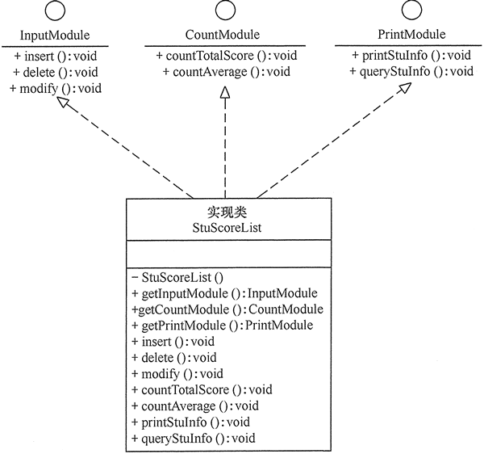

## 接口隔离原则

接口隔离原则（Interface Segregation Principle，ISP）要求程序员尽量将臃肿庞大的接口拆分成更小的和更具体的接口，让接口中只包含客户感兴趣的方法。

2002 年罗伯特·C.马丁给“接口隔离原则”的定义是：客户端不应该被迫依赖于它不使用的方法（Clients should not be forced to depend on methods they do not use）。该原则还有另外一个定义：一个类对另一个类的依赖应该建立在最小的接口上（The dependency of one class to another one should depend on the smallest possible interface）。

以上两个定义的含义是：要为各个类建立它们需要的专用接口，而不要试图去建立一个很庞大的接口供所有依赖它的类去调用。

接口隔离原则和单一职责都是为了提高类的内聚性、降低它们之间的耦合性，体现了封装的思想，但两者是不同的：

- 单一职责原则注重的是职责，而接口隔离原则注重的是对接口依赖的隔离。
- 单一职责原则主要是约束类，它针对的是程序中的实现和细节；接口隔离原则主要约束接口，主要针对抽象和程序整体框架的构建。

### 接口隔离原则的优点

接口隔离原则是为了约束接口、降低类对接口的依赖性，遵循接口隔离原则有以下 5 个优点。

1. 将臃肿庞大的接口分解为多个粒度小的接口，可以预防外来变更的扩散，提高系统的灵活性和可维护性。
2. 接口隔离提高了系统的内聚性，减少了对外交互，降低了系统的耦合性。
3. 如果接口的粒度大小定义合理，能够保证系统的稳定性；但是，如果定义过小，则会造成接口数量过多，使设计复杂化；如果定义太大，灵活性降低，无法提供定制服务，给整体项目带来无法预料的风险。
4. 使用多个专门的接口还能够体现对象的层次，因为可以通过接口的继承，实现对总接口的定义。
5. 能减少项目工程中的代码冗余。过大的大接口里面通常放置许多不用的方法，当实现这个接口的时候，被迫设计冗余的代码。

### 接口隔离原则的实现方法

在具体应用接口隔离原则时，应该根据以下几个规则来衡量。

- 接口尽量小，但是要有限度。一个接口只服务于一个子模块或业务逻辑。
- 为依赖接口的类定制服务。只提供调用者需要的方法，屏蔽不需要的方法。
- 了解环境，拒绝盲从。每个项目或产品都有选定的环境因素，环境不同，接口拆分的标准就不同深入了解业务逻辑。
- 提高内聚，减少对外交互。使接口用最少的方法去完成最多的事情。

下面以学生成绩管理程序为例介绍接口隔离原则的应用。

【例1】学生成绩管理程序。

分析：学生成绩管理程序一般包含插入成绩、删除成绩、修改成绩、计算总分、计算均分、打印成绩信息、査询成绩信息等功能，如果将这些功能全部放到一个接口中显然不太合理，正确的做法是将它们分别放在输入模块、统计模块和打印模块等 3 个模块中，其类图如图 1 所示。



```java
public class ISPtest {
	public static void main(String[] args) {
		InputModule input = StuScoreList.getInputModule();
		CountModule count = StuScoreList.getCountModule();
		PrintModule print = StuScoreList.getPrintModule();
		input.insert();
		count.countTotalScore();
		print.printStuInfo();
		// print.delete();
	}
}

// 输入模块接口
interface InputModule {
	void insert();

	void delete();

	void modify();
}

// 统计模块接口
interface CountModule {
	void countTotalScore();

	void countAverage();
}

// 打印模块接口
interface PrintModule {
	void printStuInfo();

	void queryStuInfo();
}

// 实现类
class StuScoreList implements InputModule, CountModule, PrintModule {
	private StuScoreList() {
	}

	public static InputModule getInputModule() {
		return (InputModule) new StuScoreList();
	}

	public static CountModule getCountModule() {
		return (CountModule) new StuScoreList();
	}

	public static PrintModule getPrintModule() {
		return (PrintModule) new StuScoreList();
	}

	public void insert() {
		System.out.println("输入模块的insert()方法被调用！");
	}

	public void delete() {
		System.out.println("输入模块的delete()方法被调用！");
	}

	public void modify() {
		System.out.println("输入模块的modify()方法被调用！");
	}

	public void countTotalScore() {
		System.out.println("统计模块的countTotalScore()方法被调用！");
	}

	public void countAverage() {
		System.out.println("统计模块的countAverage()方法被调用！");
	}

	public void printStuInfo() {
		System.out.println("打印模块的printStuInfo()方法被调用！");
	}

	public void queryStuInfo() {
		System.out.println("打印模块的queryStuInfo()方法被调用！");
	}
}
```


