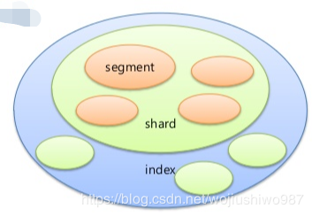
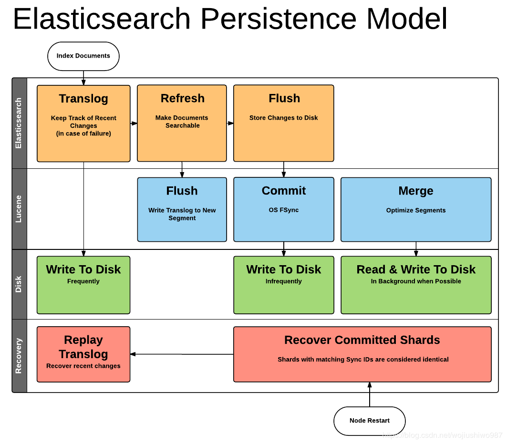

### Elasticsearch写入核心概念

#### 1 索引 index

Elasticsearch中的“索引”有点像关系数据库中的数据库。 它是存储/索引数据的地方。

#### 2 分片 shard

“分片”是Lucene的一个索引。 它本身就是一个功能齐全的搜索引擎。
“索引”可以由单个分片组成，但通常由多个分片组成，一部分主分片、一部分副本分片。
ES默认5个主分片，1个副本分片；
副本分片的用途：（1）主节点故障时的故障转移；（2）增加的读取吞吐量。

#### 3 分段 segment

每个分片包含多个“分段”，其中分段是倒排索引。
分段内的doc数量上限是2的31次方。
默认每秒都会生成一个segment文件.
在分片中搜索将依次搜索每个片段，然后将其结果合并到该分片的最终结果中。

查看索引中分段信息的方法：

```shell
GET /test/_segments
```

#### 4 倒排索引

倒排索引”是Lucene用于使数据可搜索的数据结构。

索引、分片、分段的关系如下：



#### 5 translog日志文件:

为了防止elasticsearch宕机造成数据丢失保证可靠存储，es会将每次写入数据同时写到translog日志中。

translog还用于提供实时CRUD。 当您尝试按ID检索，更新或删除文档时，它会首先检查translog中是否有任何最近的更改，然后再尝试从相关段中检索文档。 这意味着它始终可以实时访问最新的已知文档版本。

#### 6、倒排索引是不可变的

写入磁盘的倒排索引永远不会改变。
好处：无需锁定，不用担心多进程操作更改`数据导致数据不一致`问题。
坏处：更新了词典词库后，老的索引不能生效。如果要使其可搜索，则必须重建整个索引。建议：reindex操作。

#### 7 分段不可变

分段是不可变的。更新文档时，实际上只是将旧文档标记为已删除，并为新文档编制索引。合并过程还会清除这些旧的已删除文。

### Elasticsearch写入步骤拆解

步骤1：新document首先写入内存Buffer缓存中。
步骤2：每隔一段时间，执行“commitpoint”操作，buffer写入新Segment中。
步骤3：新segment写入文件系统缓存 filesystem cache。
步骤4：文件系统缓存中的index segment被fsync强制刷到磁盘上，确保物理写入。
	此时，新egment被打开供search操作。
步骤5：清空内存buffer，可以接收新的文档写入。

#### refresh操作

相比于Lucene的提交操作，ES的refresh是相对轻量级的操作。
先将index-buffer中文档（document）生成的segment写到文件系统之中，这样避免了比较损耗性能io操作，又可以使搜索可见。
默认1s钟刷新一次，所以说ES是近实时的搜索引擎，不是准实时。

注意：实际需要结合自己的业务场景设置refresh频率值。调大了会优化索引速度。注意单位：s代表秒级。

#### flush操作

新创建的document数据会先进入到index buffer之后，与此同时会将操作记录在translog之中，当发生refresh时ranslog中的操作记录并不会被清除，而是当数据从filesystem cache中被写入磁盘之后才会将translog中清空。

从filesystem cache写入磁盘的过程就是flush。

#### 图解Elasticsearch写入持久化模型



图的示意图要从上往下看。
1、当新的文档写入后，写入 index buffer的同时会写入translog。
2、refresh操作使得写入文档搜索可见；
3、flush操作使得filesystem cache写入磁盘，以达到持久化的目的。

