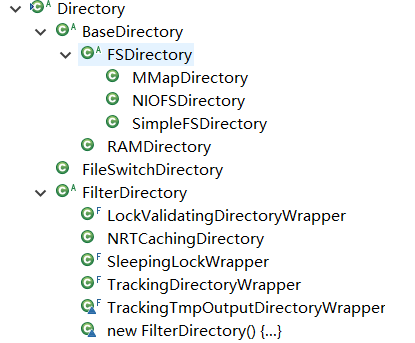

### 1、Luke 索引查看工具安装

下 载 地 址 ：
https://github.com/DmitryKey/luke/releases


### IndexWriter

创建IndexWriter

```java
public IndexWriter getWriter() {
    // 创建使用的分词器
    Analyzer analyzer = new IKAnalyzer4Lucene7(true);
    // 索引配置对象
    IndexWriterConfig config = new IndexWriterConfig(analyzer);
    // 设置索引库的打开模式,共三种模式：
    // 新建: OpenMode.APPEND
    // 追加: OpenMode.CREATE
    // 新建或追加: OpenMode.CREATE_OR_APPEND
    config.setOpenMode(OpenMode.CREATE_OR_APPEND);
    // 索引存放目录
    Directory directory;
    try {
         // 存放到文件系统中
        directory = FSDirectory.open((new File(Consts.INDEX_PATH)).toPath());
        // 创建索引写对象
        IndexWriter writer = new IndexWriter(directory, config);
        return writer;
    } catch (IOException e) {
        return null;
    }

}
```

#### IndexWriterConfig

写索引配置

使用的分词器，
如何打开索引（是新建，还是追加）。
还可配置缓冲区大小、或缓存多少个文档，再刷新到存储中。
还可配置合并、删除等的策略

**注意**： 用这个配置对象创建好IndexWriter对象后，再修改这个配置对象的配置信息不会对IndexWriter对象起作用。
如要在indexWriter使用过程中修改它的配置信息，通过indexWriter的getConfig()方法获得LiveIndexWriterConfig对象，
在这个对象中可查看该IndexWriter使用的配置信息，可进行少量的配置修

#### Directory

指定索引数据存放的位置

内存 FSDirectory
文件系统 RAMDirectory
数据库

保存到文件系

```java
Directory directory = FSDirectory.open(Path path);
```



#### 创 建 、维护索引

```java
// 创建索引写对象
IndexWriter writer = new IndexWriter(directory, config);
// 创建document
// 将文档添加到索引
writer.addDocument(doc);
// 删除文档
//writer.deleteDocuments(terms);
//修改文档
//writer.updateDocument(term, doc);
// 刷新
writer.flush();
// 提交
writer.commit();
```

#### 索引库

存储反向索引数据，也会存储包含简单信息的document
document是以正向索引的形式存储

#### Document文档

要索引的数据记录、文档在lucene中的表示，是索引、搜索的基本单元。
一个Document由多个字段Field构成。就像数据库的记录-字段。

IndexWriter按加入的顺序为Document指定一个递增的id（从0开始），称为文档id。
反向索引中存储的是这个id，文档存储中正向索引也是这个id。
业务数据的主键id只是文档的一个字段。

正向索引示例

| 文档ID | PageId | Content                            |
| ------ | ------ | ---------------------------------- |
| 0      | p001   | 张三和李四是好朋友，非常要好的朋友 |
| 1      | p002   | 今天老师在朋友家吃饭               |

反向索引示例

| 词项 | 词项对应的文档         |
| ---- | ---------------------- |
| 朋友 | {0,2,{7,15}},{1,1,{5}} |
| 老师 | {1,1,{3}}              |

#### 文档字段Field

**字段**由字段名name、字段值value（fieldsData）、字段类型 type 三部分构成。

**字段值**可以是**文本**（String、Reader 或 预分析的 TokenStream）、**二进制值**（byte[]）或**数值**。

==需要在搜索结果中展示的字段才需要加入到Document中==
==只有需要检索的字段才需要建立索引==
例如：网页标题、内容会被作为搜索条件，需要索引；
            网页标题、URL需要被存储，而内容不需要存储；

如果字段是精确查询或范围查询的，只需要建立所有，**不需要分词**
如果字段是模糊查询，不仅需要建立所有，还需要分词

某个字段不需要进行短语查询、临近查询，那么在反向索引中就不需要保存位置、偏移数据。
可以降低反向索引的数据量,可以提升反向索引的效率

**IndexableField**

Field
	stringValue()
	numericValue()
	binaryValue()
	readerValue()
	tokenStreamValue()

Lucene6以后引入了点的概念来表示数值字段，废除了原来的IntField等。
在Point字段类中提供了精确、范围查询的便捷方法。
注意：只是引入点的概念，并未改变数值字段的本质。
既然是点，就有空间概念：维度。一维：一个值，二维：两个值的；……
pointDimensionCount() 返回点的维数
pointNumBytes() 返回点中数值类型的字节数。

Lucene预定义的字段子类

**TextField**: Reader or String indexed for full-text search
**StringField**: String indexed verbatim as a single token
**IntPoint**: int indexed for exact/range queries.
**LongPoint**: long indexed for exact/range queries.
**FloatPoint**: float indexed for exact/range queries.
**DoublePoint**: double indexed for exact/range queries.
**SortedDocValuesField**: byte[] indexed column-wise for sorting/faceting
**SortedSetDocValuesField**: SortedSet<byte[]> indexed column-wise for sorting/faceting
**NumericDocValuesField**: long indexed column-wise for sorting/faceting
**SortedNumericDocValuesField**: SortedSet<long> indexed column-wise for sorting/faceting
**StoredField**: Stored-only value for retrieving in summary results

**注意**：如果单个子类不满足需要，可多个组

**IndexableFieldType**

字段类型：描述该如何索引存储该字

字段可选择性地保存在索引中，这样在搜索结果中，这些保存的字段值就可获得。
一个Document应该包含一个或多个存储字段来唯一标识一个文档。

```
IndexableFieldType: 
docValuesType() 
indexOptions() // 如何索引
omitNorms() // 是否忽略标准化
pointDimensionCount()
pointNumBytes()
stored() // 是否存储
storeTermVectorOffsets() // 偏移量
storeTermVectorPayloads() // 词项向量附加信息
storeTermVectorPositions() // 位置
storeTermVectors() // 词项向量，由位置、偏移量、频率等信息构成
tokenized() // 是否分词
```

storeTermVectors: 对于不需要在搜索反向索引时用到，但在搜索结果处理时需要的位置、偏移量、附加数据(payLoad) 的字段，我们可以单独为该字段存储（文档id词项向量）的正向索引。
storeTermVectors设置为false，位置、偏移量也必须为false
storeTermVectors设置为true，位置也必须设置为true，偏移量可为true，也可以为false

**IndexOptions**

NONE
	Not indexed 不索引
DOCS
	向索引中只存储了包含该词的文档id，没有词频、位置
DOCS_AND_FREQS
	反向索引中会存储 文档id、词频
DOCS_AND_FREQS_AND_POSITIONS
	反向索引中存储 文档id、词频、位置
DOCS_AND_FREQS_AND_POSITIONS_AND_OFFSETS
	反向索引中存储 文档id、词频、位置、偏移量

如果某个字段不需要进行短语查询、临近查询，那么在反向索引中就
不需要保存位置、偏移数据。

**空间换时间**

对需要排序、分组、聚合的字段，为其建立独立的**文档->字段值的正向索引、列式存储**。
这样我们要加载搜中文档的这个字段的数据就快很多，耗内存少。

==需 要 排序 、 分组 、 聚合 、 分类查 询 （ 面 查 询 ） 的字段才创 建docValues==

**DocValuesType**

NONE 不开启docvalue
NUMERIC 单值、数值字段
BINARY 单值、字节数组字段用
SORTED 单值、字符字段用， 会预先对值字节进行排序、去重存储
SORTED_NUMERIC 单值、数值数组字段用，会预先对数值数组进行排序
SORTED_SET 多值字段用，会预先对值字节进行排序、去重存储

建立索引的时候，NUMERIC、SORTED_NUMERIC取值numericValue，其他类型取值binaryValue

#### 索引更新

Term词项 指定字段的词项
删除流程：根据Term、Query找到相关的文档id、同时删除索引信息，再根据文档id删除对应的文档存储。
更新流程：先删除、再加入新的doc
注意：只可根据索引的字段进行更新。


