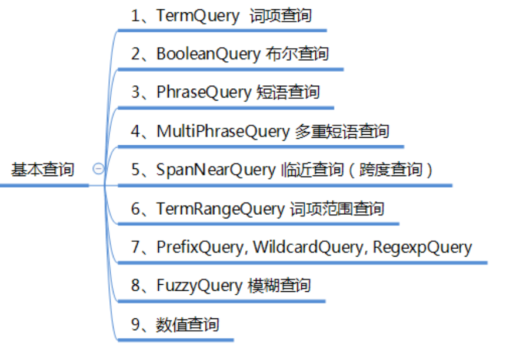

#### IndexReader  索引读取器

Open一个读取器，读取的是该时刻点的索引视图。如果后续索引发生改变，需重新open一个读取器。

```java
DirectoryReader.open(IndexWriter indexWriter)
DirectoryReader.open(Directory)
DirectoryReader.openIfChanged(DirectoryReader)
```

IndexReader分为两类：

​	CompositeReader 复合读取器
​	LeafReader 叶子读取器

叶子读取器：支持获取stored fields, doc values, terms（词项）, and postings （词项对应的文档）
复合读取器：多个读取器的复合。只可直接用它获取stored fields 。
			在内部通过CompositeReader.getSequentialSubReaders 得到里面的叶子读取器来获取其他数据。
DirectoryReader是复合读取器

**IndexReader**

```java
getDocCount(String)
getReaderCacheHelper()
getRefCount()
getSumDocFreq(String)
getSumTotalTermFreq(String)
getTermVector(int, String)
getTermVectors(int)
hasDeletions()
incRef()
leaves()
maxDoc()
numDeletedDocs()
numDocs()
registerParentReader(IndexReader)
totalTermFreq(Term)
tryIncRef()
```

**LeafReader**

```java
checkIntegrity()
docFreq(Term)
getBinaryDocValues(String)
getContext()
getCoreCacheHelper()
getDocCount(String)
getFieldInfos()
getLiveDocs()
getNormValues(String)
getNumericDocValues(String)
getPointValues(String)
getSortedDocValues(String)
getSortedNumericDocValues(String)
getSortedSetDocValues(String)
getSumDocFreq(String)
getSumTotalTermFreq(String)
postings(Term)
postings(Term, int)
terms(String)
totalTermFreq(Term)
```

**IndexSearcher**

应用通过调用它的search(Query,int)重载方法在一个IndexReader上实现搜索。出于性能的考虑，请使用一个IndexSearcher实例，除非索引发生变化。如索引更新了则通过DirectoryReader.openIfChanged(DirectoryReader)  取得新的读取器，再创建新的搜索器。

```java
search(Query, int)
search(Query, int, Sort)
search(Query, int, Sort, boolean, boolean)
search(Query, Collector)
search(Query, CollectorManager<C, T>)
searchAfter(ScoreDoc, Query, int)
searchAfter(ScoreDoc, Query, int, Sort)
searchAfter(ScoreDoc, Query, int, Sort, boolean, boolean)
```

TopDocs  搜索命中的结果集   （Top-N）

TopFieldDocs  按字段排序的搜索命中结果集

ScoreDoc

#### Query查询

TermQuery  词项查询
BooleanQuery  布尔查询
WildcardQuery 通配符查询
PhraseQuery 短语查询
PrefixQuery 前缀查询
MultiPhraseQuery 多重短语查询
FuzzyQuery 模糊查询

RegexpQuery 正则查询
TermRangeQuery 词项范围查询
PointRangeQuery 点范围查询
ConstantScoreQuery 
DisjunctionMaxQuery 
MatchAllDocsQuery
SpanNearQuery临近查询

#### QueryParser详解

传统解析器-单默认字段   QueryParser

```java
// 使用的分词器
Analyzer analyzer = new IKAnalyzer4Lucene7(true);
// 要搜索的默认字段
String defaultFiledName = "name";
// 查询生成器（解析输入生成Query查询对象）
QueryParser parser = new QueryParser(defaultFiledName, analyzer);
// 通过parse解析输入，生成query对象
Query query1 = parser.parse(
		"(name:\"联想笔记本电脑\" OR simpleIntro:英特尔) AND type:电脑 AND price:999900");
```

传统解析器-多默认字段  MultiFieldQueryParser

```java
// 传统查询解析器-多默认字段
String[] multiDefaultFields = { "name", "type", "simpleIntro" };
MultiFieldQueryParser multiFieldQueryParser = new MultiFieldQueryParser(
		multiDefaultFields, analyzer);
// 设置默认的组合操作，默认是 OR
multiFieldQueryParser.setDefaultOperator(Operator.OR);
Query query4 = multiFieldQueryParser.parse("笔记本电脑 AND price:1999900");
```

新解析框架的标准解析器：StandardQueryParser

```java
StandardQueryParser queryParserHelper = new StandardQueryParser(analyzer);
// 设置默认字段
// queryParserHelper.setMultiFields(CharSequence[] fields);
// queryParserHelper.setPhraseSlop(8);
// Query query = queryParserHelper.parse("a AND b", "defaultField");
Query query5 = queryParserHelper.parse(
	"(\"联想笔记本电脑\" OR simpleIntro:英特尔) AND type:电脑 AND price:1999900","name");

```

未分词的字段，应直接使用基本查询API加入到查询中，而不应使用查询解析器；
对于普通文本字段，使用查询解析器，而其他值字段：如 时间、数值，则应使用基本查询API

**查询语法规则**

Term 词项
	单个词项： 电脑
	没有引号，不会进行分词

短语
	短语的表示： "联想笔记本电脑"
	有引号，会分词

Field字段
	示例：name:“联想笔记本电脑” AND type:电脑
	如果字段是默认字段，则字段名可以省略

通配符
	? 单个字符
	\* 0或多个字符
	==通配符不可以写在开头==

正则表达式
	示例： /xxx/

模糊查询
	示例： roam~
	模糊查询最大支持两个不同字符，词后加 ~

临近查询
	示例： "jakarta apache"~10
	短语后加 ~移动值

范围查询
	mod_date:[20020101 TO 20030101]       包含边界值
	title:{Aida TO Carmen}      不包含边界值

词项加权
	通过 ^数值来指定加权因子，默认加权因子值是1
	示例：jakarta^4 apache
	短语也可以： "jakarta apache"^4 "Apache Lucene"

Boolean 操作符
	Lucene支持的布尔操作： AND, “+”, OR, NOT ,"-"

​	OR:  "jakarta apache" jakarta 相当于 "jakarta apache" OR jakarta

​	AND："jakarta apache" AND "Apache Lucene"

​	+： 必须包含，如 +jakarta lucene

​	NOT 非："jakarta apache" NOT "Apache Lucene“
​		注意：NOT不可单项使用
​		NOT “Apache Lucene“     不可行

​	-  同NOT ："jakarta apache"  -"Apache Lucene“

组合 ()
	字句组合：(jakarta OR apache) AND website
	字段组合：title:(+return +"pink panther")

转义   \
	对语法字符： + - && || ! ( ) { } [ ] ^ “ ~ * ? : \ /     进行转义。
	如要查询包含 (1+1):2 
     		\(1\+1\)\:2 

### Query查询详解

​	



#### 1、TermQuery  词项查询

词项查询，最基本、最常用的查询。用来查询指定字段包含指定词项的文档

```java
TermQuery tq = new TermQuery(new Term("fieldName", "term"));
```

#### 2、BooleanQuery  布尔查询

搜索的条件往往是多个的，如要查询名称包含“电脑” 或 “thinkpad”的商品，就需要两个词项查询做或合并。
布尔查询就是用来组合多个子查询的。每个子查询称为布尔字句 BooleanClause，布尔字句自身也可以是组合的。
组合关系支持如下四种：

Occur.SHOULD    或
Occur.MUST   且
Occur.MUST_NOT    且非
Occur.FILTER   同 MUST，但该字句不参与评分

布尔查询默认的最大字句数为1024，在将通配符查询这样的查询rewriter为布尔查询时，往往会产生很多的字句，可能抛出TooManyClauses 异常。可通过BooleanQuery.setMaxClauseCount(int)设置最大字句数。

```java
// 布尔查询
Query query1 = new TermQuery(new Term(filedName, "thinkpad"));
Query query2 = new TermQuery(new Term("simpleIntro", "英特尔"));
BooleanQuery.Builder booleanQueryBuilder = new BooleanQuery.Builder();
booleanQueryBuilder.add(query1, Occur.SHOULD);
booleanQueryBuilder.add(query2, Occur.MUST);
BooleanQuery booleanQuery = booleanQueryBuilder.build();
// 可像下一行这样写
BooleanQuery booleanQuery = new BooleanQuery.Builder()
	.add(query1, Occur.SHOULD).add(query2, Occur.MUST).build();
```

#### 3、PhraseQuery  短语查询

匹配特点序列的多个词项。PhraserQuery使用一个位置移动因子（slop）来决定任意两个词项的位置可最大移动多少个位置来进行匹配，默认为0。有两种方式来构建对象：

```java
PhraseQuery phraseQuery1 = new PhraseQuery("name", "thinkpad",
	"carbon");

PhraseQuery phraseQuery2 = new PhraseQuery(1, "name", "thinkpad",
	"carbon");

PhraseQuery phraseQuery3 = new PhraseQuery("name", "笔记本电脑", "联想");

PhraseQuery phraseQuery4 = new PhraseQuery.Builder()
	.add(new Term("name", "笔记本电脑"), 4)
	.add(new Term("name", "联想"), 5).build();
// 这两句等同
PhraseQuery phraseQuery5 = new PhraseQuery.Builder()
	.add(new Term("name", "笔记本电脑"), 0)
	.add(new Term("name", "联想"), 1).build();
```

==根据位置,后一项的位置要大于或等于前一项，否则会报错==

**PhraseQuery  slop  移动因子说明**

name = "ThinkPad X1 Carbon 20KH0009CD/25CD 超极本轻薄笔记本电脑联想";

1、如果想用  “thinkpad  carbon” 来匹配 name。因中间有 x1,则需要将thinkpad 向右移动1个位置。

2、如果想用  “carbon  thinkpad” 来匹配 name。因中间有 x1,则需要将carbon 向右移动3个位置。

```java
// String name = "ThinkPad X1 Carbon 20KH0009CD/25CD 超极本轻薄笔记本电脑联想";
// PhraseQuery 短语查询
PhraseQuery phraseQuery2 = new PhraseQuery(1, "name", "thinkpad","carbon");
// slop示例
PhraseQuery phraseQuery2Slop = new PhraseQuery(3, "name", "carbon",	"thinkpad");
PhraseQuery phraseQuery3 = new PhraseQuery("name", "笔记本电脑", "联想");
// slop示例
PhraseQuery phraseQuery3Slop = new PhraseQuery(2, "name", "联想","笔记本电脑");
```

#### 4、MultiPhraseQuery  多重短语查询

短语查询的一种更通用的用法，支持同位置多个词的OR匹配。
通过里面的Builder来构建MultiPhraseQuery：

```java
MultiPhraseQuery 多重短语查询
Term[] terms = new Term[2];
terms[0] = new Term("name", "笔记本");
terms[1] = new Term("name", "笔记本电脑");
Term t = new Term("name", "联想");
MultiPhraseQuery multiPhraseQuery = new MultiPhraseQuery.Builder()
	.add(terms).add(t).build();

// 对比 PhraseQuery在同位置加入多个词 ，同位置的多个词都需匹配，所以查不出。
PhraseQuery pquery = new PhraseQuery.Builder().add(terms[0], 0)
	.add(terms[1], 0).add(t, 1).build();
```

#### 5、SpanNearQuery  临近查询（跨度查询）

用于更复杂的短语查询，可以指定词间位置的最大间隔跨度。通过组合一系列的SpanQuery 实例来进行查询，可以指定是否按顺序匹配、slop、gap。

```java
// SpanNearQuery 临近查询
SpanTermQuery tq1 = new SpanTermQuery(new Term("name", "thinkpad"));
SpanTermQuery tq2 = new SpanTermQuery(new Term("name", "carbon"));
SpanNearQuery spanNearQuery = new SpanNearQuery(
	new SpanQuery[] { tq1, tq2 }, 1, true);

// SpanNearQuery 临近查询 gap slop 使用
SpanNearQuery.Builder spanNearQueryBuilder = SpanNearQuery
	.newOrderedNearQuery("name");
spanNearQueryBuilder.addClause(tq1).addGap(0).setSlop(1)
	.addClause(tq2);
SpanNearQuery spanNearQuery5 = spanNearQueryBuilder.build();
```

#### 6、TermRangeQuery  词项范围查询

用于查询包含某个范围内的词项的文档，如以字母开头a到c的词项。词项在反向索引中是排序的，只需指定的开始词项、结束词项，就可以查询该范围的词项。
如果是做数值的范围查询则用 PointRangeQuery 。


参数说明:
    field – 字段
    lowerTerm – 下边界词
    upperTerm – 上边界词
    includeLower –是否包含下边界.
    includeUpper – 是否包含上边界.

```java
// TermRangeQuery 词项范围查询
TermRangeQuery termRangeQuery = TermRangeQuery.newStringRange("name",
	"carbon", "张三", false, true);
```

#### 7、PrefixQuery, WildcardQuery, RegexpQuery

+ PrefixQuery 前缀查询
  查询包含以xxx为前缀的词项的文档，是通配符查询，如 app，实际是 app* 
+ WildcardQuery 通配符查询
  *表示0个或多个字符，?表示1个字符，\是转义符。通配符查询可能会比较慢，不可以通配符开头（那样就是所有词项了）
+ RegexpQuery 正则表达式查询
  词项符合某正则表达式

==注意==：这三种查询可能会比较慢，使用时+谨慎

```java
// PrefixQuery 前缀查询
PrefixQuery prefixQuery = new PrefixQuery(new Term("name", "think"));

// WildcardQuery 通配符查询
WildcardQuery wildcardQuery = new WildcardQuery(
	new Term("name", "think*"));

// WildcardQuery 通配符查询
WildcardQuery wildcardQuery2 = new WildcardQuery(
	new Term("name", "厉害了???"));

// RegexpQuery 正则表达式查询
RegexpQuery regexpQuery = new RegexpQuery(new Term("name", "厉害.{4}"));
```

#### 8、FuzzyQuery 模糊查询

简单地与索引词项进行相近匹配，允许最大2个不同字符。常用于拼写错误的容错：如把 “thinkpad” 拼成 “thinkppd”或 “thinkd”，使用FuzzyQuery 仍可搜索到正确的结果。

```java
// FuzzyQuery 模糊查询
FuzzyQuery fuzzyQuery = new FuzzyQuery(new Term("name", "thind"));

FuzzyQuery fuzzyQuery2 = new FuzzyQuery(new Term("name", "thinkd"), 2);

FuzzyQuery fuzzyQuery3 = new FuzzyQuery(new Term("name", "thinkpaddd"));

FuzzyQuery fuzzyQuery4 = new FuzzyQuery(new Term("name", "thinkdaddd"));
```

#### 9、数值查询

前提：查询的数值字段必须索引。通过 IntPoint, LongPoint, FloatPoint, or DoublePoint 中的方法构建对应的查询。

```java
// 精确值查询
Query exactQuery = IntPoint.newExactQuery("price", 1999900);
// 数值范围查询
Query pointRangeQuery = IntPoint.newRangeQuery("price", 499900,1000000);
// 集合查询
Query setQuery = IntPoint.newSetQuery("price", 1999900, 1000000,2000000);
```

