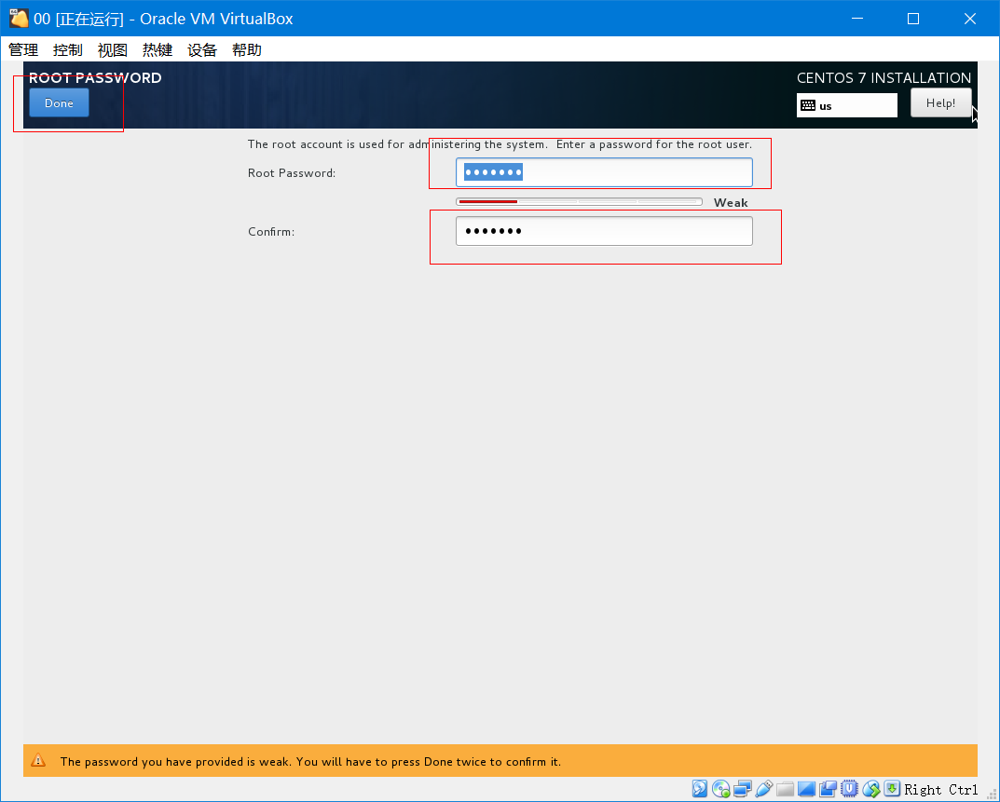

## CentOS7虚拟机安装

### 1、安装前准备

- 安装Oracle VM VirtualBox。这个直接去网上下载，安装也很简单。
- 下载iso镜像，这里使用的版本是`CentOS-7-x86_64-DVD-1511.iso`
  下载地址：http://vault.centos.org/7.2.1511/isos/x86_64/
  iso文件有DVD、Everything、Minimal三种。
  Minimal是简版，文件比较小；Everything文件非常大，因为包含各种安装包。
  建议下载DVD版。

### 2、开始安装

新建虚拟电脑，名称随便取，类型选择Linux，版本就选择Other Linux （64-bit）


设置内存大小，默认就512MB好，设置大一点也行，比如1024MB。


虚拟硬盘默认选择第二项“现在创建虚拟硬盘”


虚拟硬盘文件类型默认就好


存储在物理硬盘上，选在“动态分盘”


创建虚拟硬盘，默认是8GB，当然也可以设置打一下，如30GB


选择虚拟机进行设置


常规、系统、显示三向默认就行，不用特别设置


设置存储，选在刚开始准备的iso文件即可


声音可以取消掉，虚拟机要声音也没啥意义


设置网络，可以启用两个网卡，连接方式都选择【桥接网卡】。
至于界面名称，可以先看一下自己的网络连接，具体是用哪个连接到网络的。
我连接的是wifi，所以选在无线网卡WLAN【Qualcomm Atheros...】


正常启动虚拟机，开始centos安装


按enter键直接进入下一步


出现如下界面，需要选择系统语言，默认英语就好


选择安装目标，其实就是选择硬盘。只有选在安装目标后，Begin Install按钮变蓝色，才能就行下一步安装


安装大概需要30分钟左右，可以先把root用户密码设置一下。




自动安装相关软件包


自动安装完成之后，点击Reboot安装重新启动。

### 3、常规设置

用root用户登录，进行常规设置。


**设置网卡**
进入目录`cd /etc/sysconfig/network-scripts/`
编辑文件`vi ifcfg-enp0s3`，其中ONBOOT改成yes，再添加IP地址和子网掩码
至于ip和子网掩码的设置，可以先打开本机cmd窗口，执行命令`ipconfig`查看下自己本机的ip和子网掩码
给虚拟机设置的ip前三段必须与本机ip保持一致，并且子网掩码也要相同
例如，你本机ip是`192.168.0.24`,子网掩码`255.255.255.0`，虚拟机的IP和子网掩码可如下设置

```shell
ONBOOT="yes"
IPADDR=192.168.0.31
NETMASK=255.255.255.0
```

重新启动网卡`systemctl restart network`
执行ping命令验证网卡设置情况`ping www.baidu.com`
如果看到一下信息，说明网卡设置成功

```shell
PING www.a.shifen.com (14.215.177.39) 56(84) bytes of data.
64 bytes from 14.215.177.39: icmp_seq=1 ttl=57 time=39.4 ms
64 bytes from 14.215.177.39: icmp_seq=2 ttl=57 time=16.1 ms
64 bytes from 14.215.177.39: icmp_seq=3 ttl=57 time=23.0 ms
64 bytes from 14.215.177.39: icmp_seq=4 ttl=57 time=34.3 ms
```

**安装常用软件包**
网卡设置完毕，就能连接外网了，可以通过yum命令安装一下常用软件包

```shell
yum install gcc gcc-c++ gdb redhat-lsb net-tools wget vim tree screen lsof tcpdump nc -y
```

**安装JDK**
根据个人经验，很多应用都是运行在java虚拟机上的，jdk的安装也变得非常有必要。

```shell
# 进入目录`/lib`,并创建文件夹java
cd /lib
mkdir java
# 下载jdk安装包，上传至目录`/lib/java`,并解压
tar -xvf jdk-8u151-linux-x64.tar.gz
# 编辑文件/etc/profile设置环境变量
vi /etc/profile
export JAVA_HOME=/lib/java/jdk1.8.0_151
export PATH=$PATH:$JAVA_HOME/bin
# 使设置生效
source /etc/profile
```

**其他设置**
如果可以的话还可以设置一下PS1以及个别命令的别名

```shell
# 编辑profile文件
vi /etc/profile
# 添加
PS1='\u@$PWD:' # 不用pwd命令，也能时刻知道当前路径
alias ..='cd ..' # 用 .. 代替命令 cd ..
# 使设置生效
source /etc/profile
```


