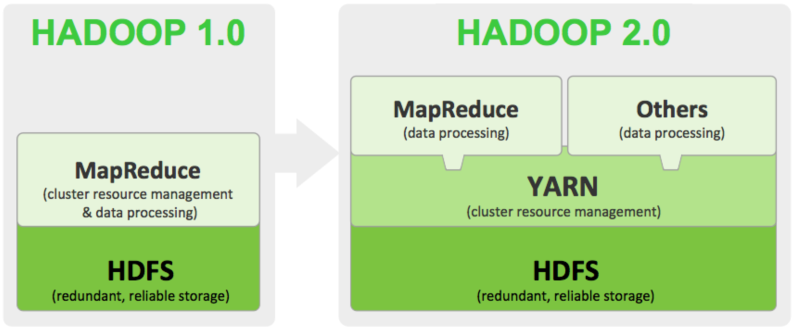

大数据关键技术—从技术层面考虑

| 数据采集       | 利用ETL工具将分布的的数据如关系数据、平面数据文件等，抽取到临时中间层后进行清洗、转换、集成，最后加载到数据仓库或数据集中，进行分析处理 |
| -------------- | ------------------------------------------------------------ |
| 数据存储和管理 | 利用分布式文件系统、数据仓库、关系数据库、NoSQL数据库、云数据库等，实现对结构化、半结构化和非结构化海量数据的存储和管理 |
| 数据处理与分析 | 利用分布式并行编程模型和计算框架，结合机器学习和数据挖掘算法，实现对海量数据的处理和分析；对分析结果进行可视化呈现 |
| 数据隐私和安全 | 在从大数据中挖掘潜在的巨大商业价值和学术价值的同时，构建隐私数据保护体系和数据安全体系，有效保护个人隐私和数据安全 |

大数据2大核心技术

+ 分布式存储

+ 分布式处理

大数据计算模式

| 计算模式     | 解决问题                       | 框架或产品                                            |
| ------------ | ------------------------------ | ----------------------------------------------------- |
| 批处理计算   | 针对大规模数据的批处理         | MapReduce、Spark等                                    |
| 流计算       | 针对流数据的实时计算           | Storm、S4、DStream、Super Mario、银河流数据处理平台等 |
| 图计算       | 针对大规模图结构数据的处理     | Pregel、GraphX、Giraph、PowerGraph、Hama、GoldenOrb等 |
| 查询分析计算 | 大规模数据的存储管理和查询分析 | Hive、Cassandra、Impala等                             |

SaaS (Software-as-a-Service)软件即服务

Paas (Platform-as-a-Service)平台即服务

Iaas (Infrastructure as a Service)基础设施即服务

Hadoop1.0和2.0：

+ **HDFS**（Hadoop Distributed File System） 分布式存储系统
    提供了高可靠性、高扩展性和高吞吐率的数据存储服务 
+ **YARN**（Yet Another Resource Negotiator） 资源管理系统
    负责集群资源的统一管理和调度 
+ **MapReduce**  分布式计算框架
     具有易于编程、高容错性和高扩展性等优点 

**Hadoop2.0层级关系**

+ MapService 分布式计算层
+ YARN 集群资源管理层
+ HDFS分布式存储层

#### Hadoop构成 ：

**1、HDFS特点** 

+ 良好的扩展性
+ 高容错性 
+ 适合PB级以上海量数据的存储 

**2、YARN（资源管理系统）**

+ YARN是什么 
  Hadoop 2.0新增系统 
  负责集群的资源管理和调度 
  使得多种计算框架可以运行在一个集群中 

+ YARN的特点 
  良好的扩展性、高可用性 
  对多种类型的应用程序进行统一管理和调度 
  自带了多种多用户调度器，适合共享集群环境