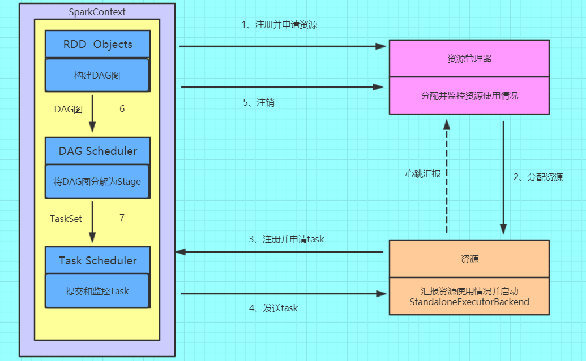

七周期并发模型

# 一、spark安装包下载

1、官网下载

<http://spark.apache.org/downloads.html>

2、从微软的镜像站下载

<http://mirrors.hust.edu.cn/apache/>

3、从清华的镜像站下载

<https://mirrors.tuna.tsinghua.edu.cn/apache/>


## 二、安装基础

1、Java8安装成功

2、zookeeper安装成功

3、hadoop2.7.5 HA安装成功

4、Scala安装成功（不安装进程也可以启动）


### 进入spark/conf修改配置文件

复制spark-env.sh.template并重命名为spark-env.sh，并在文件最后添加配置内容

```shell
export JAVA_HOME=/lib/java/jdk1.8.0_151
export HADOOP_HOME=/home/hadoop/hadoop-2.8.5
export HADOOP_CONF_DIR=/home/hadoop/hadoop-2.8.5/etc/hadoop
export SPARK_WORKER_MEMORY=500m
export SPARK_WORKER_CORES=1
export SPARK_DAEMON_JAVA_OPTS="-Dspark.deploy.recoveryMode=ZOOKEEPER -Dspark.deploy.zookeeper.url=H11:2181,H12:2181,H13:2181 -Dspark.deploy.zookeeper.dir=/spark"
```

复制slaves.template成slaves，并添加如下内容

```shell
H11
H12
H13
```

将安装包分发给其他节点

```
scp -r spark-2.3.0-bin-hadoop2.7/ hadoop2:$PWD
```

### 配置环境变量

```
export SPARK_HOME=/home/hadoop/apps/spark
export PATH=$PATH:$SPARK_HOME/bin
```

启动spark

```shell
./sbin/start-all.sh
```

启动spark shell

```shell
./spark-shell \
--master spark://H11:7077 \
--executor-memory 500m \
--total-executor-cores 1
```

在spark shell上执行

```scala
sc.textFile("/spark/input/hello.txt")
.flatMap(_.split(",")).map((_,1)).reduceByKey(_+_)
.saveAsTextFile("/spark/output")
```

```shell
spark-submit --class org.apache.spark.examples.SparkPi \
--master spark://H01:7077 \
--driver-memory 500m \
--deploy-mode cluster \
--executor-memory 500m \
--executor-cores 1 \
/root/spark-2.3.0-bin-hadoop2.7/examples/jars/spark-examples_2.11-2.3.0.jar
```

```shell
spark-shell --master yarn --deploy-mode client
```

### RDD

RDD（Resilient Distributed Dataset）叫做**弹性分布式数据集**，**是Spark中最基本的数据抽象**，它代表一个不可变、可分区、里面的元素可并行计算的集合。RDD具有数据流模型的特点：自动容错、位置感知性调度和可伸缩性。RDD允许用户在执行多个查询时显式地将工作集缓存在内存中，后续的查询能够重用工作集，这极大地提升了查询速度。

### RDD的属性

（1）一组分片（Partition），即数据集的基本组成单位。对于RDD来说，每个分片都会被一个计算任务处理，并决定并行计算的粒度。用户可以在创建RDD时指定RDD的分片个数，如果没有指定，那么就会采用默认值。默认值就是程序所分配到的CPU Core的数目。

（2）一个计算每个分区的函数。Spark中RDD的计算是以分片为单位的，每个RDD都会实现compute函数以达到这个目的。compute函数会对迭代器进行复合，不需要保存每次计算的结果。

（3）RDD之间的依赖关系。RDD的每次转换都会生成一个新的RDD，所以RDD之间就会形成类似于流水线一样的前后依赖关系。在部分分区数据丢失时，Spark可以通过这个依赖关系重新计算丢失的分区数据，而不是对RDD的所有分区进行重新计算。

（4）一个Partitioner，即RDD的分片函数。当前Spark中实现了两种类型的分片函数，一个是基于哈希的HashPartitioner，另外一个是基于范围的RangePartitioner。只有对于于key-value的RDD，才会有Partitioner，非key-value的RDD的Parititioner的值是None。Partitioner函数不但决定了RDD本身的分片数量，也决定了parent RDD Shuffle输出时的分片数量。

（5）一个列表，存储存取每个Partition的优先位置（preferred location）。对于一个HDFS文件来说，这个列表保存的就是每个Partition所在的块的位置。按照“移动数据不如移动计算”的理念，Spark在进行任务调度的时候，会尽可能地将计算任务分配到其所要处理数据块的存储位置。

### RDD的创建方式

**通过读取文件生成的**

由外部存储系统的数据集创建，包括本地的文件系统，还有所有Hadoop支持的数据集，比如HDFS、Cassandra、HBase等

```scala
val file = sc.textFile("/spark/hello.txt")
```

**通过并行化的方式创建RDD**

```scala
val array = Array(1,2,3,4,5)
val rdd = sc.parallelize(array)

```

**其他方式**

读取数据库等等其他的操作。也可以生成RDD。
RDD可以通过其他的RDD转换而来的。

```scala
	sc.emptyRDD
    sc.hadoopFile("")
    sc.newAPIHadoopFile("")
    sc.makeRDD(list)
    sc.sequenceFile("", null, null);
    sc.union(listRDD);
    sc.textFile("", 2);
```

### RDD编程API

Spark支持两个类型（算子）操作：Transformation和Action

#### Transformation

主要做的是就是将一个已有的RDD生成另外一个RDD。Transformation具有**lazy****特性(延迟加载)**。Transformation算子的代码不会真正被执行。只有当我们的程序里面遇到一个action算子的时候，代码才会真正的被执行。这种设计让Spark更加有效率地运行。
常用的Transformation：

+ **map**(func)
  返回一个新的RDD，该RDD由每一个输入元素经过func函数转换后组成
+ **filter**(func)
  返回一个新的RDD，该RDD由经过func函数计算后返回值为true的输入元素组成
+ **flatMap**(func)
  类似于map，但是每一个输入元素可以被映射为0或多个输出元素（所以func应该返回一个序列，而不是单一元素）
+ **mapPartitions**(func)
  类似于map，但独立地在RDD的每一个分片上运行，因此在类型为T的RDD上运行时，func的函数类型必须是Iterator[T] => Iterator[U]
+ **mapPartitionsWithIndex**(func)
  类似于mapPartitions，但func带有一个整数参数表示分片的索引值，因此在类型为T的RDD上运行时，func的函数类型必须是(Int, Interator[T]) => Iterator[U]
+ **sample**(withReplacement, fraction, seed)
  根据fraction指定的比例对数据进行采样，可以选择是否使用随机数进行替换，seed用于指定随机数生成器种子
+ **union**(otherDataset)
  对源RDD和参数RDD求并集后返回一个新的RDD
+ **intersection**(otherDataset)
  对源RDD和参数RDD求交集后返回一个新的RDD
+ **distinct**([numTasks]))
  对源RDD进行去重后返回一个新的RDD
+ **groupByKey**([numTasks])
  在一个(K,V)的RDD上调用，返回一个(K, Iterator[V])的RDD
+ **reduceByKey**(func, [numTasks])
  在一个(K,V)的RDD上调用，返回一个(K,V)的RDD，使用指定的reduce函数，将相同key的值聚合到一起，与groupByKey类似，reduce任务的个数可以通过第二个可选的参数来设置
+ **aggregateByKey**(zeroValue)(seqOp, combOp, [numTasks])
  先按分区聚合 再总的聚合   每次要跟初始值交流 例如：aggregateByKey(0)(_+_,_+_) 对k/y的RDD进行操作
+ **sortByKey**([ascending], [numTasks])
  在一个(K,V)的RDD上调用，K必须实现Ordered接口，返回一个按照key进行排序的(K,V)的RDD
+ **sortBy**(func,[ascending], [numTasks])
  与sortByKey类似，但是更灵活 第一个参数是根据什么排序  第二个是怎么排序 false倒序   第三个排序后分区数  默认与原RDD一样
+ **join**(otherDataset, [numTasks])
  在类型为(K,V)和(K,W)的RDD上调用，返回一个相同key对应的所有元素对在一起的(K,(V,W))的RDD  相当于内连接（求交集）
+ **cogroup**(otherDataset, [numTasks])
  在类型为(K,V)和(K,W)的RDD上调用，返回一个(K,(Iterable<V>,Iterable<W>))类型的RDD
+ **cartesian**(otherDataset)
  两个RDD的笛卡尔积的成很多个K/V
+ **pipe**(command, [envVars])
  调用外部程序
+ **coalesce**(numPartitions**)**
  重新分区 第一个参数是要分多少区，第二个参数是否shuffle 默认false  少分区变多分区 true   多分区变少分区 false
+ **repartition**(numPartitions)
  重新分区 必须shuffle  参数是要分多少区  少变多
+ **repartitionAndSortWithinPartitions**(partitioner)
  重新分区+排序  比先分区再排序效率高  对K/V的RDD进行操作
+ **foldByKey**(zeroValue)(seqOp)
  该函数用于K/V做折叠，合并处理 ，与aggregate类似   第一个括号的参数应用于每个V值  第二括号函数是聚合例如：_+_
+ **combineByKey**
  合并相同的key的值 rdd1.combineByKey(x => x, (a: Int, b: Int) => a + b, (m: Int, n: Int) => m + n)
+ **partitionBy**(partitioner)
  对RDD进行分区  partitioner是分区器 例如new HashPartition(2)
+ **cache** 和 **persist**
  RDD缓存，可以避免重复计算从而减少时间，区别：cache内部调用了persist算子，cache默认就一个缓存级别MEMORY-ONLY ，而persist则可以选择缓存级别
+ **Subtract**（rdd）
  返回前rdd元素不在后rdd的rdd
+ **leftOuterJoin**
  leftOuterJoin类似于SQL中的左外关联left outer join，返回结果以前面的RDD为主，关联不上的记录为空。只能用于两个RDD之间的关联，如果要多个RDD关联，多关联几次即可。
+ **rightOuterJoin**
  rightOuterJoin类似于SQL中的有外关联right outer join，返回结果以参数中的RDD为主，关联不上的记录为空。只能用于两个RDD之间的关联，如果要多个RDD关联，多关联几次即可
+ **subtractByKey**
  substractByKey和基本转换操作中的subtract类似只不过这里是针对K的，返回在主RDD中出现，并且不在otherRDD中出现的元素

#### Action

触发代码的运行，我们一段spark代码里面至少需要有一个action操作。

+ **reduce**(*func*)
  通过func函数聚集RDD中的所有元素，这个功能必须是可交换且可并联的
+ **collect**()
  在驱动程序中，以数组的形式返回数据集的所有元素
+ **count**()
  返回RDD的元素个数
+ **first**()
  返回RDD的第一个元素（类似于take(1)）
+ **take**(*n*)
  返回一个由数据集的前n个元素组成的数组
+ **takeSample**(*withReplacement*,*num*, [*seed*])
  返回一个数组，该数组由从数据集中随机采样的num个元素组成，可以选择是否用随机数替换不足的部分，seed用于指定随机数生成器种子
+ **takeOrdered**(*n*, *[ordering]*)
+ **saveAsTextFile**(*path*)
  将数据集的元素以textfile的形式保存到HDFS文件系统或者其他支持的文件系统，对于每个元素，Spark将会调用toString方法，将它装换为文件中的文本
+ **saveAsSequenceFile**(*path*) 
  将数据集中的元素以Hadoop sequencefile的格式保存到指定的目录下，可以使HDFS或者其他Hadoop支持的文件系统。
+ **saveAsObjectFile**(*path*) 
+ **countByKey**()
  针对(K,V)类型的RDD，返回一个(K,Int)的map，表示每一个key对应的元素个数。
+ **foreach**(*func*)
  在数据集的每一个元素上，运行函数func进行更新。
+ **aggregate**
  先对分区进行操作，在总体操作
+ **reduceByKeyLocally**
+ **lookup**
+ **top**
+ **fold**
+ **foreachPartition**


### Spark中的基本概念

（1）**Application**：表示你的应用程序

（2）**Driver**：表示main()函数，创建SparkContext。由SparkContext负责与ClusterManager通信，进行资源的申请，任务的分配和监控等。程序执行完毕后关闭SparkContext

（3）**Executor**：某个Application运行在Worker节点上的一个进程，该进程负责运行某些task，并且负责将数据存在内存或者磁盘上。在Spark on Yarn模式下，其进程名称为 CoarseGrainedExecutor Backend，一个CoarseGrainedExecutor Backend进程有且仅有一个executor对象，它负责将Task包装成taskRunner，并从线程池中抽取出一个空闲线程运行Task，这样，每个CoarseGrainedExecutorBackend能并行运行Task的数据就取决于分配给它的CPU的个数。

（4）**Worker**：集群中可以运行Application代码的节点。在Standalone模式中指的是通过slave文件配置的worker节点，在Spark on Yarn模式中指的就是NodeManager节点。

（5）**Task**：在Executor进程中执行任务的工作单元，多个Task组成一个Stage

（6）**Job**：包含多个Task组成的并行计算，是由Action行为触发的

（7）**Stage**：每个Job会被拆分很多组Task，作为一个TaskSet，其名称为Stage

（8）**DAGScheduler**：根据Job构建基于Stage的DAG，并提交Stage给TaskScheduler，其划分Stage的依据是RDD之间的依赖关系

（9）**TaskScheduler**：将TaskSet提交给Worker（集群）运行，每个Executor运行什么Task就是在此处分配的。


### Spark的基本运行流程

(1)构建Spark Application的运行环境（启动SparkContext），SparkContext向资源管理器（可以是Standalone、Mesos或YARN）注册并申请运行Executor资源；

(2)资源管理器分配Executor资源并启动StandaloneExecutorBackend，Executor运行情况将随着心跳发送到资源管理器上；

(3)SparkContext构建成DAG图，将DAG图分解成Stage，并把Taskset发送给Task Scheduler。Executor向SparkContext申请Task

(4)Task Scheduler将Task发放给Executor运行同时SparkContext将应用程序代码发放给Executor。

(5)Task在Executor上运行，运行完毕释放所有资源。



#### Spark运行架构特点

（1）每个Application获取专属的executor进程，该进程在Application期间一直驻留，并以多线程方式运行tasks。这种Application隔离机制有其优势的，无论是从调度角度看（每个Driver调度它自己的任务），还是从运行角度看（来自不同Application的Task运行在不同的JVM中）。当然，这也意味着Spark Application不能跨应用程序共享数据，除非将数据写入到外部存储系统。

（2）Spark与资源管理器无关，只要能够获取executor进程，并能保持相互通信就可以了。

（3）提交SparkContext的Client应该靠近Worker节点（运行Executor的节点)，最好是在同一个Rack里，因为Spark Application运行过程中SparkContext和Executor之间有大量的信息交换；如果想在远程集群中运行，最好使用RPC将SparkContext提交给集群，不要远离Worker运行SparkContext。

（4）Task采用了数据本地性和推测执行的优化机制。

### DAGScheduler

Job=多个stage，Stage=多个同种task, Task分为ShuffleMapTask和ResultTask，Dependency分为ShuffleDependency和NarrowDependency

面向stage的切分，切分依据为宽依赖

维护waiting jobs和active jobs，维护waiting stages、active stages和failed stages，以及与jobs的映射关系

1. 接收提交Job的主入口，`submitJob(rdd, ...)`或`runJob(rdd, ...)`。在`SparkContext`里会调用这两个方法。 

- - 生成一个Stage并提交，接着判断Stage是否有父Stage未完成，若有，提交并等待父Stage，以此类推。结果是：DAGScheduler里增加了一些waiting stage和一个running stage。
  - running stage提交后，分析stage里Task的类型，生成一个Task描述，即TaskSet。
  - 调用`TaskScheduler.submitTask(taskSet, ...)`方法，把Task描述提交给TaskScheduler。TaskScheduler依据资源量和触发分配条件，会为这个TaskSet分配资源并触发执行。
  - `DAGScheduler`提交job后，异步返回`JobWaiter`对象，能够返回job运行状态，能够cancel job，执行成功后会处理并返回结果

2. 处理`TaskCompletionEvent` 

- - 如果task执行成功，对应的stage里减去这个task，做一些计数工作： 
    - 如果task是ResultTask，计数器`Accumulator`加一，在job里为该task置true，job finish总数加一。加完后如果finish数目与partition数目相等，说明这个stage完成了，标记stage完成，从running stages里减去这个stage，做一些stage移除的清理工作
    - 如果task是ShuffleMapTask，计数器`Accumulator`加一，在stage里加上一个output location，里面是一个`MapStatus`类。`MapStatus`是`ShuffleMapTask`执行完成的返回，包含location信息和block size(可以选择压缩或未压缩)。同时检查该stage完成，向`MapOutputTracker`注册本stage里的shuffleId和location信息。然后检查stage的output location里是否存在空，若存在空，说明一些task失败了，整个stage重新提交；否则，继续从waiting stages里提交下一个需要做的stage
  - 如果task是重提交，对应的stage里增加这个task
  - 如果task是fetch失败，马上标记对应的stage完成，从running stages里减去。如果不允许retry，abort整个stage；否则，重新提交整个stage。另外，把这个fetch相关的location和map任务信息，从stage里剔除，从`MapOutputTracker`注销掉。最后，如果这次fetch的blockManagerId对象不为空，做一次`ExecutorLost`处理，下次shuffle会换在另一个executor上去执行。
  - 其他task状态会由`TaskScheduler`处理，如Exception, TaskResultLost, commitDenied等。

3. 其他与job相关的操作还包括：cancel job， cancel stage, resubmit failed stage等

其他职能： cacheLocations 和 preferLocation

### TaskScheduler

维护task和executor对应关系，executor和物理资源对应关系，在排队的task和正在跑的task。

内部维护一个任务队列，根据FIFO或Fair策略，调度任务。

`TaskScheduler`本身是个接口，spark里只实现了一个`TaskSchedulerImpl`，理论上任务调度可以定制。

主要功能：

1. submitTasks(taskSet)，接收DAGScheduler提交来的tasks 

为tasks创建一个TaskSetManager，添加到任务队列里。TaskSetManager跟踪每个task的执行状况，维护了task的许多具体信息。
触发一次资源的索要。 
首先，TaskScheduler对照手头的可用资源和Task队列，进行executor分配(考虑优先级、本地化等策略)，符合条件的executor会被分配给TaskSetManager。
然后，得到的Task描述交给SchedulerBackend，调用launchTask(tasks)，触发executor上task的执行。task描述被序列化后发给executor，executor提取task信息，调用task的run()方法执行计算。

2. cancelTasks(stageId)，取消一个stage的tasks 

调用SchedulerBackend的killTask(taskId, executorId, ...)方法。taskId和executorId在TaskScheduler里一直维护着。

3. resourceOffer(offers: Seq[Workers])，这是非常重要的一个方法，调用者是SchedulerBacnend，用途是底层资源SchedulerBackend把空余的workers资源交给TaskScheduler，让其根据调度策略为排队的任务分配合理的cpu和内存资源，然后把任务描述列表传回给SchedulerBackend 

从worker offers里，搜集executor和host的对应关系、active executors、机架信息等等
worker offers资源列表进行随机洗牌，任务队列里的任务列表依据调度策略进行一次排序
遍历每个taskSet，按照进程本地化、worker本地化、机器本地化、机架本地化的优先级顺序，为每个taskSet提供可用的cpu核数，看是否满足 
默认一个task需要一个cpu，设置参数为"spark.task.cpus=1"
为taskSet分配资源，校验是否满足的逻辑，最终在TaskSetManager的resourceOffer(execId, host, maxLocality)方法里
满足的话，会生成最终的任务描述，并且调用DAGScheduler的taskStarted(task, info)方法，通知DAGScheduler，这时候每次会触发DAGScheduler做一次submitMissingStage的尝试，即stage的tasks都分配到了资源的话，马上会被提交执行

4. statusUpdate(taskId, taskState, data),另一个非常重要的方法，调用者是SchedulerBacnend，用途是SchedulerBacnend会将task执行的状态汇报给TaskScheduler做一些决定 

若TaskLost，找到该task对应的executor，从active executor里移除，避免这个executor被分配到其他task继续失败下去。
task finish包括四种状态：finished, killed, failed, lost。只有finished是成功执行完成了。其他三种是失败。
task成功执行完，调用TaskResultGetter.enqueueSuccessfulTask(taskSet, tid, data)，否则调用TaskResultGetter.enqueueFailedTask(taskSet, tid, state, data)。TaskResultGetter内部维护了一个线程池，负责异步fetch task执行结果并反序列化。默认开四个线程做这件事，可配参数"spark.resultGetter.threads"=4。

#### TaskResultGetter取task result的逻辑

1、对于success task，如果taskResult里的数据是直接结果数据，直接把data反序列出来得到结果；如果不是，会调用blockManager.getRemoteBytes(blockId)从远程获取。如果远程取回的数据是空的，那么会调用TaskScheduler.handleFailedTask，告诉它这个任务是完成了的但是数据是丢失的。否则，取到数据之后会通知BlockManagerMaster移除这个block信息，调用TaskScheduler.handleSuccessfulTask，告诉它这个任务是执行成功的，并且把result data传回去。

2、对于failed task，从data里解析出fail的理由，调用TaskScheduler.handleFailedTask，告诉它这个任务失败了，理由是什么。

### SchedulerBackend

在`TaskScheduler`下层，用于对接不同的资源管理系统，`SchedulerBackend`是个接口，需要实现的主要方法如下：

```scala
def start(): Unit
def stop(): Unit
// 重要方法：SchedulerBackend把自己手头上的可用资源交给TaskScheduler，
// TaskScheduler根据调度策略分配给排队的任务吗，返回一批可执行的任务描述，
// SchedulerBackend负责launchTask，即最终把task塞到了executor模型上，executor里的线程池会执行task的run()
def reviveOffers(): Unit 
def killTask(taskId: Long, executorId: String, interruptThread: Boolean): Unit =
    throw new UnsupportedOperationException
```

粗粒度：进程常驻的模式，典型代表是standalone模式，mesos粗粒度模式，yarn

细粒度：mesos细粒度模式

这里讨论粗粒度模式，更好理解：`CoarseGrainedSchedulerBackend`。

维护executor相关信息(包括executor的地址、通信端口、host、总核数，剩余核数)，手头上executor有多少被注册使用了，有多少剩余，总共还有多少核是空的等等。

主要职能:

1、Driver端主要通过actor监听和处理下面这些事件： 

- - `RegisterExecutor(executorId, hostPort, cores, logUrls)`。这是executor添加的来源，通常worker拉起、重启会触发executor的注册。`CoarseGrainedSchedulerBackend`把这些executor维护起来，更新内部的资源信息，比如总核数增加。最后调用一次`makeOffer()`，即把手头资源丢给`TaskScheduler`去分配一次，返回任务描述回来，把任务launch起来。这个`makeOffer()`的调用会出现在*任何与资源变化相关的事件*中，下面会看到。
  - `StatusUpdate(executorId, taskId, state, data)`。task的状态回调。首先，调用`TaskScheduler.statusUpdate`上报上去。然后，判断这个task是否执行结束了，结束了的话把executor上的freeCore加回去，调用一次`makeOffer()`。
  - `ReviveOffers`。这个事件就是别人直接向`SchedulerBackend`请求资源，直接调用`makeOffer()`。
  - `KillTask(taskId, executorId, interruptThread)`。这个killTask的事件，会被发送给executor的actor，executor会处理`KillTask`这个事件。
  - `StopExecutors`。通知每一个executor，处理`StopExecutor`事件。
  - `RemoveExecutor(executorId, reason)`。从维护信息中，那这堆executor涉及的资源数减掉，然后调用`TaskScheduler.executorLost()`方法，通知上层我这边有一批资源不能用了，你处理下吧。`TaskScheduler`会继续把`executorLost`的事件上报给`DAGScheduler`，原因是`DAGScheduler`关心shuffle任务的output location。`DAGScheduler`会告诉`BlockManager`这个executor不可用了，移走它，然后把所有的stage的shuffleOutput信息都遍历一遍，移走这个executor，并且把更新后的shuffleOutput信息注册到`MapOutputTracker`上，最后清理下本地的`CachedLocations`Map。

`2、reviveOffers()`方法的实现。直接调用了`makeOffers()`方法，得到一批可执行的任务描述，调用`launchTasks`。

`3、launchTasks(tasks: Seq[Seq[TaskDescription]])`方法。 

- - 遍历每个task描述，序列化成二进制，然后发送给每个对应的executor这个任务信息 
    - 如果这个二进制信息太大，超过了9.2M(默认的akkaFrameSize 10M 减去 默认 为akka留空的200K)，会出错，abort整个taskSet，并打印提醒增大akka frame size
    - 如果二进制数据大小可接受，发送给executor的actor，处理`LaunchTask(serializedTask)`事件。

### Executor

Executor是spark里的进程模型，可以套用到不同的资源管理系统上，与`SchedulerBackend`配合使用。

内部有个线程池，有个running tasks map，有个actor，接收上面提到的由`SchedulerBackend`发来的事件。

**事件处理**

1. `launchTask`。根据task描述，生成一个`TaskRunner`线程，丢尽running tasks map里，用线程池执行这个`TaskRunner`
2. `killTask`。从running tasks map里拿出线程对象，调它的kill方法。


快学scala
深入理解scala
Spark大数据处理：技术、应用与性能优化
Apache Spark源码剖析