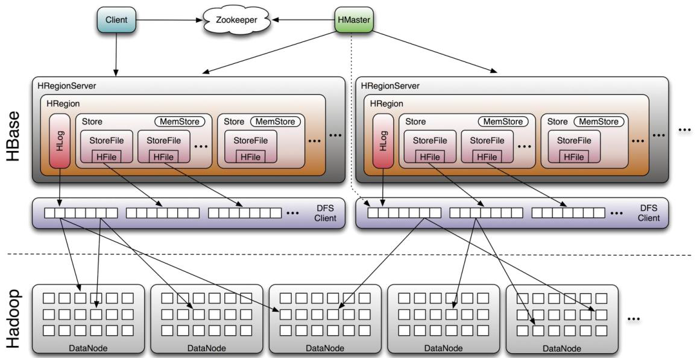
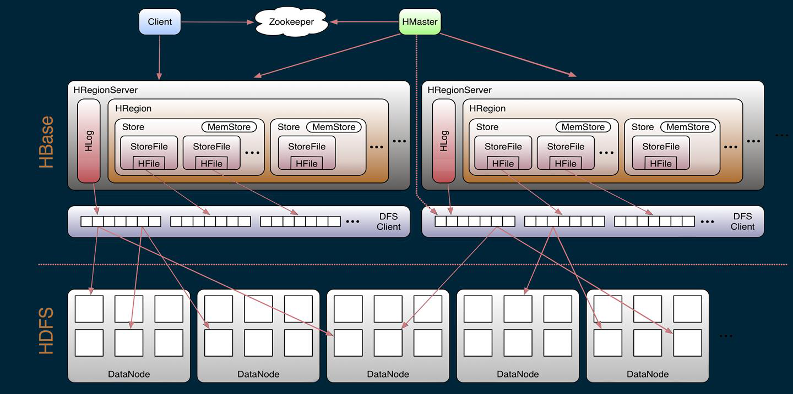
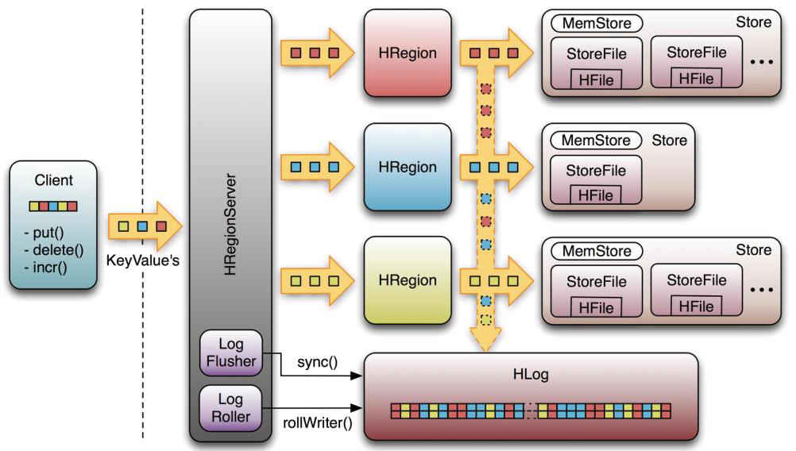

## hbase原理

### 系统架构

#### 错误图解

注意：应该是每一个 RegionServer 就只有一个 HLog，而不是一个 Region 有一个 HLog。

#### 正确图解

从HBase的架构图上可以看出，HBase中的组件包括Client、Zookeeper、HMaster、HRegionServer、HRegion、Store、MemStore、StoreFile、HFile、HLog等，接下来介绍他们的作用。

#### Client 

1、HBase 有两张特殊表：

**.META.**：记录了用户所有表拆分出来的的 Region 映射信息，.META.可以有多个 Regoin

**-ROOT-**：记录了.META.表的 Region 信息，-ROOT-只有一个 Region，无论如何不会分裂

2、Client 访问用户数据前需要首先访问 ZooKeeper，找到-ROOT-表的 Region 所在的位置，然 后访问-ROOT-表，接着访问.META.表，最后才能找到用户数据的位置去访问，中间需要多次网络操作，不过 client 端会做 cache 缓存。

#### ZooKeeper 

1、ZooKeeper 为 HBase 提供 Failover 机制，选举 Master，避免单点 Master 单点故障问题

2、存储所有 Region 的寻址入口：-ROOT-表在哪台服务器上。-ROOT-这张表的位置信息

3、实时监控 RegionServer 的状态，将 RegionServer 的上线和下线信息实时通知给 Master

4、存储 HBase 的 Schema，包括有哪些 Table，每个 Table 有哪些 Column Family

#### Master 

1、为 RegionServer 分配 Region

2、负责 RegionServer 的负载均衡

3、发现失效的 RegionServer 并重新分配其上的 Region

4、HDFS 上的垃圾文件（HBase）回收

5、处理 Schema 更新请求（表的创建，删除，修改，列簇的增加等等）

#### RegionServer 

1、RegionServer 维护 Master 分配给它的 Region，处理对这些 Region 的 IO 请求

2、RegionServer 负责 Split 在运行过程中变得过大的 Region，负责 Compact 操作

可以看到，client 访问 HBase 上数据的过程并不需要 master 参与（寻址访问 zookeeper 和 RegioneServer，数据读写访问 RegioneServer），Master仅仅维护者Table和Region的元数据信息，负载很低。

.META. 存的是所有的 Region 的位置信息，那么 RegioneServer 当中 Region 在进行分裂之后 的新产生的 Region，是由Master 来决定发到哪个 RegioneServer，这就意味着，只有 Master 知道 new Region 的位置信息，所以，由 Master 来管理.META.这个表当中的数据的 CRUD

所以结合以上两点表明，在没有 Region 分裂的情况，Master 宕机一段时间是可以忍受的。

#### HRegion

table在行的方向上分隔为多个Region。Region是HBase中分布式存储和负载均衡的最小单元，即不同的region可以分别在不同的Region Server上，但同一个Region是不会拆分到多个server上。
Region按大小分隔，每个表一般是只有一个region。随着数据不断插入表，region不断增大，当region的某个列族达到一个阈值时就会分成两个新的region。
每个region由以下信息标识：< 表名,startRowkey,创建时间>
由目录表(-ROOT-和.META.)记录该region的endRowkey

#### Store

每一个region由一个或多个store组成，至少是一个store，hbase会把一起访问的数据放在一个store里面，即为每个 ColumnFamily建一个store，如果有几个ColumnFamily，也就有几个Store。一个Store由一个memStore和0或者 多个StoreFile组成。 HBase以store的大小来判断是否需要切分region

#### MemStore

memStore 是放在内存里的。保存修改的数据即keyValues。当memStore的大小达到一个阀值（默认128MB）时，memStore会被flush到文 件，即生成一个快照。目前hbase 会有一个线程来负责memStore的flush操作。

#### StoreFile

memStore内存中的数据写到文件后就是StoreFile，StoreFile底层是以HFile的格式保存。

#### HFile

HBase中KeyValue数据的存储格式，HFile是Hadoop的 二进制格式文件，实际上StoreFile就是对Hfile做了轻量级包装，即StoreFile底层就是HFile

#### HLog

HLog(WAL log)：WAL意为write ahead log，用来做灾难恢复使用，HLog记录数据的所有变更，一旦region server 宕机，就可以从log中进行恢复。
HLog文件就是一个普通的Hadoop Sequence File， Sequence File的value是key时HLogKey对象，其中记录了写入数据的归属信息，除了table和region名字外，还同时包括sequence number和timestamp，timestamp是写入时间，sequence number的起始值为0，或者是最近一次存入文件系统中的sequence number。 Sequence File的value是HBase的KeyValue对象，即对应HFile中的KeyValue。

### 物理存储

#### 整体的物理结构

1、Table 中的所有行都按照 RowKsey 的字典序排列。

2、Table 在行的方向上分割为多个 HRegion。

3、HRegion 按大小分割的(默认 10G)，每个表一开始只有一个 HRegion，随着数据不断插入 表，HRegion 不断增大，当增大到一个阀值的时候，HRegion 就会等分会两个新的 HRegion。 当表中的行不断增多，就会有越来越多的 HRegion。

4、HRegion 是 Hbase 中分布式存储和负载均衡的最小单元。最小单元就表示不同的 HRegion 可以分布在不同的 HRegionserver 上。但一个 HRegion 是不会拆分到多个 server 上的。

5、HRegion 虽然是负载均衡的最小单元，但并不是物理存储的最小单元。事实上，HRegion 由一个或者多个 Store 组成，每个 Store 保存一个 Column Family。每个 Strore 又由一个 memStore 和 0 至多个 StoreFile 组成

### StoreFile 和 HFile 结构

StoreFile 以 HFile 格式保存在 HDFS 上，请看下图 **HFile** 的数据组织格式：

首先 HFile 文件是不定长的，长度固定的只有其中的两块：Trailer 和 FileInfo。

正如图中所示：

　　Trailer 中有指针指向其他数据块的起始点。

　　FileInfo 中记录了文件的一些 Meta 信息，例如：AVG_KEY_LEN, AVG_VALUE_LEN, LAST_KEY, COMPARATOR, MAX_SEQ_ID_KEY 等。

HFile 分为六个部分：

　　**Data Block** 段–保存表中的数据，这部分可以被压缩

　　**Meta Block** 段 (可选的)–保存用户自定义的 kv 对，可以被压缩。

　　**File Info** 段–Hfile 的元信息，不被压缩，用户也可以在这一部分添加自己的元信息。

　　**Data Block Index** 段–Data Block 的索引。每条索引的 key 是被索引的 block 的第一条记录的 key。

　　**Meta Block Index** 段 (可选的)–Meta Block 的索引。

　　**Trailer** 段–这一段是定长的。保存了每一段的偏移量，读取一个 HFile 时，会首先读取 Trailer， Trailer保存了每个段的起始位置(段的Magic Number用来做安全check)，然后，DataBlock Index 会被读取到内存中，这样，当检索某个 key 时，不需要扫描整个 HFile，而只需从内存中找 到key所在的block，通过一次磁盘io将整个block读取到内存中，再找到需要的key。DataBlock Index 采用 LRU 机制淘汰。

　　HFile 的 Data Block，Meta Block 通常采用压缩方式存储，压缩之后可以大大减少网络 IO 和磁 盘 IO，随之而来的开销当然是需要花费 cpu 进行压缩和解压缩。

目标 Hfile 的压缩支持两种方式：Gzip，LZO。

　　Data Index 和 Meta Index 块记录了每个 Data 块和 Meta 块的起始点。

　　Data Block 是 HBase I/O 的基本单元，为了提高效率，HRegionServer 中有基于 LRU 的 Block Cache 机制。每个 Data 块的大小可以在创建一个 Table 的时候通过参数指定，大号的 Block 有利于顺序 Scan，小号 Block 利于随机查询。 每个 Data 块除了开头的 Magic 以外就是一个 个 KeyValue 对拼接而成, Magic 内容就是一些随机数字，目的是防止数据损坏。

​	HFile 里面的每个 **KeyValue** 对就是一个简单的 byte 数组。但是这个 byte 数组里面包含了很 多项，并且有固定的结构。我们来看看里面的具体结构：

开始是两个固定长度的数值，分别表示 Key 的长度和 Value 的长度。紧接着是 Key，开始是 固定长度的数值，表示 RowKey 的长度，紧接着是 RowKey，然后是固定长度的数值，表示 Family 的长度，然后是 Family，接着是 Qualifier，然后是两个固定长度的数值，表示 Time Stamp 和 Key Type（Put/Delete）。Value 部分没有这么复杂的结构，就是纯粹的二进制数据了。

#### MemStore 和 StoreFile

一个 Hregion 由多个 Store 组成，每个 Store 包含一个列族的所有数据。

Store 包括位于内存的一个 memstore 和位于硬盘的多个 storefile 组成。

写操作先写入 memstore，当 memstore 中的数据量达到某个阈值，HRegionServer 启动 flushcache 进程写入 storefile，每次写入形成单独一个 Hfile。

当总storefile大小超过一定阈值后，会把当前的region分割成两个，并由 HMaster分配给相 应的region服务器，实现负载均衡。

客户端检索数据时，先在 memstore 找，找不到再找 storefile

#### Hbase WAL HLog预写

WAL 意为 Write ahead log(http://en.wikipedia.org/wiki/Write-ahead_logging)，类似 mysql 中的 binlog，用来做灾难恢复之用，Hlog 记录数据的所有变更，一旦数据修改，就可以从 log 中 进行恢复。

每个 Region Server 维护一个 Hlog,而不是每个 Region 一个。这样不同 region(来自不同 table) 的日志会混在一起，这样做的目的是不断追加单个文件相对于同时写多个文件而言，可以减 少磁盘寻址次数，因此可以提高对 table 的写性能。带来的麻烦是，如果一台 region server 下线，为了恢复其上的 region，需要将 region server 上的 log 进行拆分，然后分发到其它 region server 上进行恢复。

HLog 文件就是一个普通的 Hadoop Sequence File（序列化文件）：

　　1、HLog Sequence File 的 Key 是 HLogKey 对象，HLogKey 中记录了写入数据的归属信息，除 了 table 和 region 名字外，同时还包括 sequence number 和 timestamp，timestamp 是”写入 时间”，sequence number 的起始值为 0，或者是最近一次存入文件系统中 sequence number。

　　2、HLog Sequece File 的 Value 是 HBase 的 KeyValue 对象，即对应 HFile 中的 KeyValue。

#### Region 寻址机制

**老的 Region 寻址方式**

在 HBase-0.96 版本以前，HBase 有两个特殊的表，分别是-ROOT-表和.META.表，其中-ROOT的位置存储在 ZooKeeper 中，-ROOT-本身存储了.META. Table 的 RegionInfo 信息，并且-ROOT不会分裂，只有一个 Region。而.META.表可以被切分成多个 Region。读取的流程如下图所示：

详细步骤：

第 1 步：Client 请求 ZooKeeper 获得-ROOT-所在的 RegionServer 地址
第 2 步：Client 请求-ROOT-所在的 RS 地址，获取.META.表的地址，Client 会将-ROOT-的相关 信息 cache 下来，以便下一次快速访问
第 3 步：Client 请求.META.表的 RegionServer 地址，获取访问数据所在 RegionServer 的地址， Client 会将.META.的相关信息 cache 下来，以便下一次快速访问
第 4 步：Client 请求访问数据所在 RegionServer 的地址，获取对应的数据

从上面的路径我们可以看出，用户需要 3 次请求才能直到用户 Table 真正的位置，这在一定 程序带来了性能的下降。在 0.96 之前使用 3 层设计的主要原因是考虑到元数据可能需要很 大。但是真正集群运行，元数据的大小其实很容易计算出来。在 BigTable 的论文中，每行 METADATA 数据存储大小为 1KB 左右，如果按照一个 Region 为 128M 的计算，3 层设计可以支持的 Region 个数为 2^34 个，采用 2 层设计可以支持 2^17（131072）。那么 2 层设计的情 况下一个集群可以存储 4P 的数据。这仅仅是一个 Region 只有 128M 的情况下。如果是 10G 呢? 因此，通过计算，其实 2 层设计就可以满足集群的需求。因此在 0.96 版本以后就去掉 了-ROOT-表了。

**新的 Region 寻址方式**

如上面的计算，2 层结构其实完全能满足业务的需求，因此 0.96 版本以后将-ROOT-表去掉了。 如下图所示：

访问路径变成了 3 步：

第 1 步：Client 请求 ZooKeeper 获取.META.所在的 RegionServer 的地址。
第 2 步：Client 请求.META.所在的 RegionServer 获取访问数据所在的 RegionServer 地址，Client 会将.META.的相关信息 cache 下来，以便下一次快速访问。
第 3 步：Client 请求数据所在的 RegionServer，获取所需要的数据。

**总结去掉-ROOT-的原因有如下 2 点：**
其一：提高性能
其二：2 层结构已经足以满足集群的需求

这里还有一个问题需要说明，那就是 Client 会缓存.META.的数据，用来加快访问，既然有缓 存，那它什么时候更新？如果.META.更新了，比如 Region1 不在 RerverServer2 上了，被转移 到了 RerverServer3 上。Client 的缓存没有更新会有什么情况？

其实，Client 的元数据缓存不更新，当.META.的数据发生更新。如上面的例子，由于 Region1 的位置发生了变化，Client 再次根据缓存去访问的时候，会出现错误，当出现异常达到重试 次数后就会去.META.所在的 RegionServer 获取最新的数据，如果.META.所在的 RegionServer 也变了，Client 就会去 ZooKeeper 上获取.META.所在的 RegionServer 的最新地址。

### 读写过程

#### 读请求过程

1、客户端通过 ZooKeeper 以及-ROOT-表和.META.表找到目标数据所在的 RegionServer(就是 数据所在的 Region 的主机地址)

2、联系 RegionServer 查询目标数据

3、RegionServer 定位到目标数据所在的 Region，发出查询请求

4、Region 先在 Memstore 中查找，命中则返回

5、如果在 Memstore 中找不到，则在 Storefile 中扫描。为了能快速的判断要查询的数据在不在这个 StoreFile 中，应用了 BloomFilter

**BloomFilter，布隆过滤器：迅速判断一个元素是不是在一个庞大的集合内，但是他有一个 弱点：它有一定的误判率）**
**（误判率：原本不存在与该集合的元素，布隆过滤器有可能会判断说它存在，但是，如果布隆过滤器，判断说某一个元素不存在该集合，那么该元素就一定不在该集合内）**

#### 写请求过程

1、Client 先根据 RowKey 找到对应的 Region 所在的 RegionServer

2、Client 向 RegionServer 提交写请求

3、RegionServer 找到目标 Region

4、Region 检查数据是否与 Schema 一致

5、如果客户端没有指定版本，则获取当前系统时间作为数据版本

6、将更新写入 WAL Log

7、将更新写入 Memstore

8、判断 Memstore 的是否需要 flush 为 StoreFile 文件。

Hbase 在做数据插入操作时，首先要找到 RowKey 所对应的的 Region，怎么找到的？其实这 个简单，因为.META.表存储了每张表每个 Region 的起始 RowKey 了。

　　 **建议：在做海量数据的插入操作，避免出现递增 rowkey 的 put 操作**

 　　如果 put 操作的所有 RowKey 都是递增的，那么试想，当插入一部分数据的时候刚好进行分 裂，那么之后的所有数据都开始往分裂后的第二个 Region 插入，就造成了数据热点现象。

 　　细节描述：

　　　　 HBase 使用 MemStore 和 StoreFile 存储对表的更新。

　　数据在更新时首先写入 HLog(WAL Log)，再写入内存(MemStore)中，MemStore 中的数据是排 序的，当 MemStore 累计到一定阈值时，就会创建一个新的 MemStore，并且将老的 MemStore 添加到 flush 队列，由单独的线程 flush 到磁盘上，成为一个 StoreFile。于此同时，系统会在 ZooKeeper 中记录一个 redo point，表示这个时刻之前的变更已经持久化了。当系统出现意外时，可能导致内存(MemStore)中的数据丢失，此时使用 HLog(WAL Log)来恢复 checkpoint 之后的数据。

　　StoreFile 是只读的，一旦创建后就不可以再修改。因此 **HBase 的更新/修改其实是不断追加 的操作**。当一个 Store 中的 StoreFile 达到一定的阈值后，就会进行一次合并(minor_compact, major_compact)，将对同一个 key 的修改合并到一起，形成一个大的 StoreFile，当 StoreFile 的大小达到一定阈值后，又会对 StoreFile 进行 split，等分为两个 StoreFile。由于对表的更 新是不断追加的，compact 时，需要访问 Store 中全部的 StoreFile 和 MemStore，将他们按 rowkey 进行合并，由于 StoreFile 和 MemStore 都是经过排序的，并且 StoreFile 带有内存中 索引，合并的过程还是比较快。

　　**major_compact 和 minor_compact 的区别：**

　　　　**minor_compact 仅仅合并小文件（HFile）**

　　　　**major_compact 合并一个 region 内的所有文件**

　　Client 写入 -> 存入 MemStore，一直到 MemStore 满 -> Flush 成一个 StoreFile，直至增长到 一定阈值 -> 触发 Compact 合并操作 -> 多个 StoreFile 合并成一个 StoreFile，同时进行版本 合并和数据删除 -> 当 StoreFiles Compact 后，逐步形成越来越大的 StoreFile -> 单个 StoreFile 大小超过一定阈值后，触发 Split 操作，把当前 Region Split 成 2 个 Region，Region 会下线， 新 Split 出的 2 个孩子 Region 会被 HMaster 分配到相应的 HRegionServer 上，使得原先 1 个 Region 的压力得以分流到 2 个 Region 上由此过程可知，**HBase 只是增加数据，有所得更新 和删除操作，都是在 Compact 阶段做的，所以，用户写操作只需要进入到内存即可立即返 回，从而保证 I/O 高性能。**

　　写入数据的过程补充：

　　工作机制：每个 HRegionServer 中都会有一个 HLog 对象，HLog 是一个实现 Write Ahead Log 的类，每次用户操作写入 Memstore 的同时，也会写一份数据到 HLog 文件，HLog 文件定期 会滚动出新，并删除旧的文件(已持久化到 StoreFile 中的数据)。当 HRegionServer 意外终止 后，HMaster 会通过 ZooKeeper 感知，HMaster 首先处理遗留的 HLog 文件，将不同 Region 的 log数据拆分，分别放到相应 Region 目录下，然后再将失效的 Region（带有刚刚拆分的 log） 重新分配，领取到这些 Region 的 HRegionServer 在 load Region 的过程中，会发现有历史 HLog 需要处理，因此会 Replay HLog 中的数据到 MemStore 中，然后 flush 到 StoreFiles，完成数据 恢复。

### RegionServer 工作机制

#### Region 分配

任何时刻，一个 Region 只能分配给一个 RegionServer。master 记录了当前有哪些可用的 RegionServer。以及当前哪些 Region 分配给了哪些 RegionServer，哪些 Region 还没有分配。 当需要分配的新的 Region，并且有一个 RegionServer 上有可用空间时，Master 就给这个 RegionServer 发送一个装载请求，把 Region 分配给这个 RegionServer。RegionServer 得到请 求后，就开始对此 Region 提供服务。

#### RegionServer 上线

Master 使用 zookeeper 来跟踪 RegionServer 状态。当某个 RegionServer 启动时，会首先在 ZooKeeper 上的 server 目录下建立代表自己的 znode。由于 Master 订阅了 server 目录上的变 更消息，当 server 目录下的文件出现新增或删除操作时，Master 可以得到来自 ZooKeeper 的实时通知。因此一旦 RegionServer 上线，Master 能马上得到消息。

#### RegionServer 下线

当 RegionServer 下线时，它和 zookeeper 的会话断开，ZooKeeper 而自动释放代表这台 server 的文件上的独占锁。Master 就可以确定：

　　1、RegionServer 和 ZooKeeper 之间的网络断开了。

　　2、RegionServer 挂了。

　　无论哪种情况，RegionServer都无法继续为它的Region提供服务了，此时Master会删除server 目录下代表这台 RegionServer 的 znode 数据，并将这台 RegionServer 的 Region 分配给其它还 活着的同志。

### Master 工作机制

Master 启动进行以下步骤:

​	1、从 ZooKeeper 上获取唯一一个代表 Active Master 的锁，用来阻止其它 Master 成为 Master。

​	2、扫描 ZooKeeper 上的 server 父节点，获得当前可用的 RegionServer 列表。

​	3、和每个 RegionServer 通信，获得当前已分配的 Region 和 RegionServer 的对应关系。

​	4、扫描.META. Region 的集合，计算得到当前还未分配的 Region，将他们放入待分配 Region 列表。

#### Master 下线

​	由于 Master 只维护表和 Region 的元数据，而不参与表数据 IO 的过程，Master 下线仅 导致所有元数据的修改被冻结(无法创建删除表，无法修改表的 schema，无法进行 Region 的负载均衡，无法处理 Region 上下线，无法进行 Region 的合并，唯一例外的是 Region 的 split 可以正常进行，因为只有 RegionServer 参与)，表的数据读写还可以正常进行。因此 Master 下线短时间内对整个 hbase 集群没有影响。

​	从上线过程可以看到，Master 保存的信息全是可以冗余信息（都可以从系统其它地方 收集到或者计算出来）

​	因此，一般 HBase 集群中总是有一个 Master 在提供服务，还有一个以上的 Master 在等 待时机抢占它的位置。

