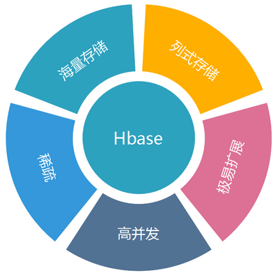

## Hbase基础

### 产生背景

自 1970 年以来，关系数据库用于数据存储和维护有关问题的解决方案。大数据的出现后， 好多公司实现处理大数据并从中受益，并开始选择像 Hadoop 的解决方案。Hadoop 使用分 布式文件系统，用于存储大数据，并使用 MapReduce 来处理。Hadoop 擅长于存储各种格式 的庞大的数据，任意的格式甚至非结构化的处理。

Hadoop 的限制

Hadoop 只能执行批量处理，并且只以顺序方式访问数据。这意味着必须搜索整个数据集， 即使是最简单的搜索工作。 当处理结果在另一个庞大的数据集，也是按顺序处理一个巨大的数据集。在这一点上，一个 新的解决方案，需要访问数据中的任何点（随机访问）单元。

Hadoop 随机存取数据库

应用程序，如 HBase，Cassandra，CouchDB，Dynamo 和 MongoDB 都是一些存储大量数据和 以随机方式访问数据的数据库。

总结：

（1）海量数据量存储成为瓶颈，单台机器无法负载大量数据

（2）单台机器 IO 读写请求成为海量数据存储时候高并发大规模请求的瓶颈

（3）随着数据规模越来越大，大量业务场景开始考虑数据存储横向水平扩展，使得存储服 务可以增加/删除，而目前的关系型数据库更专注于一台机器

### HBase简介

**HBase 是 BigTable 的开源（源码使用 Java 编写）版本。是 Apache Hadoop 的数据库，是建 立在 HDFS 之上，被设计用来提供高可靠性、高性能、列存储、可伸缩、多版本的 NoSQL 的分布式数据存储系统，实现对大型数据的实时、随机的读写访问。**

**HBase 依赖于 HDFS 做底层的数据存储，BigTable 依赖 Google GFS 做数据存储**

**HBase 依赖于 MapReduce 做数据计算，BigTable 依赖 Google MapReduce 做数据计算**

**HBase 依赖于 ZooKeeper 做服务协调，BigTable 依赖 Google Chubby 做服务协调**

NoSQL = NO SQL

NoSQL = Not Only SQL：会有一些把 NoSQL 数据的原生查询语句封装成 SQL，比如 HBase 就有 Phoenix 工具

### Hbase的特点

① 它介于 NoSQL 和 RDBMS 之间，**仅能通过主键(rowkey)和主键的 range 来检索数据**

② HBase 查询数据功能很简单，**不支持 join 等复杂操作**

③ 不支持复杂的事务，**只支持行级事务**(可通过 hive 支持来实现多表 join 等复杂操作)。

④ **HBase 中支持的数据类型：byte[]（底层所有数据的存储都是字节数组）**

⑤ **主要用来存储结构化和半结构化的松散数据。**

### 结构化、半结构化和非结构化

**结构化**：数据结构字段含义确定，清晰，典型的如数据库中的表结构

**半结构化**：具有一定结构，但语义不够确定，典型的如 HTML 网页，有些字段是确定的(title)， 有些不确定(table)

**非结构化**：杂乱无章的数据，很难按照一个概念去进行抽取，无规律性

与 Hadoop 一样，HBase 目标主要依靠横向扩展，通过不断增加廉价的商用服务器，来增加 计算和存储能力。

### HBase 中的表特点

1、**大**：一个表可以有上十亿行，上百万列

2、**面向列**：面向列(族)的存储和权限控制，列(簇)独立检索。

3、**稀疏**：对于为空(null)的列，并不占用存储空间，因此，表可以设计的非常稀疏。

4、**无模式**：每行都有一个可排序的主键和任意多的列，列可以根据需要动态的增加，同一 张表中不同的行可以有截然不同的列

###  HBase表结构逻辑视图

初次接触HBase，可能看到以下描述会懵：**“基于列存储”，“稀疏MAP”，“RowKey”,“ColumnFamily”。**

其实没那么高深，我们需要分两步来理解HBase, 就能够理解为什么HBase能够“快速地”“分布式地”处理“大量数据”了。

　　**1.内存结构**

　　**2.文件存储结构**

####  名词概念

##### Rowkey的概念

**Rowkey的概念和mysql中的主键是完全一样的，Hbase使用Rowkey来唯一的区分某一行的数据。**

由于Hbase只支持3中查询方式：

1、基于Rowkey的单行查询

2、基于Rowkey的范围扫描

3、全表扫描

因此，Rowkey对Hbase的性能影响非常大，Rowkey的设计就显得尤为的重要。设计的时候要兼顾基于Rowkey的单行查询也要键入Rowkey的范围扫描。具体Rowkey要如何设计后续会整理相关的文章做进一步的描述。这里大家只要有一个概念就是Rowkey的设计极为重要。

rowkey 行键可以是任意字符串(最大长度是 **64KB**，实际应用中长度一般为 10-100bytes)，最好是 16。在 HBase 内部，rowkey 保存为字节数组。**HBase 会对表中的数据按照 rowkey 排序 (字典顺序)**

##### Column的概念

列，可理解成MySQL列。

##### ColumnFamily的概念

列族, HBase引入的概念。

Hbase通过列族划分数据的存储，列族下面可以包含任意多的列，实现灵活的数据存取。就像是家族的概念，我们知道一个家族是由于很多个的家庭组成的。列族也类似，列族是由一个一个的列组成（任意多）。

Hbase表的创建的时候就必须指定列族。就像关系型数据库创建的时候必须指定具体的列是一样的。

Hbase的列族不是越多越好，官方推荐的是列族最好小于或者等于3。我们使用的场景一般是1个列族。

##### TimeStamp的概念

TimeStamp对Hbase来说至关重要，因为它是实现Hbase多版本的关键。在Hbase中使用不同的timestame来标识相同rowkey行对应的不通版本的数据。

HBase 中通过 rowkey 和 columns 确定的为一个存储单元称为 cell。每个 cell 都保存着同一份 数据的多个版本。版本通过时间戳来索引。时间戳的类型是 64 位整型。时间戳可以由 hbase(在数据写入时

自动)赋值，此时时间戳是精确到毫秒的当前系统时间。时间戳也可以由 客户显式赋值。如果应用程序要避免数据版本冲突，就必须自己生成具有唯一性的时间戳。 每个 cell 中，不同版本的数据按照时间

倒序排序，即最新的数据排在最前面。

为了避免数据存在过多版本造成的的管理 (包括存贮和索引)负担，hbase 提供了两种数据版 本回收方式：

　　**保存数据的最后 n 个版本**

　　**保存最近一段时间内的版本（设置数据的生命周期 TTL）。**

用户可以针对每个列簇进行设置。

##### 单元格（Cell）

由{rowkey, column( = + ), version} 唯一确定的单元。 Cell 中的数据是没有类型的，全部是字节码形式存贮。

