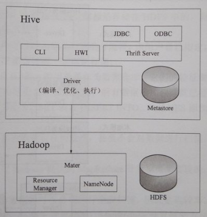

## 目录

**·** [概况](https://www.cnblogs.com/netoxi/p/7223092.html#%E6%A6%82%E5%86%B5)

**·** [手工安装](https://www.cnblogs.com/netoxi/p/7223092.html#%E6%89%8B%E5%B7%A5%E5%AE%89%E8%A3%85)

​    **·** [引言](https://www.cnblogs.com/netoxi/p/7223092.html#%E5%BC%95%E8%A8%80)

​    **·** [创建HDFS目录](https://www.cnblogs.com/netoxi/p/7223092.html#%E5%88%9B%E5%BB%BAHDFS%E7%9B%AE%E5%BD%95)

​    **·** [创建元数据库](https://www.cnblogs.com/netoxi/p/7223092.html#%E5%88%9B%E5%BB%BA%E5%85%83%E6%95%B0%E6%8D%AE%E5%BA%93)

​    **·** [配置文件](https://www.cnblogs.com/netoxi/p/7223092.html#%E9%85%8D%E7%BD%AE%E6%96%87%E4%BB%B6)

​    **·** [测试](https://www.cnblogs.com/netoxi/p/7223092.html#%E6%B5%8B%E8%AF%95)

**·** [原理](https://www.cnblogs.com/netoxi/p/7223092.html#%E5%8E%9F%E7%90%86)

​    **·** [架构](https://www.cnblogs.com/netoxi/p/7223092.html#%E6%9E%B6%E6%9E%84)

​    **·** [与关系型数据库对比](https://www.cnblogs.com/netoxi/p/7223092.html#%E4%B8%8E%E5%85%B3%E7%B3%BB%E5%9E%8B%E6%95%B0%E6%8D%AE%E5%BA%93%E5%AF%B9%E6%AF%94)

**·** [API](https://www.cnblogs.com/netoxi/p/7223092.html#API)

​    **·** [WordCount](https://www.cnblogs.com/netoxi/p/7223092.html#WordCount)

​    **·** [命令](https://www.cnblogs.com/netoxi/p/7223092.html#%E5%91%BD%E4%BB%A4)

​    **·** [数据类型](https://www.cnblogs.com/netoxi/p/7223092.html#%E6%95%B0%E6%8D%AE%E7%B1%BB%E5%9E%8B)

​    **·** [文件存储格式](https://www.cnblogs.com/netoxi/p/7223092.html#%E6%96%87%E4%BB%B6%E5%AD%98%E5%82%A8%E6%A0%BC%E5%BC%8F)

​    **·** [数据格式](https://www.cnblogs.com/netoxi/p/7223092.html#%E6%95%B0%E6%8D%AE%E6%A0%BC%E5%BC%8F)

​    **·** [数据库](https://www.cnblogs.com/netoxi/p/7223092.html#%E6%95%B0%E6%8D%AE%E5%BA%93)

​    **·** [数据表](https://www.cnblogs.com/netoxi/p/7223092.html#%E6%95%B0%E6%8D%AE%E8%A1%A8)

​    **·** [装载数据](https://www.cnblogs.com/netoxi/p/7223092.html#%E8%A3%85%E8%BD%BD%E6%95%B0%E6%8D%AE)

​    **·** [插入数据](https://www.cnblogs.com/netoxi/p/7223092.html#%E6%8F%92%E5%85%A5%E6%95%B0%E6%8D%AE)

​    **·** [导出数据](https://www.cnblogs.com/netoxi/p/7223092.html#%E5%AF%BC%E5%87%BA%E6%95%B0%E6%8D%AE)

​    **·** [查询数据](https://www.cnblogs.com/netoxi/p/7223092.html#%E6%9F%A5%E8%AF%A2%E6%95%B0%E6%8D%AE)

​    **·** [函数](https://www.cnblogs.com/netoxi/p/7223092.html#%E5%87%BD%E6%95%B0)

**·** [性能调优](https://www.cnblogs.com/netoxi/p/7223092.html#%E6%80%A7%E8%83%BD%E8%B0%83%E4%BC%98)

​    **·** [join调优](https://www.cnblogs.com/netoxi/p/7223092.html#join%E8%B0%83%E4%BC%98)

​    **·** [Reduce任务数](https://www.cnblogs.com/netoxi/p/7223092.html#Reduce%E4%BB%BB%E5%8A%A1%E6%95%B0)

​    **·** [合并小文件](https://www.cnblogs.com/netoxi/p/7223092.html#%E5%90%88%E5%B9%B6%E5%B0%8F%E6%96%87%E4%BB%B6)

​    **·** [multi-group-by insert和multiple insert](https://www.cnblogs.com/netoxi/p/7223092.html#multi-group-by%20insert%E5%92%8Cmultiple%20insert)

​    **·** [union all合并MapReduce](https://www.cnblogs.com/netoxi/p/7223092.html#union%20all%E5%90%88%E5%B9%B6MapReduce)

​    **·** [并行执行](https://www.cnblogs.com/netoxi/p/7223092.html#%E5%B9%B6%E8%A1%8C%E6%89%A7%E8%A1%8C)

​    **·** [Top N调优](https://www.cnblogs.com/netoxi/p/7223092.html#Top%20N%E8%B0%83%E4%BC%98)

------

 https://www.cnblogs.com/netoxi/p/7223092.html


## 概况

\1. 设计目标：让精通SQL而Java技能较弱的数据分析师能利用Hadoop数据分析。

\2. 使用率：实际开发中，80%操作使用Hive完成，20%使用MapReduce。

\3. 与MapReduce相比，Hive特点：稳定、代码精简、易于维护。

\4. HiveQL：未严格实现SQL-92标准。

\5. 本质：将HiveQL转化为一个或多个MapReduce作业并在集群上运行，但并不是所有HiveQL都会转为MapReduce作业。


## 手工安装


### 引言

\1. 假设已成功安装JDK、Hadoop集群及MySQL。

\2. 本次手工安装在Hadoop的Master节点上。

\3. 创建HDFS目录并分配权限。


### 创建HDFS目录

```
hadoop fs -mkdir /tmp
hadoop fs -mkdir /user/hive/warehouse
hadoop fs -chmod g+w /tmp
hadoop fs -chmod g+w /user/hive/warehouse
```


### 创建元数据库

\2. 创建MySQL元数据库。

```
create database hive character set latin1;
```

\3. 创建用户。

```
grant all on hive.* to 'hive'@'localhost' identified by 'hive';
grant all on hive.* to 'hive'@'%' identified by 'hive';
flush privileges;
```


### 配置文件

\4. 创建MySQL元数据库。

```
tar zxvf apache-hive-1.2.2-bin.tar.gz -C /opt/app
cp mysql-connector-java-5.1.42.jar /opt/app/apache-hive-1.2.2-bin/lib
cd /opt/app/apache-hive-1.2.2-bin
vi conf/hive-site.xml
```

[](javascript:void(0);)

```
<configuration>
<property>
<name>javax.jdo.option.ConnectionURL</name>
<value><![CDATA[jdbc:mysql://centos1:3306/hive?characterEncoding=latin1]]></value>
</property>
<property>
<name>javax.jdo.option.ConnectionDriverName</name>
<value>com.mysql.jdbc.Driver</value>
</property>
<property>
<name>javax.jdo.option.ConnectionUserName</name>
<value>hive</value>
</property>
<property>
<name>javax.jdo.option.ConnectionPassword</name>
<value>hive</value>
</property>
</configuration>
```

[](javascript:void(0);)


### 测试

\5. 配置环境变量。

```
vi /home/hadoop/.bash_profile
export HIVE_HOME=/opt/app/apache-hive-1.2.2-bin
export PATH=$PATH:$HIVE_HOME/bin
export HADOOP_USER_CLASSPATH_FIRST=true
source /home/hadoop/.bash_profile
env | grep HIVE_HOME
```

\6. 启动与测试。

```
hive
hive> show tables;
```


## 原理


### 架构

\1. 访问接口：CLI（命令行）、HWI（Hive网络界面）、Thrift Server提供的JDBC和ODBC。

\2. Driver职责：通过访问接口提交的命令，由Driver模块解释和编译，对计算优化，生成执行计划执行，执行计划由若干MapReduce作业组成。

\3. Metastore：Hive元数据存储，通常是关系型数据库（例如MySQL、PostgreSQL、Oracle）。

\4. 部署：Hive通过与YARN通信来执行MapReduce作业，所以Hive无需部署在YARN集群。




### 与关系型数据库对比

|                  | **Hive**  | **RDBMS**                |
| ---------------- | --------- | ------------------------ |
| **查询语言**     | HiveQL    | SQL                      |
| **数据存储位置** | HDFS      | Raw Device或本地文件系统 |
| **数据格式**     | 用户定义  | 系统决定                 |
| **数据更新**     | 不支持    | 支持                     |
| **索引**         | 无        | 有                       |
| **执行**         | MapReduce | Executor                 |
| **执行延迟**     | 高        | 低                       |
| **伸缩性**       | 高        | 低                       |
| **数据规模**     | 大        | 小                       |
| **事务**         | 无        | 一般有                   |


## API


### WordCount

[](javascript:void(0);)

```
create table wordcount_in (
  line string
);
load data local inpath '/opt/app/apache-hive-1.2.2-bin/LICENSE' overwrite into table wordcount_in;
create table wordcount_out as
select word, count(1) as count
from (
  select explode(split(line, ' ')) as word
  from wordcount_in
) words
group by word
order by word;
select * from wordcount_out;
```

[](javascript:void(0);)


### 命令

\1. hive命令

​    a) [官方文档](https://cwiki.apache.org/confluence/display/Hive/LanguageManual+Cli)

​    b) 示例

```
hive -e 'select * from wordcount_out'
hive -f hive-script.sql
```

\2. beeline命令

​    a) [官方文档](https://www.cnblogs.com/netoxi/p/7223092.html#HiveServer2Clients-Beeline%E2%80%93NewCommandLineShell)


### 数据类型

\1. 基本数据类型

| **数据类型** | **长度**            | **示例** |
| ------------ | ------------------- | -------- |
| tinyint      | 1字节，有符号整数   | 11       |
| smallint     | 2字节，有符号整数   | 11       |
| int          | 4字节，有符号整数   | 11       |
| bigint       | 8字节，有符号整数   | 11       |
| float        | 4字节，单精度浮点数 | 11.0     |
| double       | 8字节，双精度浮点数 | 11.0     |
| boolean      | 布尔值              | TRUE     |
| string       | 字符串              | 'hadoop' |

 \2. 复杂数据类型

| **数据类型** | **长度**                                                     | **示例**                                          |
| ------------ | ------------------------------------------------------------ | ------------------------------------------------- |
| struct       | 结构体，可通过“列名.属性名”访问，如struct(first_name string, last_name string) | struct('Harry', 'Potter')                         |
| map          | 键值对集合，可通过“列名.键”访问                              | map('first_name', 'Harry', 'last_name', 'Potter') |
| array        | 数组，即相同数据类型的变量集合，可通过“列名[索引]”访问（索引从0开始） | array('Harry', 'Potter')                          |

\3. 更多数据类型参考[官方文档](https://cwiki.apache.org/confluence/display/Hive/LanguageManual+Types)。


### 文件存储格式

\1. textfile

​    a) 原理：平面文本文件，默认格式。

​    b) 特点：未压缩，磁盘开销大，数据解析开销大。

\2. sequencefile

​    a) 原理：二进制格式。

​    b) 特点：使用方便、可分割、可压缩，数据按行切分。

\3. rcfile

​    a) 原理：行列存储结合的存储方式。

​    b) 特点：数据按行分块，保证同一行数据在一个块上，避免读取一行需要读取多个块。

\4. parquet

​    a) 原理：面向分析性业务的列式存储格式。

​    b) 特点：对Impala有显著性能提升。


### 数据格式

\1. 默认使用少用字符作为分隔符

| **分隔符**   | **描述**                                              |
| ------------ | ----------------------------------------------------- |
| \n           | 换行符，默认行分隔符                                  |
| ^A（Ctrl+A） | 在文本中以八进制编码\001表示，列分隔符                |
| ^B（Ctrl+B） | 在文本中以八进制编码\002表示，array、struct元素分隔符 |
| ^C（Ctrl+C） | 在文本中以八进制编码\003表示，map键值对分隔符         |

\2. 自定义（此处仍然使用默认分隔符）

[](javascript:void(0);)

```
create table test_table (
  test_string string,
  test_int int,
  test_array array<string>,
  test_struct struct<test_struct_string:string, test_struct_int:int>,
  test_map map<string, int>
)
row format delimited
fields terminated by '\001'
collection items terminated by '\002'
map keys terminated by '\003'
lines terminated by '\n'
stored as textfile;
```

[](javascript:void(0);)


### 数据库

\1. 本质：表的目录或命名空间。

\2. 场景：生产环境如果表较多，则一般使用数据库将表逻辑分组。

\3. 默认数据库：default。

\4. 存储结构

​    a) 库：一个HDFS目录，如test_database其他为/user/hive/warehouse/test_database.db。

​    b) 表：数据库HDFS目录的子目录。

​    c) default库：HDFS目录/user/hive/warehouse。

\5. 查看

```
show databases;
describe database test_database;
```

\6. 创建

```
create database test_database;
create database test_database location '/test/hive/test_database';
```

\7. 切换

```
use test_database;
```

\8. 删除

```
drop database test_database;
drop database if exists test_database; -- 避免不存在引起的错误
drop database test_database cascade; -- 其中的表一起删除（默认不允许删除非空数据库）
```


### 数据表

\1. 管理表：managed table，数据完全由Hive管理。

\2. 外部表：external table，数据除Hive管理外，还会有其他分析工具管理，如Pig。

\3. 管理表与外部表区别

​    a) 删除：删除管理表会删除元数据及其数据；删除外部表仅删除元数据。

​    b) 注意：创建表时是否指定location，管理表、外部表并无区别。

\4. 分区表

​    a) 含义：将表水平切分，数据按某种规则存储。

​    b) 分区字段报错：分区字段不能与表定义字段同名，否则报错“Column repeated in partitioning columns”。

​    c) 存储目录

```
/user/hive/warehouse/test_order/year=1999/month=11
/user/hive/warehouse/test_order/year=1999/month=12
/user/hive/warehouse/test_order/year=2000/month=01
/user/hive/warehouse/test_order/year=2000/month=02
/user/hive/warehouse/test_order/year=2000/month=03
```

​    d) 查询性能：查询大数据集时，根据分区字段查询，仅扫描分区目录下的数据，性能比非分区表的全表扫描有显著提升。

```
select * from test_order where year = '2000' and month = '01';
```

​    e) 常用分区字段：生产环境常按创建时间或修改时间分区。

​    f) strict模式：如果针对分区表的查询未对分区限制，则禁止提交；修改hive-site.xml参数“hive.mapred.mode”为strict。

\5. 查看

​    a) 表

```
show tables;
show tables in test_database; -- 指定数据库
desc test_table; -- 表结构
desc extended test_table; -- 表级别信息
desc formatted test_table; -- 表级别信息
```

​    b) 分区

```
show partitions test_order;
```

\6. 创建

​    a) 管理表

[](javascript:void(0);)

```
create table if not exists test_table (
  test_string string,
  test_int int
)
location '/test/hive/test_table';
create table test_table_bak1 like test_table; -- 复制表结构，不复制数据
create table test_table_bak2 as select test_string from test_table;
```

[](javascript:void(0);)

​    b) 外部表

```
create external table test_table (
  test_string string,
  test_int int
);
```

​    c) 分区表

```
create table test_order (
  order_no string,
  balance double
)
partitioned by (year string, month string);
```

\7. 删除

```
drop table test_table;
drop table if exists test_table;
```

\8. 修改

​    a) 重命名

```
alter table test_table rename to test_table_new;
```

​    b) 增加分区 

```
alter table test_order add partition (year='2000', month='04');
alter table test_order add partition (year='2000', month='05') location '/test/hive/test_order/year=2000/month=05';
```

​    c) 修改分区路径

```
alter table test_order add partition (year='2000', month='05') set location '/test_order/year=2000/month=05';
```

​    d) 删除分区

```
alter table test_order drop partition (year='2000', month='04');
```

​    e) 修改列

```
alter table test_table change column test_int test_double double comment 'new column' after test_string;
```

​    f) 增加列

```
alter table test_table add columns (
  test_long long,
  test_float float
);
```

​    g) 重定义列

```
alter table test_table replace columns (col1 string, col2 string, col3 string);
```


### 装载数据

\1. 以追加方式将HDFS文件移动到表

```
load data inpath '/test/data' into table test_table;
```

\2. 以覆盖方式将HDFS文件移动到表

```
load data inpath '/test/data' overwrite into table test_table;
```

\3. 以追加方式将本地文件复制到表

```
load data local inpath '/opt/test/data' into table test_table;
```

\4. 以覆盖方式将本地文件复制到表

```
load data local inpath '/opt/test/data' overwrite into table test_table;
```


### 插入数据

\1. 以覆盖方式插入非分区表

```
insert overwrite table test_table select * from test_source;
```

\2. 以覆盖方式插入分区表

```
insert overwrite table test_order partition (year='2000', month='05') select * from test_source;
```

\3. 以追加方式插入非分区表

```
insert into table test_table select * from test_source;
```

\4. 以追加方式插入分区表

```
insert into table test_order partition (year='2000', month='05') select * from test_source;
```

\5. multiple insert

```
from test_source
insert into table test_order partition (year='2000', month='05') select order_no, balance where order_no >= '0001' and order_no < '1000'
insert into table test_order partition (year='2000', month='06') select order_no, balance where order_no >= '1000' and order_no < '5000'
insert overwrite table test_order partition (year='2000', month='07') select order_no, balance where order_no >= '5000' and order_no < '9000';
```

\6. 动态分区插入

​    a) 含义：Hive根据查询结果最后几个字段作为分区字段自动创建分区并插入数据，这些字段需与分区字段顺序一致。

​    b) 参数

| **Configuration Property**               | **Default** | **Note**                                                     |
| ---------------------------------------- | ----------- | ------------------------------------------------------------ |
| hive.exec.dynamic.partition              | true        | Whether or not to allow dynamic partitions in DML/DDL.       |
| hive.exec.dynamic.partition.mode         | strict      | In strict mode, the user must specify at least one static partition in case the user accidentally overwrites all partitions. In nonstrict mode all partitions are allowed to be dynamic. |
| hive.exec.max.dynamic.partitions.pernode | 100         | Maximum number of dynamic partitions allowed to be created in each mapper/reducer node. |
| hive.exec.max.dynamic.partitions         | 1000        | Maximum number of dynamic partitions allowed to be created in total. |
| hive.exec.max.created.files              | 100000      | Maximum number of HDFS files created by all mappers/reducers in a MapReduce job. |
| hive.error.on.empty.partition            | false       | Whether to throw an exception if dynamic partition insert generates empty results. |

​    c) 示例

```
from page_view_stg pvs
insert overwrite table page_view partition(dt='2008-06-08', country)
select pvs.viewTime, pvs.userid, pvs.page_url, pvs.referrer_url, null, null, pvs.ip, pvs.cnt;
```


### 导出数据

\1. 导出到HDFS

```
insert overwrite directory '/test/hive/data' select * from test_table;
```

\2. 导出到本地磁盘

```
insert overwrite local directory '/opt/test/data' select * from test_table;
```


### 查询数据

\1. select...from...

```
select test_string, test_int from test_table;
```

​    a) 表别名

```
select t.test_string, t.test_int from test_table t;
```

​    b) 嵌套查询

```
select s.name, sc.course from (select id, name from student_info) s join (select id, course from student_class_info) sc on s.id = sc.id;
```

​    c) 限制返回行数

```
select * from test_table limit 100;
```

​    d) case...when...then...

```
select id, name, case when gender = 'm' then '男' when gender = 'f' then '女' else '保密' end
from student_info;
```

\2. where

```
select * from student_info where gender = 'm';
```

\3. group by与having

```
select gender, count(id) from student_info group by gender;
```

\4. inner join

```
select s.id, s.name from student_info s inner join student_class_info sc on s.id = sc.id;
select *
from t1
join t2 on t1.id = t2.id
join t3 on t1.id = t3.id;
```

\5. left outer join

```
select s.id, s.name from student_info s left outer join student_class_info sc on s.id = sc.id;
```

\6. right outer join

```
select s.id, s.name from student_info s right outer join student_class_info sc on s.id = sc.id;
```

\7. full outer join

```
select s.id, s.name from student_info s full outer join student_class_info sc on s.id = sc.id;
```

\8. left-semi join

​    a) left-semi join效果：如果左表数据对于右表满足on条件，则返回左表数据。

​    b) left-semi join场景：替代标准SQL的in操作。Hive**不支持**如下in操作：

```
select s.id, s.name from student_info s where s.id in (select sc.id from student_class_info sc);
```

​    c) left-semi join原理：当左表的一条数据一旦满足右表的on条件，则停止扫描该左表数据对应的右表，所以left-semi join效率高于inner join。

​    d) 示例：效果相同，但前者效率高于后者。

```
select s.id, s.name from student_info s left semi join student_class_info sc on s.id = sc.id;
select s.id, s.name from student_info s inner join student_class_info sc on s.id = sc.id;
```

\9. map-side join

​    a) map-side join原理：如果有一张小表，则将该小表加载到内存，直接在map阶段进行join，效率大大提升。

​    b) 非map-side join原理：通过在reduce阶段求笛卡尔积进行join，效率相对较低。

​    c) 示例

```
select /*+ mapjoin(s) */ s.name, sc.course from student_info s join student_class_info sc on s.id = sc.id;
```

\10. order by与sort by

​    a) order by：全局有序。

​    b) sort by：每个Reduer局部有序。

​    c) 示例

```
select * from student_info order by id asc, name desc;
select * from student_info sort by id asc, name desc;
```

\11. distribute by与cluster by

​    a) distribute by：相当于MapReduce的Partitioner，即控制中间结果分发的目的Reducer。

​    b) cluster by：如果distribute by和sort by的列相同且正序，可用cluster by替代。

​    c) 示例

```
select * from student_info distribute by id sort by id asc, name desc;
```

\12. 抽样

​    a) 公式： “bucket x out of y on z”，根据z列的哈希值将数据分为y桶，取其中第x桶。

​    b) 分桶抽样

```
select * from student_info tablesample(bucket 3 out of 10 on id);
```

​    c) 随机抽样

```
select * from student_info tablesample(bucket 3 out of 10 on rand());
```

\13. union all

​    a) 注意：Hive不支持直接union all，须嵌套查询。

​    b) 示例

[](javascript:void(0);)

```
select s.id, s.name
from (
  select s1.id, s1.name from student_info s1
  union all
  select s2.id, s2.name from student_info s2
) s;
```

[](javascript:void(0);)


### 函数

\1. 标准函数

​    a) 含义：操作一行数据，产生一个值。

​    b) 内置函数参考[官方文档](https://www.cnblogs.com/netoxi/p/7223092.html#LanguageManualUDF-Built-inFunctions)。

\2. 聚合函数

​    a) 含义：操作多行数据，产生一个值。

​    b) 内置函数参考[官方文档](https://www.cnblogs.com/netoxi/p/7223092.html#LanguageManualUDF-Built-inAggregateFunctions(UDAF))。

\3. 表生成函数

​    a) 含义：操作一行数据，产生多行数据。

​    b) 内置函数参考[官方文档](https://www.cnblogs.com/netoxi/p/7223092.html#LanguageManualUDF-Built-inTable-GeneratingFunctions(UDTF))。

\4. 自定义函数开发

​    a) Maven依赖

[](javascript:void(0);)

```
<dependency>
    <groupId>org.apache.hive</groupId>
    <artifactId>hive-exec</artifactId>
    <version>1.2.2</version>
</dependency>
<dependency>
    <groupId>org.apache.hadoop</groupId>
    <artifactId>hadoop-client</artifactId>
    <version>2.6.5</version>
</dependency>
```

[](javascript:void(0);)

​    b) 使用方法：注册jar文件“add jar /opt/test/test-hive.jar;”；创建函数“create temporary function concat_udf as 'hive.ConcatUDF';”；查看“show functions”。

\5. 自定义标准函数（UDF）

​    a) 方法：继承UDF，并实现evaluate()方法（不是Override，因为无法预知参数）。

​    b) 示例

[](javascript:void(0);)

```
 1 package hive;
 2 
 3 import org.apache.hadoop.hive.ql.exec.UDF;
 4 import org.apache.hadoop.io.Text;
 5 
 6 public class ConcatUDF extends UDF {
 7     
 8     private Text result = new Text();
 9 
10     public Text evaluate(Text str1, Text str2) {
11         if (str1 == null || str2 == null) {
12             return null;
13         }
14         result.set(str1.toString() + str2.toString());
15         return result;
16     }
17     
18 }
```

[](javascript:void(0);)

\6. 自定义聚合函数（UDAF）。

\7. 自定义表生成函数（UDTF）。


## 性能调优


### join调优

\1. 大表置右：大表放在join右边，性能更好。

\2. map-side join：如果小表可加载到内存，则考虑map-side join。


### Reduce任务数

\1. 原理：与mapred-site.xml的mapreduce.job.reduces参数原理相同，设置为0.95×NodeManager节点数或1.75×NodeManager节点数。

\2. 调优：reduce任务数 = min(hive.exec.reducers.max参数值, 总输入数据量 ÷ hive.exec.reducers.bytes.per.reducer参数值)。

​    a) hive.exec.reducers.bytes.per.reducer

​        i. 默认值：256000000

​        ii. 官方描述：size per reducer.The default is 256Mb, i.e if the input size is 1G, it will use 4 reducers.

​    b) hive.exec.reducers.max

​        i. 默认值：1009

​        ii. 官方描述：max number of reducers will be used. If the one specified in the configuration parameter mapred.reduce.tasks is negative, Hive will use this one as the max number of reducers when automatically determine number of reducers.


### 合并小文件

\1. 原理：文件数目过多给HDFS带来压力，通过合并map和reduce阶段输出文件减少文件数。

\2. 调优

​    a) hive.merge.mapfiles：合并map阶段输出文件，默认true。

​    b) hive.merge.mapredfiles：合并reduce阶段输出文件，默认false。

​    c) hive.merge.size.per.task：合并后文件大小，默认256000000。


### multi-group-by insert和multiple insert

\1. 原理：multi-group-by insert和multiple insert在同一条语句使用多个不相交的insert语句，只需一次全表扫描，效率高于多个insert。

\2. multi-group-by insert示例

```
from test_source
insert into table test_target select a, count(e) group by a
insert into table test_target select b, count(f) group by b
insert overwrite table test_target select c, count(g) group by c;
```

\3. multiple insert示例：见插入数据。


### union all合并MapReduce

\1. union all可合并执行多个MapReduce作业。

\2. 调优前：执行3个MapReduce。

[](javascript:void(0);)

```
select *
from (
  select * from t1 group by c1, c2, c3
  union all
  select * from t2 group by c1, c2, c3
) t
group by c1, c2, c3;
```

[](javascript:void(0);)

\3. 调优后：执行1各MapReduce。

[](javascript:void(0);)

```
select *
from (
  select * from t1
  union all
  select * from t2
) t
group by c1, c2, c3;
```

[](javascript:void(0);)


### 并行执行

\1. 原理：一个HiveQL被拆分为多个MapReduce作业，如果作业之间相互独立、无依赖，则可并行执行。

\2. 调优：设置hive.exec.parallel为true（默认false），即开启并行执行。


### Top N调优

\1. 原理

​    a) 调优前：如果使用order by...limit n，则执行1个作业，所有数据集中到一个reduce任务排序。

​    b) 调优后：如果使用sort by...limit n，则执行2个作业，第1个作业M个reduce任务局部排序，分别求Top N，第2个作业reduce任务接收M×N条数据排序求Top N。

 

作者：netoxi
出处：<http://www.cnblogs.com/netoxi>
本文版权归作者和博客园共有，欢迎转载，未经同意须保留此段声明，且在文章页面明显位置给出原文连接。欢迎指正与交流。

 