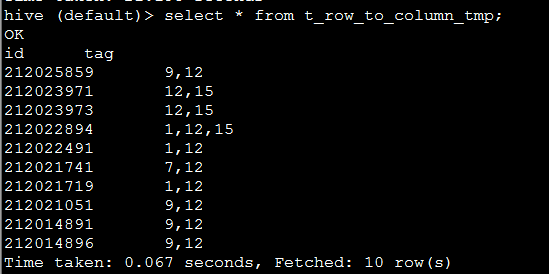
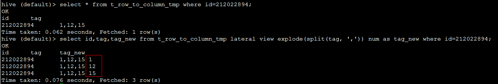
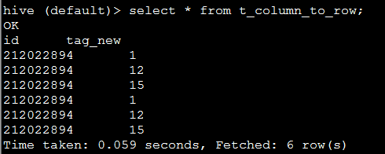
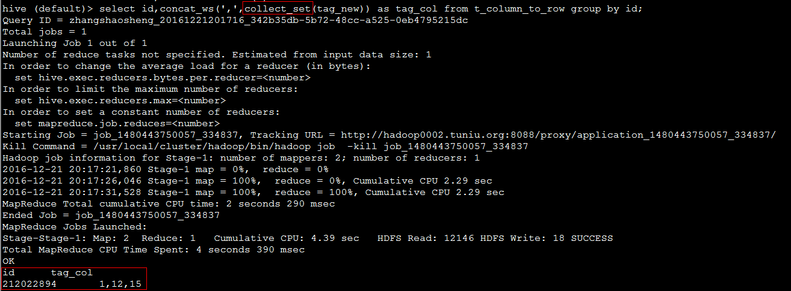
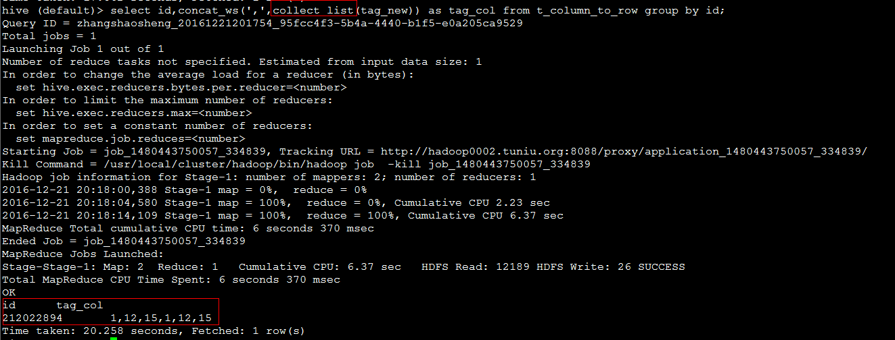

## hive行列转换

**一、列转行** (对某列拆分，一列拆多行)

使用函数：lateral view explode(split(column, ',')) num

eg: 如表：t_row_to_column_tmp 数据如下，对tag列进行拆分



SQL代码：

```sql
select id,tag,tag_new from t_row_to_column lateral view explode(split(tag, ',')) num as tag_new
where id=212022894;
```



**二、行转列** (根据主键，进行多行合并一列)

使用函数：concat_ws(',',collect_set(column))  

说明：collect_list 不去重，collect_set 去重。 column 的数据类型要求是 string

eg：如表：t_column_to_row ，根据id，对tag_new 进行合并



SQL代码1：

```sql
select id, concat_ws(',',collect_set(tag_new)) as tag_col
from t_column_to_row group by id;
```



SQL代码2：

```sql
select id, concat_ws(',',collect_list(tag_new)) as tag_col 
from t_column_to_row group by id;
```




```
user_id   order_id
104399    1715131
104399    2105395
104399    1758844
104399    981085
104399    2444143
104399    1458638
104399    968412
104400    1609001
104400    2986088
104400    1795054
```

```sql
select user_id,concat_ws(',',collect_list(order_id)) as order_value 
from t_row_to_column group by user_id;
```

总结

使用函数：concat_ws(',',collect_set(column))  

说明：collect_list 不去重，collect_set 去重。 column的数据类型要求是string


```
user_id   order_value
104408    2909888,2662805,2922438,674972,2877863,190237
104407    2982655,814964,1484250,2323912,2689723,2034331,1692373,677498,156562,2862492,338128
104406    1463273,2351480,1958037,2606570,3226561,3239512,990271,1436056,2262338,2858678
104405    153023,2076625,1734614,2796812,1633995,2298856,2833641,3286778,2402946,2944051,181577,464232
104404    1815641,108556,3110738,2536910,1977293,424564
104403    253936,2917434,2345879,235401,2268252,2149562,2910478,375109,932923,1989353
104402    3373196,1908678,291757,1603657,1807247,573497,1050134,3402420
104401    814760,213922,2008045,3305934,2130994,1602245,419609,2502539,3040058,2828163,3063469
104400    1609001,2986088,1795054,429550,1812893
104399    1715131,2105395,1758844,981085,2444143,1458638,968412
```

```sql
select user_id,order_id from t_column_to_row 
lateral view explode(split(order_value,',')) num as order_id;
```

