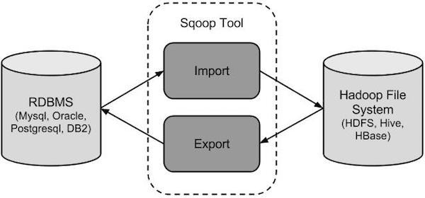

## sqoop

### 一、概述

sqoop 是 apache 旗下一款“Hadoop 和关系数据库服务器之间传送数据”的工具。

核心的功能有两个：

导入、迁入

导出、迁出

**导入数据**：MySQL，Oracle 导入数据到 Hadoop 的 HDFS、HIVE、HBASE 等数据存储系统

**导出数据**：从 Hadoop 的文件系统中导出数据到关系数据库 mysql 等 Sqoop 的本质还是一个命令行工具




### 二、工作机制

将导入或导出命令翻译成MapReduce程序来实现，在翻译出的MapReduce中主要是对 InputFormat 和 OutputFormat 进行定制

### 三、安装

1、上传解压缩安装包到指定目录

2、进入到 conf 文件夹，找到 sqoop-env-template.sh，修改其名称为 sqoop-env.sh

3、修改 sqoop-env.sh

```shell
#Set path to where bin/hadoop is available
export HADOOP_COMMON_HOME=/home/bigdata/hadoop-2.8.5

#Set path to where hadoop-*-core.jar is available
export HADOOP_MAPRED_HOME=/home/bigdata/hadoop-2.8.5

#set the path to where bin/hbase is available
export HBASE_HOME=/home/bigdata/hbase-1.3.1

#Set the path to where bin/hive is available
export HIVE_HOME=/home/bigdata/hive-2.3.4
```

在sqoop-env.sh 文件中会要求分别进行 common和mapreduce的配置：

在apache的hadoop的安装中；四大组件都是安装在同一个hadoop_home中的。但是在CDH, HDP中， 这些组件都是可选的。在安装hadoop的时候，可以选择性的只安装HDFS或者YARN，CDH,HDP在安装hadoop的时候，会把HDFS和MapReduce有可能分别安装在不同的地方。

4、加入 mysql 驱动包到 sqoop1.4.6/lib 目录下

5、配置系统环境变量

```shell
export SQOOP_HOME=/home/hadoop/apps/sqoop-1.4.7
export PATH=$PATH:$SQOOP_HOME/bin
```

6、验证安装是否成功

**sqoop-version** 或者 **sqoop version**

### 四、Sqoop的基本命令

```shell
#
sqoop help
#
./sqoop help import
# 测试连接是否正常
./sqoop list-databases --connect jdbc:mysql://10.10.10.2:3306 \
--username root --password denlaku
# 导入数据至hdfs
./sqoop import -m 1 --connect jdbc:mysql://10.10.10.2:3306/sqoop \
--username root --password denlaku  --table t_user --target-dir /sqoop/user

# 导入数据至数据库表
./sqoop export -m 1 --connect jdbc:mysql://10.10.10.2:3306/sqoop \
--username root --password denlaku --table t_user --export-dir /input/sqoop/sqoop.txt \
--fields-terminated-by ' '
```


