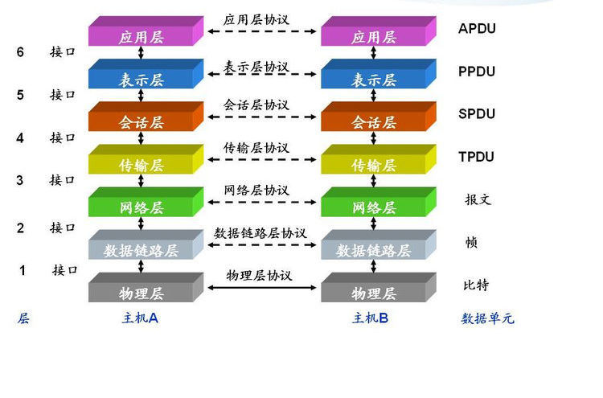

# keepalived+nginx高可用架构

### LVS

LVS是Linux Virtual Server的简写，意即Linux虚拟服务器，是一个虚拟的服务器集群系统。本项目在1998年5月由章文嵩博士成立，是中国国内最早出现的自由软件项目之一。目前有三种IP负载均衡技术（VS/NAT、VS/TUN和VS/DR），十种调度算法（rrr|wrr|lc|wlc|lblc|lblcr|dh|sh|sed|nq）

https://blog.csdn.net/weixin_40470303/article/details/80541639

LVS在社区具有很大的热度，是一个基于四层、具有强大性能的反向代理服务器。
早期使用lvs需要修改内核才能使用，但是由于性能优异，现在已经被收入内核

LVS通过工作于内核的ipvs模块来实现功能，其主要工作于netfilter 的INPUT链上。而用户需要对ipvs进行操作配置则需要使用ipvsadm这个工具。ipvsadm主要用于设置lvs模型、调度方式以及指定后端主机。

### keepalived

Keepalived是一款高可用软件，它的功能主要包括两方面：
1）通过IP漂移，实现服务的高可用：服务器集群共享一个虚拟IP，同一时间只有一个服务器占有虚拟IP并对外提供服务，若该服务器不可用，则虚拟IP漂移至另一台服务器并对外提供服务；
2）对LVS应用服务层的应用服务器集群进行状态监控：若应用服务器不可用，则keepalived将其从集群中摘除，若应用服务器恢复，则keepalived将其重新加入集群中。

Keepalived可以单独使用，即通过IP漂移实现服务的高可用，也可以结合LVS使用，即一方面通过IP漂移实现LVS负载均衡层的高可用，另一方面实现LVS应用服务层的状态监控，如图所示：

### keepalived 原理

Keepalived的实现基于VRRP（Virtual Router Redundancy Protocol，虚拟路由器冗余协议），而VRRP是为了解决静态路由的高可用

虚拟路由器由多个VRRP路由器组成，每个VRRP路由器都有各自的IP和共同的VRID(0-255)，其中一个VRRP路由器通过竞选成为MASTER，占有VIP，对外提供路由服务，其他成为BACKUP，MASTER以IP组播（组播地址：224.0.0.18）形式发送VRRP协议包，与BACKUP保持心跳连接，若MASTER不可用（或BACKUP接收不到VRRP协议包），则BACKUP通过竞选产生新的MASTER并继续对外提供路由服务，从而实现高可用。

### nginx

Nginx（发音同engine x）是一个网页服务器，它能反向代理HTTP, HTTPS, SMTP, POP3, IMAP的协议链接，以及一个负载均衡器和一个HTTP缓存。

Nginx主要用来做七层负载均衡。



### 负载均衡

四层负载均衡工作在OSI模型的传输层，由于在传输层，只有TCP/UDP协议，这两种协议中除了包含源IP、目标IP以外，还包含源端口号及目的端口号。四层负载均衡服务器在接受到客户端请求后，以后通过修改数据包的地址信息（IP+端口号）将流量转发到应用服务器。

七层负载均衡工作在OSI模型的应用层，应用层协议较多，常用http、radius、dns等。七层负载就可以基于这些协议来负载。这些应用层协议中会包含很多有意义的内容。比如同一个Web服务器的负载均衡，除了根据IP加端口进行负载外，还可根据七层的URL、浏览器类别、语言来决定是否要进行负载均衡。

四层通过虚拟 IP + 端口接收请求，然后再分配到真实的服务器，七层通过虚拟的 URL 或主机名接收请求，然后再分配到真实的服务器。所谓的四到七层负载均衡，就是在对后台的服务器进行负载均衡时，依据四层的信息或七层的信息来决定怎么样转发流量。

### LVS 和 Nginx 区别

1.lvs工作在第4层，负载能力强，逻辑简单，能对几乎所有应用进行负载，包括web和数据库；nginx工作在第7层，适用场合远多于lvs，负载能力相对较差。

2.lvs对网络稳定性依赖比较大；Nginx对网络的依赖比较小，理论上只要Ping得通，网页访问正常就能连通。

3.Nginx可以通过服务器处理网页返回的状态码、超时等来检测服务器内部的故障，并会把返回错误的请求重新发送到另一个节点；目前LVS和LDirectd 也支持对服务器内部情况的监控，但不能重新发送请求。

4.Nginx安装和配置比较简单，测试起来比较方便，它基本能把错误用日志打印出来；LVS的配置、测试耗时较长。

5.每日PV1000万以下或并发请求1万以下都可以考虑用Nginx；构建大型网站或者提供重要服务且机器较多时，可多加考虑利用LVS。

### 搭建准备

1、关闭防火墙
关闭所有服务器防火墙
firewall-cmd --state
systemctl stop firewalld.service
firewall-cmd --state
systemctl disable firewalld.service

2、关闭防selinux
关闭4台服务器selinux，修改/etc/selinux/config，将SELINUX由enforcing设置为disabled，重启服务器。
临时关闭：setenforce 0	临时开启：setenforce 1
查看selinux状态：
getenforce

3、ipvs安装
LVS无需安装，安装的是管理工具，第一种叫ipvsadm，第二种叫keepalive。ipvsadm是通过命令行管理，而keepalive读取配置文件管理。
分别在lvs01和lvs02执行如下操作：
yum -y install ipvsadm
把ipvsadm模块加载进系统
ipvsadm
lsmod | grep ip_vs

4、keepalived安装
分别在lvs01和lvs02执行如下操作：
yum -y install keepalived

5、keepalived配置
lvs01：more /etc/keepalived/keepalived.conf

```shell
! Configuration File for keepalived
global_defs {
   router_id lvs01          #router_id 机器标识，通常为hostname，但不一定非得是hostname。故障发生时，邮件通知会用到。
}
vrrp_instance VI_1 {            #vrrp实例定义部分
    state MASTER               #设置lvs的状态，MASTER和BACKUP两种，必须大写 
    interface ens33               #设置对外服务的接口
    virtual_router_id 100        #设置虚拟路由标示，这个标示是一个数字，同一个vrrp实例使用唯一标示 
    priority 100               #定义优先级，数字越大优先级越高，在一个vrrp——instance下，master的优先级必须大于backup
    advert_int 1              #设定master与backup负载均衡器之间同步检查的时间间隔，单位是秒
    authentication {           #设置验证类型和密码
        auth_type PASS         #主要有PASS和AH两种
        auth_pass 1111         #验证密码，同一个vrrp_instance下MASTER和BACKUP密码必须相同
    }
    virtual_ipaddress {         #设置虚拟ip地址，可以设置多个，每行一个
        172.27.9.100 
    }
}
virtual_server 172.27.9.100 81 {       #设置虚拟服务器，需要指定虚拟ip和服务端口
    delay_loop 6                 #健康检查时间间隔
    lb_algo wrr                  #负载均衡调度算法
    lb_kind DR                   #负载均衡转发规则
    persistence_timeout 50        #设置会话保持时间，对动态网页非常有用
    protocol TCP               #指定转发协议类型，有TCP和UDP两种
    real_server 172.27.9.91 81 {    #配置服务器节点1，需要指定real server的真实IP地址和端口
    weight 1               #设置权重，数字越大权重越高
    TCP_CHECK {              #realserver的状态监测设置部分单位秒
       connect_timeout 10       #连接超时为10秒
       retry 3             #重连次数
       delay_before_retry 3        #重试间隔
       connect_port 81         #连接端口为81，要和上面的保持一致
       }
    }
     real_server 172.27.9.92 81 {    #配置服务器节点1，需要指定real server的真实IP地址和端口
     weight 1                  #设置权重，数字越大权重越高
     TCP_CHECK {               #realserver的状态监测设置部分单位秒
       connect_timeout 10         #连接超时为10秒
       retry 3               #重连次数
       delay_before_retry 3        #重试间隔
       connect_port 81          #连接端口为81，要和上面的保持一致
       }
     }
}
```

lvs02：more /etc/keepalived/keepalived.conf

```shell
! Configuration File for keepalived
global_defs {
   router_id lvs02          #router_id 机器标识，通常为hostname，但不一定非得是hostname。故障发生时，邮件通知会用到。
}
vrrp_instance VI_1 {            #vrrp实例定义部分
    state BACKUP              #设置lvs的状态，MASTER和BACKUP两种，必须大写 
    interface ens33           #设置对外服务的接口
    virtual_router_id 100         #设置虚拟路由标示，这个标示是一个数字，同一个vrrp实例使用唯一标示 
    priority 99             #定义优先级，数字越大优先级越高，在一个vrrp——instance下，master的优先级必须大于backup
    advert_int 1              #设定master与backup负载均衡器之间同步检查的时间间隔，单位是秒
    authentication {            #设置验证类型和密码
        auth_type PASS         #主要有PASS和AH两种
        auth_pass 1111         #验证密码，同一个vrrp_instance下MASTER和BACKUP密码必须相同
    }
    virtual_ipaddress {         #设置虚拟ip地址，可以设置多个，每行一个
        172.27.9.100 
    }
}
virtual_server 172.27.9.100 81 {      #设置虚拟服务器，需要指定虚拟ip和服务端口
    delay_loop 6             #健康检查时间间隔
    lb_algo wrr              #负载均衡调度算法
    lb_kind DR               #负载均衡转发规则
    persistence_timeout 50          #设置会话保持时间，对动态网页非常有用
    protocol TCP              #指定转发协议类型，有TCP和UDP两种
    real_server 172.27.9.91 81 {       #配置服务器节点1，需要指定real server的真实IP地址和端口
    weight 1                #设置权重，数字越大权重越高
    TCP_CHECK {              #realserver的状态监测设置部分单位秒
       connect_timeout 10         #连接超时为10秒
       retry 3                #重连次数
       delay_before_retry 3       #重试间隔
       connect_port 81           #连接端口为81，要和上面的保持一致
       }
    }
     real_server 172.27.9.92 81 {   #配置服务器节点1，需要指定real server的真实IP地址和端口
     weight 1                #设置权重，数字越大权重越高
     TCP_CHECK {              #realserver的状态监测设置部分单位秒
       connect_timeout 10          #连接超时为10秒
       retry 3             #重连次数
       delay_before_retry 3        #重试间隔
       connect_port 81         #连接端口为81，要和上面的保持一致
       }
     }
}
```

5、nginx 搭建
nginx搭建详见 Centos7安装nginx。

6、realserver.sh配置
打开Nginx所在服务器的“路由”功能、关闭“ARP查询”功能并设置回环ip，nginx01和nginx02配置如下：
more /etc/rc.d/init.d/realserver.sh

```shell
#!/bin/bash
    SNS_VIP=172.27.9.100
    /etc/rc.d/init.d/functions
    case "$1" in
    start)
        ifconfig lo:0 $SNS_VIP netmask 255.255.255.255 broadcast $SNS_VIP
        /sbin/route add -host $SNS_VIP dev lo:0
        echo "1" >/proc/sys/net/ipv4/conf/lo/arp_ignore
        echo "2" >/proc/sys/net/ipv4/conf/lo/arp_announce
        echo "1" >/proc/sys/net/ipv4/conf/all/arp_ignore
        echo "2" >/proc/sys/net/ipv4/conf/all/arp_announce
        sysctl -p >/dev/null 2>&1
        echo "RealServer Start OK"
        ;;
    stop)
        ifconfig lo:0 down
        route del $SNS_VIP >/dev/null 2>&1
        echo "0" >/proc/sys/net/ipv4/conf/lo/arp_ignore
        echo "0" >/proc/sys/net/ipv4/conf/lo/arp_announce
        echo "0" >/proc/sys/net/ipv4/conf/all/arp_ignore
        echo "0" >/proc/sys/net/ipv4/conf/all/arp_announce
        echo "RealServer Stoped"
        ;;
    *)
        echo "Usage: $0 {start|stop}"
        exit 1
    esac
    exit 0
```

6、realserver.sh配置
打开Nginx所在服务器的“路由”功能、关闭“ARP查询”功能并设置回环ip，nginx01和nginx02配置如下：
more /etc/rc.d/init.d/realserver.sh 

此脚本用于节点服务器绑定 VIP ，并抑制响应 VIP 的 ARP 请求。这样做的目的是为了不让关于 VIP 的 ARP 广播时，节点服务器应答（ 因为节点服务器都绑定了 VIP ，如果不做设置它们会应答，就会乱套 ）。

给realserver.sh脚本授予执行权限：
chmod u+x realserver.sh

如果执行报该错，请在windows下使用文本编译工具把 ”文件的默认类型”改为”UNIX”即可。或者
服务器上执行 sed -i 's/\r$//' realserver.sh 

7、负载均衡及高可用测试
启动Keepalived
lvs01和lvs02分别执行：service keepalived start 查看ip，lvs01上有vip172.27.9.100，lvs02没有


