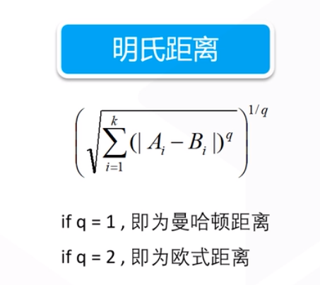
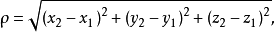
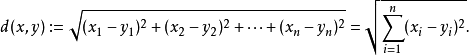
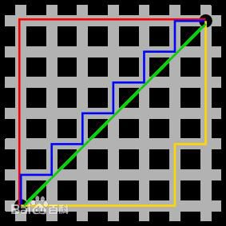
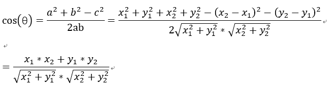
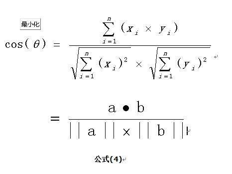
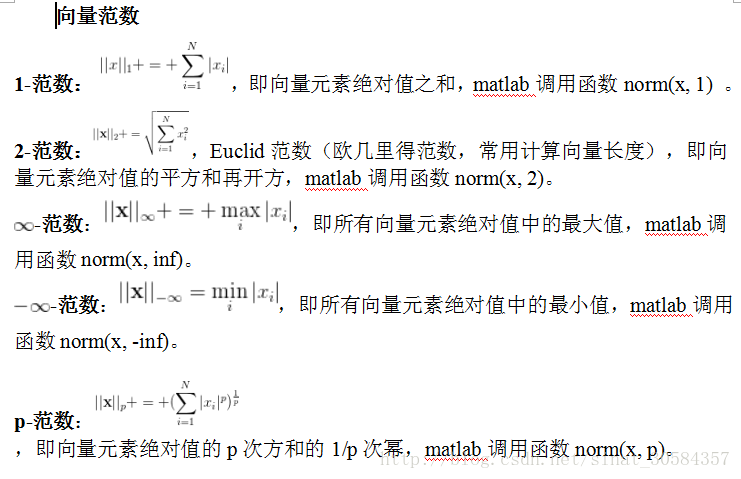
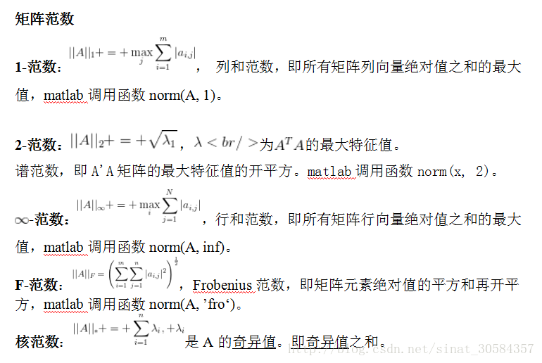

KNN(k-NearestNeighbor) -- K最近邻(*kNN*，k-NearestNeighbor)分类

### KNN与距离度

**三维空间的公式**

**n维空间的公式**

**曼哈顿距离**，就是表示两个点在标准坐标系上的绝对轴距之和

图中红线代表曼哈顿距离，**绿色代表欧氏距离**，也就是直线距离，而蓝色和黄色代表等价的**曼哈顿距离**。曼哈顿距离——两点在南北方向上的距离加上在东西方向上的距离，即d（i，j）=|xi-xj|+|yi-yj|。

### 余弦相似度计算

余弦相似度用向量空间中两个向量夹角的余弦值作为衡量两个个体间差异的大小。余弦值越接近1，就表明夹角越接近0度，也就是两个向量越相似，这就叫"余弦相似性"。

对于两个向量，如果他们之间的夹角越小，那么我们认为这两个向量是越相似的。余弦相似性就是利用了这个理论思想。它通过计算两个向量的夹角的余弦值来衡量向量之间的相似度值。

2维空间中余弦函数的公式

多维空间余弦函数的公式就是：

### 关于范数

#### 向量范数

#### 矩阵范数

超参数 K 值，一般不大于20

### KNN优点

1、简单易于理解
2、不需要庞大的样本数量，就能完成简单的分类任务
3、对异常值不敏感，关注距离较近的点，距离较远的点自然排除在外
4、天然的多分类器

### KNN特性

不需要训练，不需要求解参数 。这既是优点，也是缺点

### KNN缺点

1、大数据量、高纬度时，计算量太大
2、对于不平衡样本处理能力较差
3、不学习

### KNN实现步骤

1、计算距离
2、排序
3、K个样本
4、统计结果