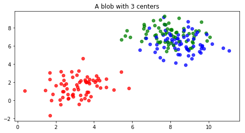

## 第一章、模型预处理

数据获取（setting data）
数据整理（preparing data）
建模前的降维（premodel dimensionality reduction）

模拟数据（fake data）

数据预处理变换的方法：
	缺失数据填补（data imputation）
	分类变量编码（categorical variable encoding）

降维方法：
	主成分分析
	因子分析
	正态随机过程

### 1、从外部源获取样本数据

datasets  模块主要有两种数据类型：
	较小的数据集：datasets.load_*?
	较大的数据集： datasets.fetch_*?

```python
from sklearn import datasets
import numpy as np
boston = datasets.load_boston()
print(boston.DESCR)
print(boston.data)
print(boston.target)
datasets.load_*?
```

```python
from sklearn import datasets
housing = datasets.fetch_california_housing()
print(housing.DESCR)
housing.data
datasets.fetch_*?
```

### 2、创建试验样本数据

```python
from sklearn import datasets
datasets.make_*?
```

----->

```txt
datasets.make_biclusters
datasets.make_blobs
datasets.make_checkerboard
datasets.make_circles
datasets.make_classification
datasets.make_friedman1
datasets.make_friedman2
datasets.make_friedman3
datasets.make_gaussian_quantiles
datasets.make_hastie_10_2
datasets.make_low_rank_matrix
datasets.make_moons
datasets.make_multilabel_classification
datasets.make_regression
datasets.make_s_curve
datasets.make_sparse_coded_signal
datasets.make_sparse_spd_matrix
datasets.make_sparse_uncorrelated
datasets.make_spd_matrix
datasets.make_swiss_roll
```

创建回归（regression）数据集

```python
from sklearn import datasets
reg_data = datasets.make_regression()
reg_data[0].shape,reg_data[1].shape
print(reg_data)
```

自定义更复杂的数据集：1000 * 10的矩阵，5个特征与因变量相关，误差系数0.2，两个因变量

```python
from sklearn import datasets
complex_reg_data = datasets.make_regression(1000, 10, 5, 2, 1.0)
complex_reg_data[0].shape,complex_reg_data[1].shape
```

创建一个非均衡数据集

```python
from sklearn import datasets
classification_set = datasets.make_classification(weights=[0.1])
np.bincount(classification_set[1])
```

创建聚类数据集

```python
from sklearn import datasets
from matplotlib import pyplot as plt
import numpy as np
blobs = datasets.make_blobs(200)
f = plt.figure(figsize=(8, 4))
ax = f.add_subplot(111)
ax.set_title("A blob with 3 centers")
colors = np.array(['r', 'g', 'b'])
ax.scatter(blobs[0][:, 0], blobs[0][:, 1], color=colors[blobs[1].astype(int)], alpha=0.75)
```




scikit-learn是如何生成回归数据集:

基本均衡数据集

```python
import numpy as np
n_samples = 5
n_features = 2
X = np.random.randn(n_samples, n_features)
ground_truth = np.zeros((n_samples, n_features))
n_informative = 5
n_targets = 2
ground_truth[:n_informative, :] = 100*np.random.rand(n_informative,n_targets)
print(ground_truth)
print(X)
np.dot(ground_truth, X.T)
```

### 3、把数据调整为标准正态分布

preprocessing  模块提供了一些函数可以将特征调整为标准形

```python
from sklearn import preprocessing,datasets
import numpy as np
boston = datasets.load_boston()
X, y = boston.data, boston.target
X[:, :3].mean(axis=0) #前三个特征的均值
X[:, :3].std(axis=0) #前三个特征的标准差

X_2 = preprocessing.scale(X[:, :3])
X_2.mean(axis=0)
X_2.std(axis=0)

#有一个中心化与标准化类，与管线命令（Pipeline）联合处理大数据集时很有用
my_scaler = preprocessing.StandardScaler()
my_scaler.fit(X[:, :3])
my_scaler.transform(X[:, :3]).mean(axis=0)

#MinMaxScaler类，将样本数据根据最大值和最小值调整到一个区间内
my_minmax_scaler = preprocessing.MinMaxScaler()
my_minmax_scaler.fit(X[:, :3])
my_minmax_scaler.transform(X[:, :3]).max(axis=0)

#MinMaxScaler类可以很容易将默认的区间0到1修改为需要的区间
my_odd_scaler = preprocessing.MinMaxScaler(feature_range=(-3.14,3.14))
my_odd_scaler.fit(X[:, :3])
my_odd_scaler.transform(X[:, :3]).max(axis=0)
```

**创建幂等标准化（idempotent scaler）对象**

```python
from sklearn import preprocessing,datasets
my_useless_scaler = preprocessing.StandardScaler(with_mean=False,with_std=False)
transformed_sd = my_useless_scaler.fit_transform(X[:, :3]).std(axis=0)
original_sd = X[:, :3].std(axis=0)
np.array_equal(transformed_sd, original_sd)
```

**处理稀疏数据填补**

标准化一个稀疏矩阵不能带 with_mean  ，只要 with_std

```python
import scipy
matrix = scipy.sparse.eye(1000)
# 标准化一个稀疏矩阵不能带 with_mean，只要 with_std
preprocessing.scale(matrix, with_mean=False)
```

### 4、用阈值创建二元特征

当不需要呈标准化分布的数据时，我们可以不处理它们直接使用；但是，如果有足够理由，直接使用也许是聪明的做法。通常，尤其是处理连续数据时，可以通过建立二元特征来分割数据。

与标准化处理类似，scikit-learn有两种方法二元特征：
preprocessing.binarize  （一个函数）
preprocessing.Binarizer  （一个类）

```python
from sklearn import preprocessing,datasets
import numpy as np
boston = datasets.load_boston()
new_target = preprocessing.binarize([boston.target], threshold=boston.target.mean())
new_target[0,:5]
(boston.target[:5] > boston.target.mean()).astype(int)

bin = preprocessing.Binarizer(boston.target.mean())
new_target = bin.fit_transform([boston.target])
new_target[0,:5]
```

**稀疏矩阵**

稀疏矩阵的 0 是不被存储的；这样可以节省很多空间。这就为 binarizer 造成了问题，需要指定阈值参数 threshold 不小于 0 来解决，如果 threshold 小于0 就会出现错误

```python
from scipy.sparse import coo
spar = coo.coo_matrix(np.random.binomial(1, .25, 100))
# threshold小于0会报错
preprocessing.binarize(spar, threshold=1)
```

### 5、分类变量处理

```python
from sklearn import preprocessing, datasets
import numpy as np
iris = datasets.load_iris()
X = iris.data
y = iris.target
d = np.column_stack((X, y))
text_encoder = preprocessing.OneHotEncoder(categories='auto')
text_encoder.fit_transform(d[:, -1:]).toarray()[:5]
```


