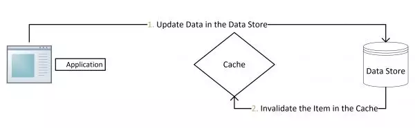

# 缓存雪崩

如果缓存数据**设置的过期时间是相同**的，并且Redis恰好将这部分数据全部删光了。这就会导致在这段时间内，这些缓存**同时失效**，全部请求到数据库中。这就是缓存雪崩。

- Redis挂掉了，请求全部走数据库。
- 对缓存数据设置相同的过期时间，导致某段时间内缓存失效，请求全部走数据库。

缓存雪崩如果发生了，很可能就把我们的数据库**搞垮**，导致整个服务瘫痪！

### 如何解决缓存雪崩？

对于“对缓存数据设置相同的过期时间，导致某段时间内缓存失效，请求全部走数据库。”这种情况，非常好解决：

解决方法：在缓存的时候给过期时间加上一个**随机值**，这样就会大幅度的**减少缓存在同一时间过期**。

对于“Redis挂掉了，请求全部走数据库”这种情况，我们可以有以下的思路：

- 事发前：实现Redis的**高可用**(主从架构+Sentinel 或者Redis Cluster)，尽量避免Redis挂掉这种情况发生。
- 事发中：万一Redis真的挂了，我们可以设置**本地缓存(ehcache)+限流(hystrix)**，尽量避免我们的数据库被干掉(起码能保证我们的服务还是能正常工作的)
- 事发后：redis持久化，重启后自动从磁盘上加载数据，**快速恢复缓存数据**。

# 缓存穿透

缓存穿透是指查询一个一定**不存在的数据**。由于缓存不命中，并且出于容错考虑，如果从**数据库查不到数据则不写入缓存**，这将导致这个不存在的数据**每次请求都要到数据库去查询**，失去了缓存的意义。这就是缓存穿透。

请求的数据在缓存大量不命中，导致请求走数据库。

### 如何解决缓存穿透？

解决缓存穿透也有两种方案：

- 由于请求的参数是不合法的(每次都请求不存在的参数)，于是我们可以使用布隆过滤器(BloomFilter)或者压缩filter**提前拦截**，不合法就不让这个请求到数据库层！
- 当我们从数据库找不到的时候，我们也将这个**空对象设置到缓存里边去**。下次再请求的时候，就可以从缓存里边获取了。这种情况我们一般会将空对象设置一个**较短的过期时间**。

# 操作缓存

正常的情况是这样的：

- 先操作数据库，成功；
- 再删除缓存，也成功；

如果原子性被破坏了：

- 第一步成功(操作数据库)，第二步失败(删除缓存)，会导致**数据库里是新数据，而缓存里是旧数据**。
- 如果第一步(操作数据库)就失败了，我们可以直接返回错误(Exception)，不会出现数据不一致。

如果在高并发的场景下，出现数据库与缓存数据不一致的**概率特别低**，也不是没有：

- 缓存**刚好**失效
- 线程A查询数据库，得一个旧值
- 线程B将新值写入数据库
- 线程B删除缓存
- 线程A将查到的旧值写入缓存

要达成上述情况，还是说一句**概率特别低**：

> 因为这个条件需要发生在读缓存时缓存失效，而且并发着有一个写操作。而实际上数据库的写操作会比读操作慢得多，而且还要锁表，**而读操作必需在写操作前进入数据库操作，而又要晚于写操作更新缓存**，所有的这些条件都具备的概率基本并不大。

### 先更新数据库，再删除缓存

正常的情况是这样的：

- 先操作数据库，成功；
- 再删除缓存，也成功；

如果原子性被破坏了：

- 第一步成功(操作数据库)，第二步失败(删除缓存)，会导致**数据库里是新数据，而缓存里是旧数据**。
- 如果第一步(操作数据库)就失败了，我们可以直接返回错误(Exception)，不会出现数据不一致。

如果在高并发的场景下，出现数据库与缓存数据不一致的**概率特别低**，也不是没有：

- 缓存**刚好**失效
- 线程A查询数据库，得一个旧值
- 线程B将新值写入数据库
- 线程B删除缓存
- 线程A将查到的旧值写入缓存

要达成上述情况，还是说一句**概率特别低**：

> 因为这个条件需要发生在读缓存时缓存失效，而且并发着有一个写操作。而实际上数据库的写操作会比读操作慢得多，而且还要锁表，**而读操作必需在写操作前进入数据库操作，而又要晚于写操作更新缓存**，所有的这些条件都具备的概率基本并不大。

对于这种策略，其实是一种设计模式：`Cache Aside Pattern`

先修改数据库，再删除缓存

**删除缓存失败的解决思路**：

- 将需要删除的key发送到消息队列中
- 自己消费消息，获得需要删除的key
- **不断重试删除操作，直到成功**

### 先删除缓存，再更新数据库

正常情况是这样的：

- 先删除缓存，成功；
- 再更新数据库，也成功；

如果原子性被破坏了：

- 第一步成功(删除缓存)，第二步失败(更新数据库)，数据库和缓存的数据还是一致的。
- 如果第一步(删除缓存)就失败了，我们可以直接返回错误(Exception)，数据库和缓存的数据还是一致的。

看起来是很美好，但是我们在并发场景下分析一下，就知道还是有问题的了：

- 线程A删除了缓存
- 线程B查询，发现缓存已不存在
- 线程B去数据库查询得到旧值
- 线程B将旧值写入缓存
- 线程A将新值写入数据库

所以也会导致数据库和缓存不一致的问题。

**并发下解决数据库与缓存不一致的思路**：

- 将删除缓存、修改数据库、读取缓存等的操作积压到**队列**里边，实现**串行化**。

将操作积压到队列中

## 3.4对比两种策略

我们可以发现，两种策略各自有优缺点：

- 先删除缓存，再更新数据库

- - 在高并发下表现不如意，在原子性被破坏时表现优异

- 先更新数据库，再删除缓存(`Cache Aside Pattern`设计模式)

- - 在高并发下表现优异，在原子性被破坏时表现不如意