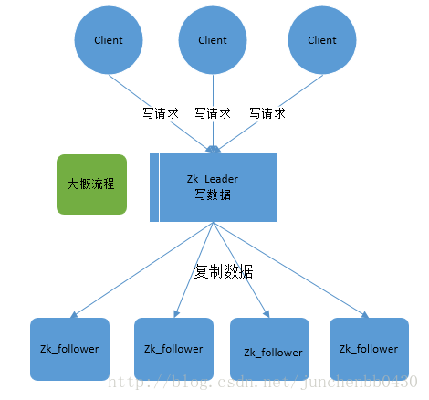
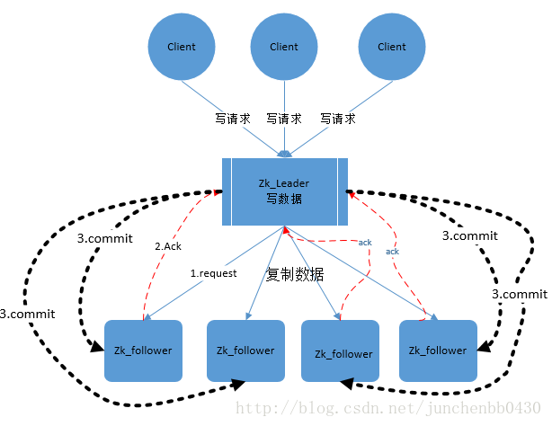
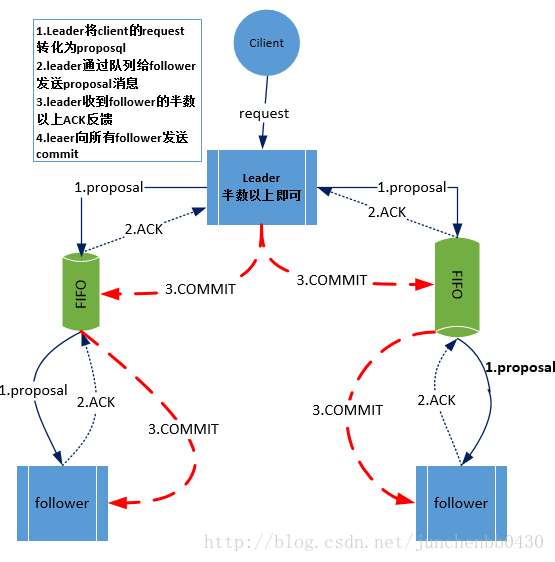
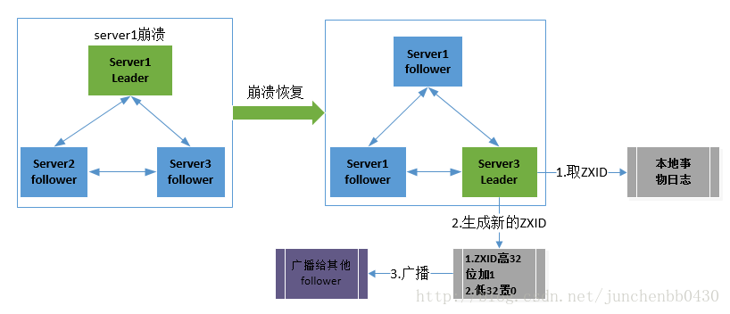

https://www.cnblogs.com/crazylqy/p/7132133.html

https://blog.csdn.net/junchenbb0430/article/details/77583955

http://www.jasongj.com/zookeeper/fastleaderelection/

https://zhuanlan.zhihu.com/p/25594630

# **2P/3P**

为了保证事务的ACID（原子性、一致性、隔离性、持久性）

2P= Two Phase commit   二段提交（RDBMS经常就这种机制，保证强一致性）

3P= Three Phase commit  三段提交

### 2P

**2P- 阶段1**：提交事务请求（投票阶段）

 

**2P- 阶段2**：执行事务提交（commit、rollback）

 

### 3p

3P- 阶段1：是否提交

3P- 阶段2：预先提交

3P- 阶段3：提交（commit、rollback）

 

# CAP理论（分布式系统遵循的理论）

一致性（Consistency）

可用性（Availability）

分区容错性（Partition tolerance）

 

 

CA(放弃P)：讲所有的数据放在一个节点。满足一致性、可用性。

AP(放弃C)：放弃强一致性，用最终一致性来保证。

CP(放弃A)：一旦系统遇见故障，受到影响的服务器需要等待一段时间，在恢复期间无法对外提供服务。

### Paxos算法

### ZAB协议

ZAB协议是专门为zookeeper实现分布式协调功能而设计。zookeeper主要是根据ZAB协议是实现分布式系统数据一致性。

zookeeper根据ZAB协议建立了主备模型完成zookeeper集群中数据的同步。这里所说的主备系统架构模型是指，在zookeeper集群中，只有一台leader负责处理外部客户端的事物请求(或写操作)，然后leader服务器将客户端的写操作数据同步到所有的follower节点中。

ZAB的协议核心是在整个zookeeper集群中只有一个节点即Leader将客户端的写操作转化为事物(或提议proposal)。Leader节点再数据写完之后，将向所有的follower节点发送数据广播请求(或数据复制)，等待所有的follower节点反馈。在ZAB协议中，只要超过半数follower节点反馈OK，Leader节点就会向所有的follower服务器发送commit消息。即将leader节点上的数据同步到follower节点之上。 

ZAB协议中主要有两种模式，第一是**消息广播模式**；第二是**崩溃恢复模式**

### 消息广播模式

在zookeeper集群中数据副本的传递策略就是采用消息广播模式。zookeeper中数据副本的同步方式与二阶段提交相似但是却又不同。二阶段提交的要求协调者必须等到所有的参与者全部反馈ACK确认消息后，再发送commit消息。要求所有的参与者要么全部成功要么全部失败。二阶段提交会产生严重阻塞问题。
ZAB协议中Leader等待follower的ACK反馈是指”只要半数以上的follower成功反馈即可，不需要收到全部follower反馈”

zookeeper中消息广播的具体步骤如下： 
4.1. 客户端发起一个写操作请求 
4.2. Leader服务器将客户端的request请求转化为事物proposql提案，同时为每个proposal分配一个全局唯一的ID，即ZXID。 
4.3. leader服务器与每个follower之间都有一个队列，leader将消息发送到该队列 
4.4. follower机器从队列中取出消息处理完(写入本地事物日志中)毕后，向leader服务器发送ACK确认。 
4.5. leader服务器收到半数以上的follower的ACK后，即认为可以发送commit 
4.6. leader向所有的follower服务器发送commit消息。

zookeeper采用ZAB协议的核心就是只要有一台服务器提交了proposal，就要确保所有的服务器最终都能正确提交proposal。这也是CAP/BASE最终实现一致性的一个体现。

leader服务器与每个follower之间都有一个单独的队列进行收发消息，使用队列消息可以做到异步解耦。leader和follower之间只要往队列中发送了消息即可。如果使用同步方式容易引起阻塞。性能上要下降很多。

### 崩溃恢复

zookeeper集群中为保证任何所有进程能够有序的顺序执行，只能是leader服务器接受写请求，即使是follower服务器接受到客户端的请求，也会转发到leader服务器进行处理。
如果leader服务器发生崩溃，则zab协议要求zookeeper集群进行崩溃恢复和leader服务器选举。
ZAB协议崩溃恢复要求满足如下2个要求： 
3.1. 确保已经被leader提交的proposal必须最终被所有的follower服务器提交。 
3.2. 确保丢弃已经被leader出的但是没有被提交的proposal。
根据上述要求，新选举出来的leader不能包含未提交的proposal，即新选举的leader必须都是已经提交了的proposal的follower服务器节点。同时，新选举的leader节点中含有最高的ZXID。这样做的好处就是可以避免了leader服务器检查proposal的提交和丢弃工作。
leader服务器发生崩溃时分为如下场景： 
5.1. leader在提出proposal时未提交之前崩溃，则经过崩溃恢复之后，新选举的leader一定不能是刚才的leader。因为这个leader存在未提交的proposal。 

5.2 leader在发送commit消息之后，崩溃。即消息已经发送到队列中。经过崩溃恢复之后，参与选举的follower服务器(刚才崩溃的leader有可能已经恢复运行，也属于follower节点范畴)中有的节点已经是消费了队列中所有的commit消息。即该follower节点将会被选举为最新的leader。剩下动作就是数据同步过程。

### 数据同步

在zookeeper集群中新的leader选举成功之后，leader会将自身的提交的最大proposal的事物ZXID发送给其他的follower节点。follower节点会根据leader的消息进行回退或者是数据同步操作。最终目的要保证集群中所有节点的数据副本保持一致。
数据同步完之后，zookeeper集群如何保证新选举的leader分配的ZXID是全局唯一呢？这个就要从ZXID的设计谈起。 

2.1 ZXID是一个长度64位的数字，其中低32位是按照数字递增，即每次客户端发起一个proposal,低32位的数字简单加1。高32位是leader周期的epoch编号，至于这个编号如何产生(我也没有搞明白)，每当选举出一个新的leader时，新的leader就从本地事物日志中取出ZXID,然后解析出高32位的epoch编号，进行加1，再将低32位的全部设置为0。这样就保证了每次新选举的leader后，保证了ZXID的唯一性而且是保证递增的。 

### ZAB协议原理

ZAB协议要求每个leader都要经历三个阶段，即发现，同步，广播。
**发现**：即要求zookeeper集群必须选择出一个leader进程，同时leader会维护一个follower可用列表。将来客户端可以这follower中的节点进行通信。
**同步**：leader要负责将本身的数据与follower完成同步，做到多副本存储。这样也是体现了CAP中高可用和分区容错。follower将队列中未处理完的请求消费完成后，写入本地事物日志中。
**广播**：leader可以接受客户端新的proposal请求，将新的proposal请求广播给所有的follower。

### Zookeeper设计目标

zookeeper作为当今最流行的分布式系统应用协调框架，采用zab协议的最大目标就是建立一个高可用可扩展的分布式数据主备系统。即在任何时刻只要leader发生宕机，都能保证分布式系统数据的可靠性和最终一致性。

深刻理解ZAB协议，才能更好的理解zookeeper对于分布式系统建设的重要性。以及为什么采用zookeeper就能保证分布式系统中数据最终一致性，服务的高可用性

