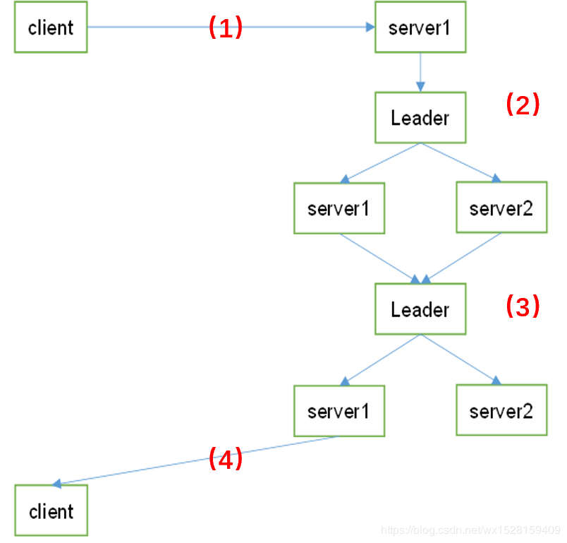

Zookeeper中Leader和Follower的作用：

 Leader：负责进行投票的发起和决议，分布式读写，更新请求转发；

 Follower：负责接收客户端请求并向客户端返回结果，在选举Leader过程中参与投票（选举机制）；

## 一、写数据流程

以3台服务器的Zookeeper集群为例，一个Leader，两个Follower即server1和server2

1）Client向Zookeeper的server1发送一个写请求，客户端写数据到服务器1上；

（2）如果server1不是Leader，那么server1会把接收到的写请求转发给Leader；然后Leader会将写请求转发给每个server；

    server1和server2负责写数据，并且两个Follower的写入数据是一致的，保存相同的数据副本；
    server1和server2写数据成功后，通知Leader；

（3）当Leader收到集群半数以上的节点写成功的消息后，说明该写操作执行成功；

    eg：这里是3台服务器，只要2台Follower服务器写成功就ok
    因为client访问的是server1，所以Leader会告知server1集群中数据写成功；

（4）被访问的server1进一步通知client数据写成功，这时，客户端就知道整个写操作成功了。

## 二、读数据流程

相比写数据流程，读数据流程就简单得多；因为每台server中数据一致性都一样，所以随便访问哪台server读数据就行；

没有写数据流程中请求转发、数据同步、成功通知这些步骤。