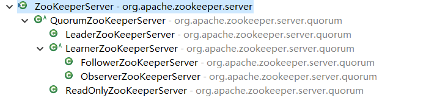

# Zookeeper 源码分析

## 选举

Election选举接口，实现类 FastLeaderElection

```java
public interface Election {
    public Vote lookForLeader() throws InterruptedException;
    public void shutdown();
}
```

QuorumCnxManager：主要完成服务器间的网络交互

```java
final ConcurrentHashMap<Long, SendWorker> senderWorkerMap;
final ConcurrentHashMap<Long, ArrayBlockingQueue<ByteBuffer>> queueSendMap;
final ConcurrentHashMap<Long, ByteBuffer> lastMessageSent;
```

Vote 选票

QuorumPeer 是zk服务器实例类

QuorumPeer.QuorumServer 存储zk server连接信息

主要实现函数：

lookForLeader：选举过程（主要函数）
totalOrderPredicate：比较选票

termPredicate：是否结束选举

senderWorkerMap：主要用于发送
queueSendMap：发送队列

SendWorker：发送器
RecvWorker：接收器

lastMessageSent：最后一条发送消息

Notification：表示该服务器节点收到选票信息

recvset：存储本节点来自其他节点的选票(投票用)

outofelection：存储本节点从其他节点由following、leading状态发送来的选票（选举确认用）

## 服务器角色

### Leader

事务请求的唯一调度者和处理者。保证事务处理的顺序性。

集群内部个服务器之间的调度者。

导致数据一致性的请求，事务请求、



途中的各种ZookeeperServer类中都有setupRequestProcessors方法，设定各个Processor执行顺序，并启动
LearnerHandler，在集群中Leader与Follower、Observer的通讯的类。

```java
// org.apache.zookeeper.server.quorum.LeaderZooKeeperServer
@Override
protected void setupRequestProcessors() {
    RequestProcessor finalProcessor = new FinalRequestProcessor(this);
    RequestProcessor toBeAppliedProcessor = new Leader.ToBeAppliedRequestProcessor(
        finalProcessor, getLeader().toBeApplied);
    commitProcessor = new CommitProcessor(toBeAppliedProcessor,
                                          Long.toString(getServerId()), false,
                                          getZooKeeperServerListener());
    commitProcessor.start();
    ProposalRequestProcessor proposalProcessor = new ProposalRequestProcessor(this,
                                                                              commitProcessor);
    proposalProcessor.initialize();
    firstProcessor = new PrepRequestProcessor(this, proposalProcessor);
    ((PrepRequestProcessor)firstProcessor).start();
}
```

1. PrepRequestProcessor
   主要的作用就是生成zxid。一个Request提交后，Leader可以断言（带来的影响，顺序节点的序列号）

2.  ProposalRequestProcessor 事务投票处理器。
   事务请求：除了提交给CommitProcessor，还会根据对应的请求创建对应的Proposal，并发送给所有的Follower服务器进行一次集群内部事务投票。

   ```java
   public ProposalRequestProcessor(LeaderZooKeeperServer zks,
               RequestProcessor nextProcessor) {
       this.zks = zks;
       this.nextProcessor = nextProcessor;
       AckRequestProcessor ackProcessor = new AckRequestProcessor(zks.getLeader());
       syncProcessor = new SyncRequestProcessor(zks, ackProcessor);
   }
   ```

3. SyncRequestProcessor 事务+日志的处理器
   处理事务并且将事务记录到日志文件中，同时触发数据快照（有条件的触发）

4.  AckRequestProcessor
   处理完事务并且记录事务日志后，向Proposal的投票收集器发送ACK反馈，通知投票收集器当前服务器已经完成对Proposal事务日志记录。

5.  CommitProcessor 事务提交处理器
   CommitProcessor等待集群内针对于该Proposal的投票直到该Proposal可以被提交（多数派协议）。并且将请求交给下一个处理器。

6.  ToBeAppliedRequestProcessor
   向所有的Follower发送Commit，必须保证Commit执行顺序。同时把请求交给下一个处理器，然后从队列中将Commit移。

7.  FinalRequestFollower

### Follower

处理客户端的非事务请求。事务请求必须转发给Leader服务器。

参与事务请求Proposal的投票

参与Leader选举

```java
// org.apache.zookeeper.server.quorum.FollowerZooKeeperServer
@Override
protected void setupRequestProcessors() {
    RequestProcessor finalProcessor = new FinalRequestProcessor(this);
    commitProcessor = new CommitProcessor(finalProcessor,
                                          Long.toString(getServerId()), true,
                                          getZooKeeperServerListener());
    commitProcessor.start();
    firstProcessor = new FollowerRequestProcessor(this, commitProcessor);
    ((FollowerRequestProcessor) firstProcessor).start();
    syncProcessor = new SyncRequestProcessor(this,
                                             new SendAckRequestProcessor((Learner)getFollower()));
    syncProcessor.start();
}
```

FollowerRequestProcessor  
处理client请求队列，用take方法逐个取出，然后交付给下一RequestProcessor。如果事务请求，那么必须转发给Leader。

### Observer

在实际运行中，它只是负责读，Leader不会将事务的投票发送给Observer。

```java
// org.apache.zookeeper.server.quorum.ObserverZooKeeperServer
@Override
protected void setupRequestProcessors() {      
    // We might consider changing the processor behaviour of 
    // Observers to, for example, remove the disk sync requirements.
    // Currently, they behave almost exactly the same as followers.
    RequestProcessor finalProcessor = new FinalRequestProcessor(this);
    commitProcessor = new CommitProcessor(finalProcessor,
                                          Long.toString(getServerId()), true,
                                          getZooKeeperServerListener());
    commitProcessor.start();
    firstProcessor = new ObserverRequestProcessor(this, commitProcessor);
    ((ObserverRequestProcessor) firstProcessor).start();

    /*
         * Observer should write to disk, so that the it won't request
         * too old txn from the leader which may lead to getting an entire
         * snapshot.
         *
         * However, this may degrade performance as it has to write to disk
         * and do periodic snapshot which may double the memory requirements
         */
    if (syncRequestProcessorEnabled) {
        syncProcessor = new SyncRequestProcessor(this, null);
        syncProcessor.start();
    }
}
```

ObserverRequestProcessor

## 序列化与通信协议

### 序列化协议

+ ProtoBuf

+ Thrift

+ Hessian

+ Kryo

+ Avro

+ JDK Serializable

+ Jsoniter/Jackson

Jute是zk序列化、反序列化协议。

Record：
	serialize(OutputArchive archive, String tag)
	deserialize(InputArchive archive, String tag);

几乎org.apache.zookeeper.proto.*下所有的类都实现了Record接口

OutputArchive 输出类

InputArchive 输入类

tag 代表表示对象的标识。

BinaryOutputArchive / BinaryInputArchive  网络传输、本地磁盘持久化

CsvOutputArchive / CsvInputArchive 方便展示

XmlOutputArchive / XmlInputArchive 还没使用。以xml保存和还原

### 通信协议

基于TCP/IP协议，所以是一个长连接。zookeeper在这个基础上完成客户端和服务器，服务器和服务器之间的通信。

ConnectRequest

ConnectResponse

ReplyHeader

ResponeHeader

org.apache.zookeeper.proto.*

Zk请求包：请求头+请求体

| 0-3  | 4-11 | 12-n |       |          |      |
| ---- | ---- | ---- | ----- | -------- | ---- |
| len  | 4-7  | 8-11 | 12-15 | 16-(n-1) | n    |
| xid  | type | len  | path  | watch    |      |

 Zk响应包：响应头+响应体

| 0-3  | 4-19 | 20 - n |       |       |        |       |      |
| ---- | ---- | ------ | ----- | ----- | ------ | ----- | ---- |
| len  | 4-7  | 8-15   | 16-19 | 20-23 | len位  | 48位  | 8位  |
| xid  | zxid | err    | len   | data  | ...... | pzxid |      |

### 数据存储

内存数据

Zk有个内存数据库：ZkDataBase、DataTree、DataNode
