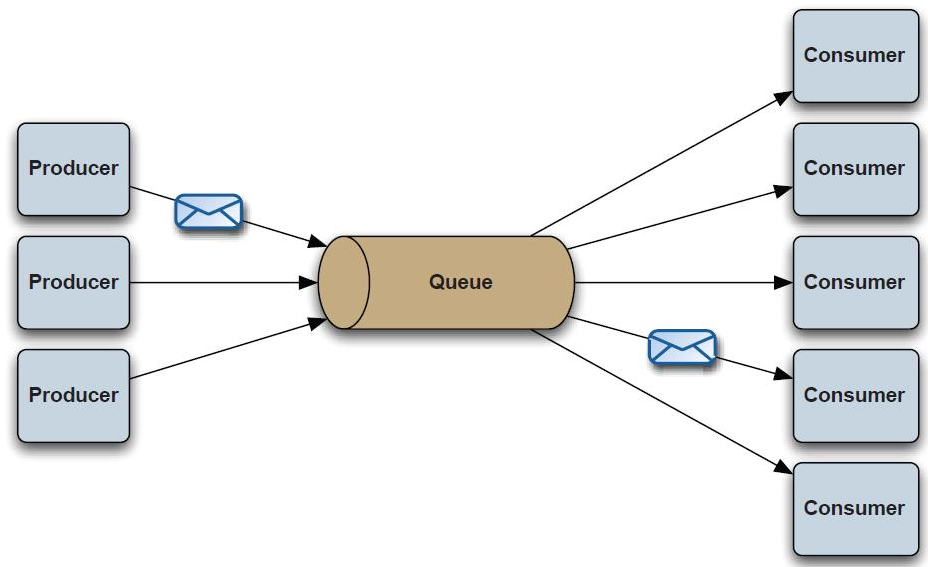
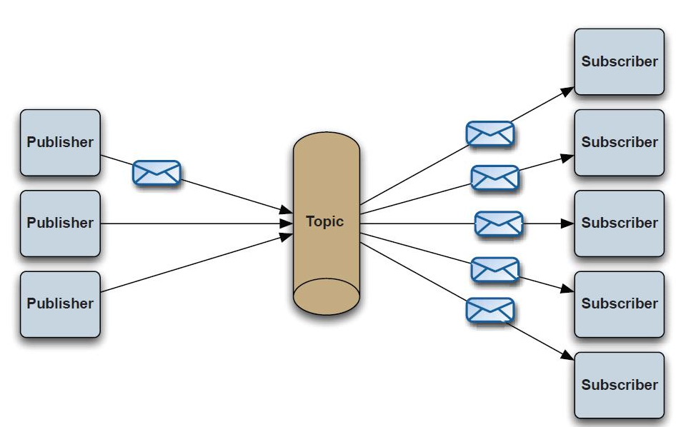

# 消息中间件

消息中间件没有标准定义，一般认为，采用消息传送机制/消息队列的中间件技术，进行数据交流，用在分布式系统的集成。

### 消息中间件对比

#### kafka和RabbitMQ的比较

1、  RabbitMq比kafka成熟，在可用性上，稳定性上，可靠性上，RabbitMq超过kafka

2、  Kafka设计的初衷就是处理日志的，可以看做是一个日志系统，针对性很强，所以它并没有具备一个成熟MQ应该具备的特性

3、  Kafka的性能（吞吐量、tps）比RabbitMq要强

### 消息中间件的组成

**Broker**

消息服务器，作为server提供消息核心服务

**Producer**

消息生产者，业务的发起方，负责生产消息传输给broker，

**Consumer**

消息消费者，业务的处理方，负责从broker获取消息并进行业务逻辑处理

**Topic**

主题，发布订阅模式下的消息统一汇集地，不同生产者向topic发送消息，由MQ服务器分发到不同的订阅者，实现消息的       广播

**Queue**

队列，PTP模式下，特定生产者向特定queue发送消息，消费者订阅特定的queue完成指定消息的接收

**Message**

消息体，根据不同通信协议定义的固定格式进行编码的数据包，来封装业务数据，实现消息的传输

### 消息模型

#### 点对点

消息生产者生产消息发送到queue中，然后消息消费者从queue中取出并且消费消息。 
消息被消费以后，queue中不再存储，所以消息消费者不可能消费到已经被消费的消息。 Queue支持存在多个消费者，但是对一个消息而言，只会有一个消费者可以消费。

#### 发布/订阅

Pub/Sub发布订阅（广播）：使用topic作为通信载体

消息生产者（发布）将消息发布到topic中，同时有多个消息消费者（订阅）消费该消息。和点对点方式不同，发布到topic的消息会被所有订阅者消费。

topic实现了发布和订阅，当你发布一个消息，所有订阅这个topic的服务都能得到这个消息，所以从1到N个订阅者都能得到一个消息的拷贝。

### 使用场景

1、异步处理

2、应用的解耦

3、流量削峰

4、纯粹的消息通信

