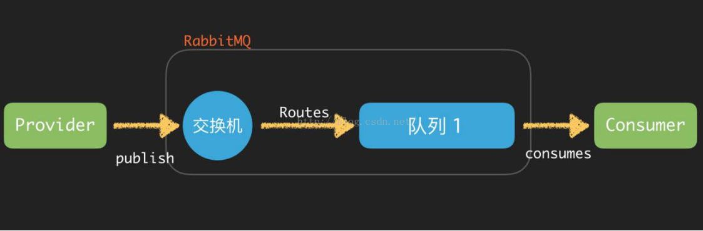
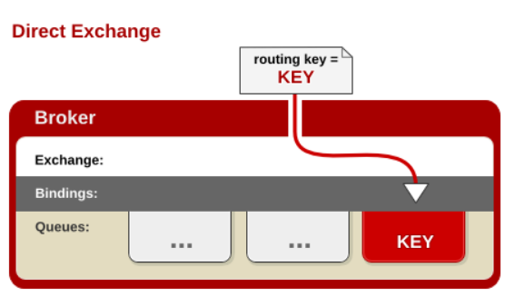
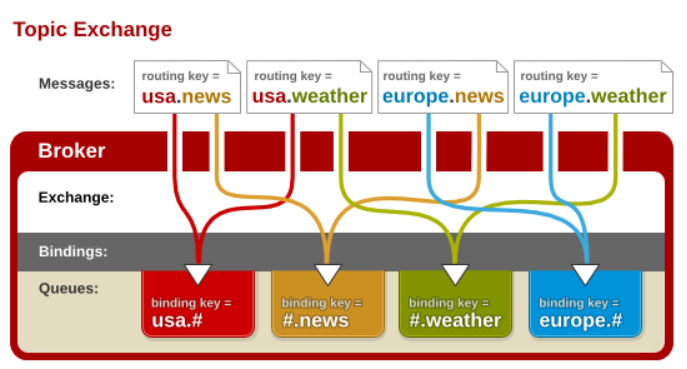

### AMQP

AMQP，即Advanced Message Queuing Protocol,一个提供统一消息服务的应用层标准高级消息队列协议。

开放标准，支持不同语言和不同的产品。

### 生产者

消息的创建者，发送到amqp的消息中间件

### 消费者

连接到amqp的消息中间件，订阅到队列上，进行消息的消费。分为持续订阅（basicConsumer）和单条订阅(basicGet)

### 消息

包括有效载荷和标签。有效载荷就是要传输的数据。标签描述有效载荷的属性，rabbitmq用标签来决定谁获得当前消息。消费者只能拿到有效载荷。

### 信道

虚拟的连接，建立在真实的tcp连接之上的。信道的创建没有限制的。

### 交换器、队列、绑定、路由键

队列通过路由键（routing key，某种确定的规则）绑定到交换器，生产者把消息发送到了交换器，交换器根据绑定的路由键将消息路由到特定的队列，订阅了队列的消费者进行接收。



**如果消息达到无人订阅的队列会怎么办**？

 消息会一直在队列中等待，rabbitmq会默认队列是无限长度的。

**多个消费者订阅到同一队列怎么办**？

消息会轮询的方式发送给消费者，每个消息只会发送给一个消费者

**消息路由到了不存在的队列怎么办？**

会忽略，当消息不存在，消息丢失了。

### 消息的确认机制

消费者收到的每一条消息都必须进行确认，分为**自动确认**和**消费者自行确认**

（分为自动确认和消费者自行确认）

消费者在声明队列时，指定autoAck=true，表示自动确认，会立即删除消息；指定autoAck=false表示自行确认，rabbitmq会等到消费者显示的发回一个ack信号才会删除消息。autoAck=false，让消费者有足够时间处理消息，直到消费者显示调用basicAck为止。

Rabbitmq中消息分为了两部分：
1、等待投递的消息；
2、已经投递，但是还没有收到ack信号的。如果消费者断连了，服务器会把消息重新入队，投递给下一个消费者。

未ack的消息是没有超时时间的。

**如何明确拒绝消息**？

 1、消费者断连
2、消费者使用reject命令（requeue=true,重新分发消息，false移除消息）
3、nack命令（批量的拒绝）

### 创建队列

（生产/消费）declareQueue。消费者订阅了队列，不能再声明队列了。相关参数（exclusive 队列为应用程序私有，auto-delete 最后一个消费者取消订阅时，队列会自动删除，durable 队列持久化）

**检测队列是否存在**

 Declare 时的passive参数

### 四种交换器

```java
public enum BuiltinExchangeType {

    DIRECT("direct"), FANOUT("fanout"), TOPIC("topic"), HEADERS("headers");

    private final String type;

    BuiltinExchangeType(String type) {
        this.type = type;
    }

    public String getType() {
        return type;
    }
}
```

#### direct

路由键完全匹配时，消息投放到对应队列。Amqp实现都必须有一个direct交换器（默认交换器），名称为空白字符。队列不声明交换器，会自动绑定到默认交换器，队列的名称作为路由键。

<div>

</div>
#### Fanout

可以理解为广播， 不理会路由键

<div>

</div>

#### Topic

主题，使来自不同源头的消息到达同一个队列

<div>

</div>

#### Headers

匹配消息头，其余与direct一样，实用性不大

### 日志处理场景

1、 有交换器（topic）log_exchange，日志级别有 error,info,warning，应用模块有 user,order,email。
路由键的规则是：日志级别+"."+应用模块名(例如info.user)

2、 发送邮件失败，报告一个email的error，basicPublic(message, "log-exchange", "error.email")

队列的绑定：queueBind("email-error-queue", "log-exchange", "’rror.email")

**要监听email所有的日志怎么办？**

queueBind("email-log-queue", "log-exchange", "*.email")

**监听所有模块所有级别日志？**

queuebind("all-log-queue", "log-exchange","#")

“.”会把路由键分为好几个标识符
“\*”匹配一个标识符
“#”匹配一个或者多个（xxx.yyy.zzzz 可以： xxx.*. zzzz ， xxx.# ， #.zzzz）。

### 虚拟主机

Vhost，真实rabbitmq服务器上的mini型虚拟的mq服务器。有自己的权限机制。Vhost提供了一个逻辑上的分离，可以区分客户端，避免队列和交换器的名称冲突。RabbitMq包含了一个缺省的vhost :“/”，用户名guest，口令 guest（guest用户只能在本机访问）。

### 消息持久化

1、 队列是必须持久化
2、 交换器也必须是持久化
3、 消息的投递模式必须（int型） 2 

以上条件全部满足，消息才能持久化

问题：性能（下降10倍）

### AMQP和JMS区别

|              | JMS                                | AMQP                         |
| ------------ | ---------------------------------- | ---------------------------- |
| 定义         | Java api                           | 协议                         |
| Model        | P2PPub/Sub                         | Direct/Fanout/Topic/headers  |
| 支持消息类型 | 5种                                | Byte[]自行消息序列化，Json化 |
| 综合评价     | Java系统，模型满足要求，跨平台较差 | 协议，天然跨平台，跨语言     |

### 命令

启动： rabbitmq-service start

停止： rabbitmqctl.bat stop

状态：rabbitmqctl.bat status

### 管理界面

http://localhost:15672

